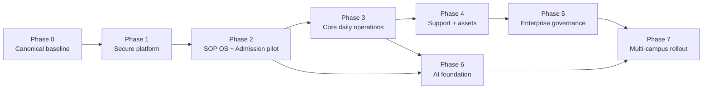

# ERP Preschool — Detailed Implementation Roadmap

| Thuộc tính | Giá trị |
|---|---|
| Trạng thái | Approved for Phase 0 — được người dùng cho phép thực thi ngày 30/08/2026; Phase 1+ vẫn theo gate |
| Phiên bản | 1.0 |
| Ngày lập | 30/08/2026 |
| Phạm vi | SOP Operating System + Full Preschool ERP 75 domain + AI enablement |
| Delivery cadence | Sprint 2 tuần; release theo gate, không release chỉ theo ngày |
| Kiến trúc baseline | TypeScript modular monolith, Next.js, NestJS, PostgreSQL, worker/outbox |
| Tài liệu liên quan | `SOP_OS_MASTER_BUILD_PLAN_CONSOLIDATED.md`, `TECHNICAL_ANALYSIS_AI_READINESS.md`, `AGENTS.md` |

## 1. Mục tiêu của roadmap

Roadmap này biến master specification thành chương trình delivery có thể lập backlog,
phân đội và bắt đầu code sau khi được duyệt. Mỗi phase xác định rõ:

- business outcome và phạm vi SOP;
- work package và thứ tự sprint;
- dependency và quyết định phải chốt;
- artifact kỹ thuật phải bàn giao;
- test, evidence và exit gate;
- phần nào có thể làm song song, phần nào nằm trên critical path.

Roadmap không biến các con số ví dụ trong SOP thành policy production. Ngưỡng phí,
SLA, thời gian, retention, tỷ lệ, nhiệt độ và approval phải được duyệt và quản lý
qua configuration có version.

## 2. Planning baseline

### 2.1 Giả định năng lực dùng để ước lượng

Ước lượng sprint bên dưới dựa trên một đội delivery ổn định khoảng 10–14 người:

| Vai trò | Năng lực baseline |
|---|---:|
| Product Owner | 1 |
| Delivery/Project Manager | 1 |
| Lead BA/Domain BA | 2–3 |
| Solution/Enterprise Architect | 1 |
| Backend Engineer | 2–3 |
| Frontend Engineer | 2 |
| QA Automation/Manual | 2 |
| DevOps/SRE | 0.5–1 |
| Security/Privacy | 0.5, tham gia theo gate |
| UX/UI | 0.5–1 trong phase có UI mới |
| Data/AI Engineer | 1–2 từ Phase 6 |

Nếu đội nhỏ hơn, thiếu Process Owner hoặc phải chờ procurement/hardware/vendor,
timeline phải được re-baseline. Không tăng tốc bằng cách bỏ scope/security/test.

### 2.2 Ước lượng chương trình

- SOP OS + Admission pilot: khoảng 13 sprint, gồm Phase 0–2, tương đương 5–6 tháng.
- Core daily operations: thêm 8 sprint, tổng khoảng 9–10 tháng từ kickoff.
- Full enterprise scope 75 domain: khoảng 41 sprint core sequence, tương đương
  18–21 tháng trước rollout rộng.
- AI Foundation/AI-0 chạy song song từ khi Gate 2 đạt; không kéo dài critical path
  nếu có đội AI riêng.
- Multi-campus hardening và rollout: thêm 4–6 sprint tùy dữ liệu và số cơ sở.

Đây là planning range, không phải contractual date. Lịch chính thức chỉ khóa sau
Phase 0 khi biết team velocity, vendor lead time và pilot campus.

## 3. Nguyên tắc tổ chức delivery

1. Release theo vertical slice, không build toàn bộ database rồi mới làm UI.
2. Mỗi slice phải đi đủ `SOP -> BR -> FR -> AC -> Test -> Release evidence`.
3. Platform security đi trước HRI và tài chính.
4. Safeguarding và medical được ưu tiên theo mức rủi ro, nhưng chỉ pilot sau khi
   kiểm thử offline, hardware và emergency drill.
5. Configuration, approval, audit, outbox, document và notification là shared
   capability; không viết lại riêng cho từng module.
6. External provider luôn qua typed adapter; vendor có thể thay mà không đổi domain.
7. AI chỉ tạo recommendation/shadow output cho đến khi eval và human-control đạt.
8. Mỗi phase có Go/No-Go; không tự chuyển phase khi gate còn `BLOCKED`.

## 4. Roadmap tổng thể

| Phase | Sprint dự kiến | Thời lượng | Outcome chính | Exit gate |
|---|---:|---:|---|---|
| 0. Mobilization & Canonical Baseline | S0–S2 | 4–6 tuần | Source canonical, governance, ADR/decision register, backlog ready | G0 Foundation Ready |
| 1. Secure Platform Foundation | S3–S7 | 8–10 tuần | OIDC, scoped policy, config/rules, audit/outbox, documents, CI/test/recovery | G1 Platform Secure |
| 2. SOP OS & Admission Pilot | S8–S12 | 8–10 tuần | 28 SOP Draft registry; SOP governance + Lead-to-Handover pilot | G2 Pilot Accepted |
| 3. Core Daily Operations | S13–S20 | 14–16 tuần | SIS/safeguarding, medical, billing, academic, security operations | G3 Core Operations Safe |
| 4. Operational Support & Assets | S21–S31 | 20–22 tuần | Kitchen, P2P, inventory, facility, bus, HR core, marketing | G4 Support Operations Ready |
| 5. Enterprise Governance & Lifecycle | S32–S40 | 16–18 tuần | Finance planning, HR performance, student lifecycle, CS/QA/GOV/crisis | G5 Enterprise Scope Complete |
| 6. AI Foundation & AI-0 | Song song S21–S26 | 10–12 tuần | AI gateway, governed RAG, extraction staging, eval/shadow mode | G6 AI-0 Approved |
| 7. Multi-campus Rollout & AI-1/2 | S41–S46 | 10–12 tuần | Rollout waves, migration, DR/performance, selected AI operations | G7 Rollout Accepted |

Core sequence tham chiếu là 47 sprint tính cả Sprint 0–46. Phase 6 có thể song
song với Phase 4 khi Gate 2 và các điều kiện dữ liệu/AI đã đạt.

## 5. Dependency map



Critical path mặc định:

`Source canonical -> OIDC/scope -> config/approval/audit -> SOP/Admission pilot ->
SIS/Medical/Billing -> support modules -> enterprise governance -> rollout`.

Vendor critical path:

- IdP chặn Gate 1.
- Object storage/malware scan chặn hồ sơ thật và secure document flow.
- Payment/e-sign/messaging chặn production Admission/Billing, nhưng adapter/mock có
  thể được build trước.
- Hardware/offline decision chặn pilot Gate/Bus/Kitchen/Medical tại campus.
- AI provider/data-processing decision chặn dữ liệu thật vào Phase 6.

## 6. Workstream xuyên suốt

| Workstream | Owner chính | Bắt đầu | Kết thúc |
|---|---|---|---|
| Product/SOP/Traceability | Product Owner + BA | Phase 0 | Phase 7 |
| Architecture/ADR | Architect | Phase 0 | Phase 7 |
| Identity/Security/Privacy | Security + Platform | Phase 0 | Phase 7 |
| Data/Migration/Master Data | Data + Backend + BA | Phase 0 | Phase 7 |
| Domain/API/Worker | Engineering | Phase 1 | Phase 7 |
| Web/Mobile-ready UX | UX + Frontend | Phase 1 | Phase 7 |
| QA/E2E/Recovery | QA + SRE | Phase 0 | Phase 7 |
| Vendor/Integration | Product + Architecture | Phase 0 | Phase 7 |
| AI/Eval/Governance | AI + Security + Domain Owner | Phase 2 discovery | Phase 7 |
| Change/Training/Support | Operations + Product | Phase 2 | Phase 7 |

Mỗi workstream duy trì backlog, owner và evidence riêng, nhưng cùng dùng một release
gate và một traceability matrix.

## 7. Phase 0 — Mobilization & Canonical Baseline

**Execution status 30/08/2026:** In progress. Source promotion, local engineering
gates, threat-model baseline và remote clean-checkout CI đã hoàn tất; local stack
có lifecycle script và restart/smoke evidence. Gate G0 chưa PASS do chưa có named
owners/pilot scope, Security/Privacy sign-off và branch protection/CODEOWNERS thật.
Xem `governance/PHASE_0_GATE_G0.md`.

### 7.1 Mục tiêu

Tạo điều kiện để code không phát sinh thêm source of truth, business rule giả định
hoặc dependency vendor không kiểm soát.

### 7.2 Work packages

| ID | Work package | Đầu ra |
|---|---|---|
| P0-WP01 | Promote release-candidate ra application root | Monorepo canonical; archive read-only; inventory và checksum/diff |
| P0-WP02 | Repository governance | Git history, branch/PR policy, CODEOWNERS, release/tag convention |
| P0-WP03 | Program governance | Product/Process/Security/Data owners, RACI, meeting cadence, escalation |
| P0-WP04 | Canonical SOP baseline | Mapping 28 SOP, dedupe CRM-001, normalize escaped Markdown, source lineage |
| P0-WP05 | Decision register | IdP, hosting, DB, storage/scan, secrets/KMS, payment, e-sign, messaging, observability, RPO/RTO, RLS, money precision |
| P0-WP06 | Rule/config catalog | Rule ID, status, owner, policy reference, parameters, scope, validity |
| P0-WP07 | Backlog decomposition | Epic -> capability -> vertical slice -> story; BR/FR/AC/Test links |
| P0-WP08 | Environment baseline | Local Docker, CI database, synthetic seed, environment matrix |
| P0-WP09 | Threat/data-flow baseline | Trust boundaries, HRI paths, abuse cases, mitigation backlog |

### 7.3 Sprint sequence

#### Sprint S0 — Repository and governance

- Promote source theo change riêng; không sửa application logic trong cùng change.
- Xác lập canonical root và cập nhật manifest/readme/AGENTS paths.
- Bật CI với frozen lockfile, lint, typecheck, unit, build và migration smoke.
- Chỉ định owner và mở Decision Register.

#### Sprint S1 — Canonical data/process baseline

- Chốt canonical SOP IDs và import normalization rules.
- Chốt naming, lifecycle/state, permission vocabulary và data classification.
- Lập module context map và table ownership matrix.
- Phân tích data gap giữa dictionary và migration `0001`–`0005`.

#### Sprint S2 — Delivery-ready backlog

- Viết ADR cho các quyết định đã chốt; spike các quyết định còn rủi ro cao.
- Hoàn thành traceability baseline cho Phase 1–2.
- Chốt test pyramid, environment/release strategy và synthetic data factory.
- Lập plan migration theo vertical slice.

### 7.4 Migration plan khởi đầu

Không tạo một file `0006_phase1_extensions.sql` chứa mọi domain. Dùng chuỗi nhỏ:

1. `0006_platform_scope_hardening.sql`
2. `0007_governance_traceability.sql`
3. `0008_rule_configuration.sql`
4. `0009_secure_documents.sql`
5. `0010_admission_extensions.sql`

Tên/số cuối cùng được xác nhận sau source promotion. Migration đã apply là immutable.

### 7.5 Exit Gate G0 — Foundation Ready

- Có một source canonical và CI xanh từ clean checkout.
- Có Product Owner, Security Owner, Data Owner và pilot Process Owner.
- 28 SOP được map/deduplicate, nhưng chỉ import Draft/Proposed.
- Decision Register có owner/deadline; blocker critical có hướng xử lý.
- Backlog Phase 1–2 đạt Definition of Ready.
- Threat/data-flow baseline và test strategy được review.

## 8. Phase 1 — Secure Platform Foundation

### 8.1 Mục tiêu

Xây shared platform đủ an toàn để domain HRI/tài chính không phải tự chế auth,
approval, configuration, document, audit và retry.

### 8.2 Work packages

| ID | Capability | Scope kỹ thuật |
|---|---|---|
| P1-WP01 | Identity/OIDC | Token validation, session/claims mapping, disabled user, MFA policy adapter, production fail-safe |
| P1-WP02 | Scoped authorization | Action + org + campus + domain + classification; deny-by-default; SoD primitives |
| P1-WP03 | Tenant DB hardening | Composite tenant constraints, service scope, RLS spike/decision, least-privilege DB roles |
| P1-WP04 | API foundation | DTO/schema validation, pagination, stable errors, correlation, body limits, ETag/row version |
| P1-WP05 | Idempotency/transaction | Command idempotency, transaction helper, audit + outbox atomicity |
| P1-WP06 | Approval engine | Definition/version, instance/action, threshold/scope, delegation/escalation, SoD |
| P1-WP07 | Rule/config engine | Versioned master data, scope/time validity, snapshot, approval/audit |
| P1-WP08 | Secure documents | Upload quarantine, malware scan adapter, signed access, field/export permission |
| P1-WP09 | Worker/integration runtime | Async delivery, timeout, retry classification, dead-letter, reconciliation |
| P1-WP10 | Observability/recovery | Redacted logs/metrics, health/readiness, security events, backup/restore evidence |
| P1-WP11 | Test platform | Integration DB, contract tests, Playwright, accessibility, security negative suite |

### 8.3 Sprint sequence

#### S3 — Identity and policy skeleton

- OIDC adapter và actor context từ trusted claims.
- Public/private route metadata; deny-by-default guard.
- Permission vocabulary và organization/campus enforcement helper.
- Cross-org/campus negative test harness.

#### S4 — Database and API hardening

- Tenant-safe constraints và migration runner atomic/recovery behavior.
- Global validation, stable error model, pagination/upper bound.
- Optimistic concurrency và idempotency foundation.
- Chốt money precision ADR và enum reconciliation plan.

#### S5 — Governance shared services

- Approval definition/instance/action.
- Rule/config version/scope/effective period.
- Traceability entities BR/FR/AC/Test/TraceLink.
- SoD và approval audit tests.

#### S6 — Documents and integration runtime

- Secure upload/download/quarantine/scan adapter.
- Worker dispatch thật, provider result, retry/dead-letter/reconciliation.
- Notification template/channel adapter với mock provider.
- Export permission và audit evidence.

#### S7 — Platform hardening gate

- Observability redaction và security-event flow.
- SCA, secret, container baseline scan.
- Backup/restore isolated rehearsal.
- Platform Playwright/contract/security suite và performance workload workshop.

### 8.4 Exit Gate G1 — Platform Secure

- Staging không dùng development actor/wildcard permission.
- 100% negative cases P0 cho cross-org/campus/missing permission bị chặn.
- Approval/SoD, audit/outbox và idempotency có integration test.
- Secure document không cho tải file chưa clean hoặc ngoài scope.
- Worker không đánh dấu processed khi delivery chưa thành công.
- Restore test có evidence; không còn Sev-1/Sev-2 hoặc Critical/High chưa xử lý/waive.

## 9. Phase 2 — SOP OS & Admission Pilot

### 9.1 Phạm vi nghiệp vụ

- SOP Governance platform.
- `SOP-CRM-001` và canonical `SOP-ADM-001` đến `SOP-ADM-004`.
- Data-layer vertical slice: Lead -> Application -> Assessment -> Offer -> Enrollment
  -> Contract/Fee readiness -> Operational Handover.

`SOP-ADM-005/006/007` thuộc vòng đời sau nhập học và được làm ở Phase 5.

### 9.2 Work packages

| ID | Vertical slice | Deliverable |
|---|---|---|
| P2-WP01 | SOP Registry import | 28 SOP Draft/Proposed, source lineage, dedupe report, import reconciliation |
| P2-WP02 | SOP Studio | Structured section/step/RACI, validation, autosave, concurrency, preview |
| P2-WP03 | Review/version/publication | Comment, approval, diff, schedule/effective/supersede, immutable Effective |
| P2-WP04 | CRM Lead/Tour | Lead intake, duplicate, interaction, tour, assignment, funnel/tasks |
| P2-WP05 | Application/Documents | Guardian/consent, application checklist, secure document verification |
| P2-WP06 | Assessment/Decision | Schedule, result, finalize/revision, decision with HRI projection |
| P2-WP07 | Offer/Enrollment | Offer version/approval/expiry/response, enrollment blocker/confirmation |
| P2-WP08 | Contract/Fee readiness | Contract/fee draft, discount request/config approval; provider adapters mocked |
| P2-WP09 | Handover | Checklist, return/rework/accept, downstream event |
| P2-WP10 | Pilot operations | Role training, UAT evidence, support/rollback, pilot KPI baseline |

### 9.3 Sprint sequence

| Sprint | Mục tiêu |
|---|---|
| S8 | SOP import/registry/studio foundation + traceability links |
| S9 | SOP approval/version/effective/search/export + governance E2E |
| S10 | CRM Lead/Interaction/Tour + duplicate/assignment/tasks |
| S11 | Application/Guardian/Consent/Documents + Assessment/Decision |
| S12 | Offer/Enrollment/Contract-Fee readiness/Handover + pilot UAT |

Payment, e-sign và external messaging production chỉ bật khi vendor, webhook,
reconciliation và legal/business gate đã đạt. Trước đó dùng adapter contract và
deterministic sandbox/mock.

### 9.4 Exit Gate G2 — Pilot Accepted

- 28 SOP có source lineage; không có duplicate canonical ID.
- SOP Governance happy/rework/approve/effective/concurrency paths đạt.
- Lead-to-Handover P0 UAT đạt; 100% P0 Pass, không còn Sev-1/Sev-2.
- Cross-campus, SoD, HRI masking/export và direct API negative tests đạt.
- Audit/outbox có evidence cho mọi mutation P0.
- Restore, rollback rehearsal, runbook và named support owner sẵn sàng.
- Business Owner, Product Owner, Security Owner và pilot Process Owner ký Go/No-Go.

## 10. Phase 3 — Core Daily Operations

### 10.1 Mục tiêu

Đưa các chức năng cần cho một ngày vận hành trường vào hệ thống, ưu tiên an toàn
trẻ, y tế, học phí và học vụ.

### 10.2 Module và SOP

| Stream | SOP/domain | Phạm vi MVP vận hành |
|---|---|---|
| Safeguarding/SIS | SOP-SIS-001 | Attendance events, gate/class/bus touchpoint, authorized pickup, exception, offline reconciliation |
| Daily care | SOP-SIS-002 | Daily activity log, parent communication, development observation |
| Medical | SOP-MED-001 | Medical/allergy flags, medication request/admin, health incident, access audit |
| Billing | SOP-FIN-001 | Fee matrix, invoice/AR, discount approval, payment webhook/reconciliation, meal adjustment |
| Academic | SOP-ACA-001 | Curriculum, lesson plan, timetable, teacher assignment, ratio warning via config |
| Security ops | SOP-SEC-001 core | HRI access audit, export/unmask workflow, security monitoring baseline |

### 10.3 Sprint sequence

| Sprint | Slice | Gate nội bộ |
|---|---|---|
| S13 | SIS attendance + class roster | Offline event model và reconciliation test |
| S14 | Authorized pickup + gate handover | Deny/exception/human confirmation E2E |
| S15 | Medical/allergy master + permission projection | HRI need-to-know and access audit |
| S16 | Medication/incident workflow | Three-point checks, exception/rollback drill |
| S17 | Fee/config/invoice/AR | Calculation property tests và approval SoD |
| S18 | Payment webhook/reconciliation | Signature/replay/idempotency/manual matching |
| S19 | Curriculum/timetable/teacher assignment | Config/version/conflict/ratio warning tests |
| S20 | Cross-module pilot | Attendance -> meal/billing; medical alerts; full-day UAT |

### 10.4 Exit Gate G3 — Core Operations Safe

- Pickup/medication/payment không có AI hoặc client-only authorization.
- Offline/reconnect không tạo duplicate/mất attendance và handover event.
- Allergy/medical alert projection đúng role, campus và current version.
- Fee calculation có rule snapshot và reconciliation.
- Payment webhook có signature, replay protection và idempotency.
- Hardware/tablet/network failure drills và full-day pilot đạt.
- Không còn Sev-1/Sev-2/Critical/High chưa xử lý/waive.

## 11. Phase 4 — Operational Support & Assets

### 11.1 Module và thứ tự

| Sprint | Module/SOP | Vertical slice chính |
|---|---|---|
| S21–S22 | SOP-KIT-001 | Menu/recipe/allergen, meal count, food inspection/sample/evidence |
| S23–S24 | SOP-PUR-001 | PR -> approval -> RFQ/PO -> receipt -> 3-way match readiness |
| S25 | SOP-INV-001 | Stock ledger, reservation/issue/transfer/count/variance |
| S26 | SOP-FAC-001 | Asset/facility request, maintenance, safety/PCCC evidence |
| S27–S28 | SOP-BUS-001 | Route/trip/attendance/GPS adapter/rear-seat verification/offline reconciliation |
| S29–S30 | SOP-HR-001 | Employee/qualification/safeguarding, schedule, attendance/payroll export |
| S31 | SOP-MKT-001 | Campaign/event/lead attribution/budget and CAC/ROI projection |

### 11.2 Cross-module dependencies

- Kitchen lấy attendance snapshot và allergy projection, không đọc trực tiếp medical tables.
- Procurement/Inventory dùng shared approval, budget code, evidence và supplier master.
- Facility/Bus hardware đi qua ingestion adapters, không ghi thẳng transaction tables.
- HR safeguarding status là input được kiểm soát cho teacher assignment.
- Marketing attribution liên kết Lead source nhưng không được đọc HRI ngoài mục đích.

### 11.3 Exit Gate G4 — Support Operations Ready

- Kitchen allergy/meal/sample critical scenarios đạt và có manual fallback.
- P2P/Inventory có immutable ledger hoặc correction event, SoD và reconciliation.
- Bus rear-seat verification, three-way attendance và offline drills đạt.
- HR qualification/safeguarding gate và payroll export audit đạt.
- Hardware/vendor monitoring, support contract và runbook có owner.
- Financial and stock reconciliation được Finance/Operations sign-off.

## 12. Phase 5 — Enterprise Governance & Lifecycle

### 12.1 Module và thứ tự

| Sprint | SOP/capability | Scope |
|---|---|---|
| S32 | SOP-HR-002 | Training/competency, performance input, reward/discipline controlled workflow |
| S33 | SOP-FIN-002 | Cash/bank/advance/expense and reconciliation |
| S34 | SOP-FIN-003 | Budget/version/encumbrance, 12-week forecast baseline |
| S35 | SOP-ADM-005 | Withdrawal, hold, refund/deposit settlement |
| S36 | SOP-ADM-006/007 | Graduation/transition and inter-campus transfer |
| S37 | SOP-CS-001 | Complaint/service request, SLA, CSAT/NPS; deterministic triage baseline |
| S38 | SOP-QA-001 | Audit plan/checklist/evidence/findings/CAPA |
| S39 | SOP-GOV-001 | Enterprise configuration, multi-campus governance, BI projections |
| S40 | SOP-GOV-004 | Risk/crisis/war room/evidence lock/statement approval/drill |

### 12.2 Exit Gate G5 — Enterprise Scope Complete

- 75 domain có canonical owner, implementation status và traceability coverage.
- Financial budget/cash/refund flows có reconciliation và Finance sign-off.
- Transfer không lộ/copy sai HRI giữa campus; debt/document/scope handover atomic.
- HR discipline và crisis statement luôn cần human/legal approval.
- QA/CAPA evidence và audit chain có verification/runbook.
- Enterprise dashboard metrics có data lineage và reconciliation với source.

## 13. Phase 6 — AI Foundation & AI-0

Phase này có thể bắt đầu discovery ở Phase 2, nhưng chỉ code với dữ liệu thật sau
Gate 2, AI provider/data-processing approval và AI threat model.

### 13.1 Work packages

| ID | Capability | Đầu ra |
|---|---|---|
| P6-WP01 | AI governance | Use-case registry, risk tier, allowed data, owner/reviewer, kill switch |
| P6-WP02 | AI gateway | Provider-neutral adapter, structured output, timeout/retry, cost/latency telemetry |
| P6-WP03 | Prompt/model registry | Immutable prompt/tool/retrieval/model versions and approval |
| P6-WP04 | Redaction/data boundary | Field policy, tokenization, provider region/retention controls |
| P6-WP05 | Governed RAG | Approved/Effective SOP index, ACL before retrieval, stable citation |
| P6-WP06 | Eval platform | Golden/adversarial sets, regression, leakage/citation/quality metrics |
| P6-WP07 | AI-0 applications | SOP draft/summary/gap detection; OCR/extract into staging |
| P6-WP08 | Human feedback | Accept/edit/reject, reason, run/output hash, drift monitoring |

### 13.2 Sprint sequence

| Sprint song song | Mục tiêu |
|---|---|
| AI-S1 | AI decision/threat model/use-case registry/eval design |
| AI-S2 | Gateway, model/prompt registry, redaction and run audit |
| AI-S3 | Governed SOP RAG + citation/ACL/adversarial tests |
| AI-S4 | SOP assistant draft/summary/gap recommendation |
| AI-S5 | OCR/extraction staging + human field verification |
| AI-S6 | Shadow/canary, feedback, cost/latency/drift and rollback rehearsal |

### 13.3 Exit Gate G6 — AI-0 Approved

- Không cross-org/campus/HRI leakage trong eval/adversarial suite.
- Output có structured schema và citation tới stable approved source.
- Model không ghi trực tiếp domain table hoặc thực hiện side effect.
- Human reviewer, fallback và kill switch hoạt động.
- Mỗi model/prompt/retrieval change bắt buộc re-eval.
- Risk owner chấp nhận threshold cụ thể cho từng use case; không dùng một threshold chung.

## 14. Phase 7 — Multi-campus Rollout & AI-1/2

### 14.1 Rollout waves

| Sprint | Wave | Phạm vi |
|---|---|---|
| S41 | Wave 0 | Production-like staging, migration rehearsal, full regression/security/recovery |
| S42 | Wave 1 | Một pilot campus, SOP OS + Admission + selected core operations |
| S43 | Wave 2 | Pilot campus full core; training/support/incident observation |
| S44 | Wave 3 | Campus thứ hai; validate configuration variance và tenant/campus isolation |
| S45 | Wave 4 | Mở rộng theo cluster; performance/capacity/DR rehearsal |
| S46 | Wave 5 | Enterprise operating model, support SLA, benefit/KPI review |

Mỗi wave có feature flag, migration batch, reconciliation, named owner, support room,
rollback trigger và sign-off. Không rollout toàn chuỗi trong một cutover.

### 14.2 AI-1/AI-2 candidate use cases

Chỉ chọn use case có dữ liệu sạch và baseline:

- Complaint triage/route/severity ở shadow mode, CSKH xác nhận.
- Lead duplicate/next-best-action recommendation, không tự merge/close.
- Audit/incident summary đã redaction, reviewer kiểm tra source.
- Anomaly alert cho export/unmask/payment change; deterministic rule vẫn hard stop.
- Enrollment/cash/kitchen/procurement forecast ở dạng scenario, owner phê duyệt action.

Không cho AI tự pickup, cấp thuốc, chẩn đoán, thanh toán, kỷ luật, crisis statement,
SOP publish, permission change hoặc HRI disposition.

### 14.3 Exit Gate G7 — Rollout Accepted

- Ít nhất hai campus chứng minh scope/config variance không làm rò rỉ dữ liệu.
- Migration/reconciliation/rollback và DR đạt RPO/RTO được duyệt.
- Capacity/performance đạt SLO sau workload workshop.
- Support, on-call, security incident, vendor escalation và training ownership rõ.
- AI-1/2 chỉ release use case có eval, shadow evidence và risk-owner approval.
- Product/Business/Security/IT ký enterprise rollout acceptance.

## 15. Unit bàn giao chuẩn cho mỗi vertical slice

Một module/slice không được coi là hoàn thành nếu thiếu một trong các artifact:

1. Canonical SOP step, BR, FR, AC và Test link.
2. Context/entity ownership và data classification.
3. Versioned migration + synthetic seed + reconciliation.
4. Typed command/query contract và validation.
5. Explicit state machine và deterministic rules.
6. Permission/SoD/organization/campus/field policy.
7. Audit + outbox + idempotency + failure/retry behavior.
8. Role-based UI, conflict/error/accessibility states.
9. Unit + integration + contract + security negative + Playwright E2E.
10. Metrics/log redaction, alert, runbook, rollback and support owner.

## 16. Environment và release strategy

| Environment | Dữ liệu | Mục đích | Quy tắc |
|---|---|---|---|
| Local | Synthetic | Developer workflow | Development actor chỉ ở đây |
| CI | Synthetic ephemeral | Automated gates | Fresh DB + previous-version migration tests |
| Integration | Synthetic representative | Provider contract, async/recovery | Mock/sandbox provider |
| Staging/UAT | De-identified hoặc approved | UAT/security/performance/recovery | OIDC, TLS, secret manager bắt buộc |
| Production pilot | Consent/policy-controlled | Wave rollout | No debug/wildcard; monitoring/on-call/rollback |
| DR isolated | Encrypted restored copy | Restore verification | Restricted, disposable, audited |

Artifact phải build once và promote; không rebuild khác nhau giữa staging/production.
Migration chạy có backup, dry-run/rehearsal, reconciliation và forward-fix plan.

## 17. Quality gate chung

```text
spec/trace review
  -> lint/typecheck/unit
  -> migration/integration/contract
  -> tenant/campus/SoD/security negative
  -> Playwright/accessibility
  -> build/smoke
  -> SCA/secret/container scan
  -> backup/restore/reconciliation
  -> UAT + owner sign-off
  -> AI eval/shadow/canary (nếu có AI)
```

Pull request không được merge nếu làm giảm permission, audit, validation hoặc test
để “đạt CI”. Waiver phải có risk owner, lý do, expiry và remediation ticket.

## 18. Governance và nhịp điều hành

| Nhịp | Thành phần | Kết quả bắt buộc |
|---|---|---|
| Hằng ngày | Delivery team | Blocker, security/data concern, dependency |
| Hằng tuần | Product/BA/Architecture/Security | Backlog readiness, decision/risk review |
| Mỗi sprint | Planning/review/retro | Goal, demo evidence, velocity, improvement |
| Mỗi phase | Gate review | PASS/BLOCKED/NO-GO và sign-off |
| Hằng tháng | Steering Committee | Scope/budget/vendor/benefit/risk decisions |
| Trước rollout | Go/No-Go board | UAT/security/recovery/operations evidence |

Decision không có owner/deadline không được coi là decision. Blocker vendor phải có
adapter/spike plan và ngày escalation.

## 19. Risk register cấp chương trình

| Risk | Dấu hiệu sớm | Mitigation | Owner |
|---|---|---|---|
| Hai source of truth | Code bị sửa cả root và docs | Promote source ở Phase 0; archive read-only | Architect |
| Scope 75 domain quá sớm | Nhiều module dở, không có pilot | Vertical slices + gate + WIP limit | Product Owner |
| Rule chưa duyệt bị hardcode | Con số SOP xuất hiện trong code | Versioned config/rule catalog | BA/Business Owner |
| Cross-campus/HRI leak | Query chỉ filter organization/UI | Scoped policy + negative integration tests + RLS decision | Security/Engineering |
| Vendor delay | Không có sandbox/contract/owner | Decision deadline + adapter/mock + procurement escalation | Product/IT |
| Hardware/offline failure | Demo online-only | Offline model, sync/reconciliation and field drill | Operations/Engineering |
| Financial mismatch | Gateway/ERP/ledger khác số | Idempotency, webhook verification, daily reconciliation | Finance/Engineering |
| AI hallucination/leakage | Output không source hoặc lấy sai campus | Governed RAG, ACL, eval, human review, kill switch | AI/Security |
| Data migration quality | Duplicate/orphan/reject tăng | Staging, dry-run, data owner, reconciliation | Data Owner |
| Team bottleneck | BA/PO/QA không đủ | Capacity re-baseline; không kéo thêm scope | Program Manager |

## 20. Kế hoạch 30 ngày đầu sau khi duyệt

### Tuần 1

- Chỉ định owner và duyệt planning baseline/team.
- Quyết định source promotion; inventory/checksum release-candidate.
- Mở Decision Register và chốt deadline IdP/storage/hosting.
- Tạo backlog Phase 0 và Definition of Ready.

### Tuần 2

- Promote source canonical; cập nhật manifest/AGENTS/readme.
- Chạy clean install/check/migration/seed/smoke làm baseline.
- Bật branch/PR/CODEOWNERS và CI frozen lockfile.
- Bắt đầu canonical SOP normalization/dedup.

### Tuần 3

- Chốt context map/table ownership/state/permission vocabulary.
- Threat/data-flow workshop cho Identity, Documents, Admission và AI future.
- Data gap/migration plan và money/enum/RLS ADR spikes.
- Synthetic data factory/test matrix baseline.

### Tuần 4

- Duyệt ADR/decision đã đủ bằng chứng.
- Hoàn thành traceability và backlog Phase 1–2.
- Demo clean checkout -> CI -> local environment.
- Gate G0 review hoặc ghi chính xác blocker còn lại.

## 21. Checklist “Ready to Code Phase 1”

- [ ] Source canonical đã promote và archive không còn là source phát triển.
- [ ] Product Owner, Architect, Security Owner, Data Owner và pilot Process Owner được chỉ định.
- [ ] Team/capacity/sprint cadence được duyệt.
- [ ] Canonical SOP mapping và module boundary được duyệt.
- [ ] Identity, hosting, storage/scan và secrets decisions có owner/deadline.
- [ ] Money precision, RLS strategy, tenant FK và migration strategy có ADR.
- [ ] Permission vocabulary, HRI field policy và SoD baseline được duyệt.
- [ ] Phase 1 stories có BR/FR/AC/Test, data class và dependency.
- [ ] CI clean checkout, migration, seed, lint, typecheck, test, build và smoke đạt.
- [ ] Threat model/data flow và security test backlog được review.
- [ ] Synthetic test data có, không dùng production PII/HRI.
- [ ] Gate G0 được ký `PASS`.

Chỉ sau checklist này mới bắt đầu thay đổi application logic của Phase 1.

## 22. Các quyết định cần phê duyệt roadmap

1. Chấp nhận delivery baseline 8 phase và sprint 2 tuần hay yêu cầu cadence khác.
2. Xác nhận team baseline hoặc cung cấp capacity thực tế để re-estimate.
3. Chọn một pilot campus và phạm vi pilot Phase 2/3.
4. Chấp nhận SOP OS + Admission pilot trước khi mở rộng Full ERP.
5. Chấp nhận Phase 6 chạy song song, chỉ sau Gate 2 và data-processing approval.
6. Chấp nhận rollout theo wave, không big-bang toàn chuỗi.
7. Chỉ định approver cho Gate G0–G7.

Sau khi các quyết định trên được duyệt, bước tiếp theo là thực hiện Phase 0, bắt đầu
bằng source promotion plan và backlog Sprint S0; chưa code module nghiệp vụ trong
cùng thay đổi promote source.
