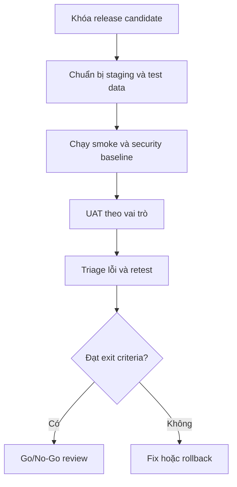

# SOP-012 — UAT, Security Hardening & Pilot Release

| Thuộc tính | Giá trị |
|---|---|
| Mã SOP | SOP-012 |
| Phiên bản | 1.0 — Release Candidate |
| Phạm vi | SOP Governance + Lead-to-Enrollment Pilot |
| Chủ sở hữu | Product Owner / IT Manager |
| Approver | Business Owner + Security Owner |
| Phân loại | Internal |

## 1. Mục đích

Quy định cách nghiệm thu, kiểm tra bảo mật, kiểm tra khả năng phục hồi và phát
hành pilot SOP OS mà không đưa dữ liệu hoặc người dùng thật vào hệ thống khi
các gate bắt buộc chưa đạt.

## 2. Nguyên tắc bắt buộc

1. Không dùng dữ liệu PII/HRI thật trong Dev hoặc UAT nếu chưa có phê duyệt.
2. Không bật `AUTH_MODE=development` trên staging hoặc production.
3. Không bỏ qua lỗi P0/P1 bằng xác nhận miệng; mọi waiver phải có owner,
   lý do, thời hạn và approver.
4. Migration, release và rollback phải chạy từ phiên bản source đã định danh.
5. Mọi bằng chứng UAT/security/restore phải liên kết release candidate.
6. Pilot không đồng nghĩa production sign-off.

## 3. Vai trò và trách nhiệm

| Vai trò | Trách nhiệm |
|---|---|
| Product Owner | Khóa phạm vi, chấp nhận outcome và quyết định go/no-go |
| IT/Release Manager | Deploy, backup, rollback, monitoring và evidence pack |
| Admission Officer | UAT Lead, Application, interaction và task |
| Admission Manager | UAT assignment, approval, exception và dashboard |
| SOP Author/Reviewer/Approver | UAT Studio, review, version và publication |
| Finance/Academic | UAT Contract/Fee Plan và Handover |
| Security Owner | Review RBAC, vulnerability, logging và privacy |
| Auditor | Xác nhận audit append-only, hash chain và export control |

## 4. Điều kiện vào UAT

- Release candidate build thành công từ CI.
- Database migration và seed UAT hoàn tất, không có dữ liệu production.
- Staging sử dụng HTTPS, secret manager và IdP đã chọn.
- Role/campus scope đã import và được owner kiểm tra.
- Backup trước release đã hoàn tất.
- Monitoring cho API health, 5xx, latency, database và outbox đang hoạt động.
- Danh sách UAT user và test data được phê duyệt.

Nếu thiếu một điều kiện, Release Manager ghi trạng thái `BLOCKED`; không tự
chuyển sang `PASS WITH CONDITION`.

## 5. UAT workflow

## 6. Danh mục test UAT bắt buộc

| ID | Persona | Kịch bản | Kết quả mong đợi | Priority |
|---|---|---|---|---|
| UAT-001 | Admission Officer | Tạo Lead đủ email/phone | Lead New; audit và outbox được tạo | P0 |
| UAT-002 | Admission Officer | Tạo Lead trùng contact | Bị chặn 409; hiển thị Lead nghi trùng | P0 |
| UAT-003 | Admission Manager | Assign Lead | Bắt buộc owner và next action | P0 |
| UAT-004 | Admission Officer | New chuyển thẳng Converted | Bị chặn; không thay đổi dữ liệu | P0 |
| UAT-005 | Admission Officer | Close Lead không có reason | Bị chặn validation | P0 |
| UAT-006 | Admission Officer | Qualified Lead tạo Application | Application Draft; Lead Converted | P0 |
| UAT-007 | Admission Officer | Submit Application thiếu field | Bị chặn theo checklist | P0 |
| UAT-008 | Reviewer | Mark Application Incomplete | Reason bắt buộc; task được tạo | P0 |
| UAT-009 | Reviewer | Verify hồ sơ | Trạng thái Verified; audit đầy đủ | P0 |
| UAT-010 | Admission Manager | Tạo và submit Offer | Đúng version, expiry và terms | P0 |
| UAT-011 | Approver | Approve Offer | SoD và scope được kiểm tra | P0 |
| UAT-012 | Admission Officer | Issue Offer | Timestamp/event được tạo | P0 |
| UAT-013 | Guardian test | Accept Offer còn hạn | Offer Accepted | P0 |
| UAT-014 | Guardian test | Accept Offer hết hạn | Bị chặn | P0 |
| UAT-015 | Admission Manager | Confirm Enrollment | Chỉ từ Offer Accepted | P0 |
| UAT-016 | Finance | Tạo Contract/Fee Plan | Bản Draft liên kết Enrollment | P0 |
| UAT-017 | Academic | Handover thiếu checklist | Không thể Ready/Accept | P0 |
| UAT-018 | Academic | Return Handover không reason | Bị chặn | P0 |
| UAT-019 | Academic | Accept Handover đầy đủ | Enrollment Handed Over | P0 |
| UAT-020 | SOP Author | Tạo SOP dưới Process L3 | SOP + Draft v1 được tạo | P0 |
| UAT-021 | SOP Author | Lưu section với row version cũ | Trả 409; không silent overwrite | P0 |
| UAT-022 | SOP Author | Submit SOP thiếu section/step | Bị chặn Blocking validation | P0 |
| UAT-023 | SOP Author | Tự approve phiên bản của mình | Bị chặn SoD | P0 |
| UAT-024 | Approver | Approve và activate SOP | Chỉ một version Effective | P0 |
| UAT-025 | SOP Author | Sửa Effective version | Bị chặn immutable control | P0 |
| UAT-026 | User Campus A | Truy cập hồ sơ Campus B | 403/404; không rò rỉ metadata | P0 |
| UAT-027 | User thiếu permission | Gọi mutation qua API trực tiếp | 403 | P0 |
| UAT-028 | Auditor | Kiểm tra audit integrity | `valid=true`; chuỗi hash liên tục | P0 |
| UAT-029 | Admission Manager | Xem dashboard/task quá hạn | Số liệu khớp dữ liệu nguồn | P1 |
| UAT-030 | Mobile user | Dùng dashboard màn hình nhỏ | Không mất action P0 hoặc tràn layout | P1 |

## 7. Quy trình ghi nhận kết quả

Mỗi test case phải ghi:

- Release/version và môi trường.
- Tester, vai trò, campus và thời gian.
- Test data ID, không ghi plaintext HRI vào ảnh/log.
- Actual result, `PASS/FAIL/BLOCKED` và evidence link.
- Defect ID, severity, owner và retest result nếu Fail.

Severity:

| Mức | Định nghĩa | Xử lý |
|---|---|---|
| Sev-1 | Mất dữ liệu, lộ HRI, bypass auth hoặc hệ thống không dùng được | Stop pilot, rollback ngay |
| Sev-2 | Sai workflow/approval/audit P0, không có workaround an toàn | No-Go |
| Sev-3 | Lỗi chức năng có workaround được phê duyệt | Fix hoặc waiver có hạn |
| Sev-4 | UI/cosmetic không ảnh hưởng kiểm soát | Có thể đưa backlog |

## 8. Security verification

| Control | Cách kiểm tra | Pass criteria |
|---|---|---|
| Authentication | OIDC login, disabled user, expired session | Không có local password; session lỗi bị từ chối |
| Authorization | API direct-call theo role/campus | 100% negative cases P0 bị chặn |
| SoD | Author/Requester tự approve | Không thể tự approve khi policy cấm |
| Input validation | UUID, status, required field, oversized body | 4xx an toàn; không stack trace |
| Security headers | Smoke scan HTTPS response | CSP, no-sniff, frame deny, no-store có mặt |
| CORS | Origin hợp lệ và origin lạ | Chỉ allowlist được cấp credential |
| Secrets | Scan repo/image/runtime config | Không secret thật trong source/log/image |
| Dependency | SCA và container scan | Không Critical/High chưa xử lý/waive |
| Database | Least privilege và encrypted connection | App user không phải owner/superuser |
| Audit | Append-only và hash-chain verification | Update/delete bị chặn; chain valid |
| Privacy | Role visibility và export | HRI chỉ hiển thị need-to-know; export có audit |
| Outbox | Retry/dead-letter | Không mất event; lỗi không giữ transaction chính |
| Backup | Restore sang isolated target | Dữ liệu/schema nhất quán; bằng chứng lưu lại |

## 9. Backup/restore verification

1. Tạo backup mã hóa từ staging trước release.
2. Ghi checksum, thời gian, size, database version và retention target.
3. Restore vào database cô lập, không ghi đè staging hiện hành.
4. Chạy migrations status, row-count reconciliation và `/health`.
5. Kiểm tra ít nhất Organization, SOP Effective, Lead/Application, audit và outbox.
6. Ghi thời gian restore thực tế so với RTO được phê duyệt.
7. Xóa bản restore test theo retention policy sau sign-off.

RPO/RTO chính thức phải được Business Owner phê duyệt trước production pilot;
không dùng giá trị ngầm định từ môi trường development.

## 10. Pilot rollout

Phạm vi đề xuất:

- Một campus, 5–10 người dùng được đào tạo.
- 10 SOP `ADM-001…ADM-010`.
- Dữ liệu pilot có consent và retention rule rõ ràng.
- Thời gian quan sát hai tuần trước production expansion.

Các wave:

| Wave | Phạm vi | Gate |
|---|---|---|
| 0 | IT/Product smoke | Health, migration, auth, audit đạt |
| 1 | SOP Author/Reviewer | Studio, review, publication đạt |
| 2 | Admission team nhỏ | Lead-to-Application đạt |
| 3 | Admission + Finance + Academic | Offer-to-Handover đạt |
| 4 | Pilot review | KPI, defect, support và security được sign-off |

## 11. Go/No-Go criteria

Go khi đồng thời:

- 100% test P0 Pass.
- Ít nhất 95% P1 Pass; phần còn lại có waiver được duyệt.
- Không còn Sev-1/Sev-2 mở.
- Không còn lỗ hổng Critical/High chưa xử lý hoặc chưa được risk owner chấp nhận.
- Restore test đạt RPO/RTO đã phê duyệt.
- Audit integrity, monitoring, alert và rollback rehearsal đạt.
- Product Owner, IT/Release, Security và Business Owner ký xác nhận.

## 12. Rollback trigger và thủ tục

Rollback ngay khi có một trong các tình huống:

- Bypass authentication/authorization hoặc lộ HRI.
- Migration gây mất/corrupt dữ liệu.
- Audit/outbox không ghi được cho mutation P0.
- Tỷ lệ 5xx hoặc latency vượt ngưỡng pilot đã duyệt liên tục.
- Lead/Application/SOP state machine cho phép transition sai.

Thủ tục:

1. Freeze mutation và thông báo Incident Commander.
2. Thu thập correlation ID, log và deployment version; không chép HRI vào chat.
3. Rollback application về image/version trước đó.
4. Chỉ rollback database theo runbook migration đã review; ưu tiên forward-fix.
5. Verify health, critical read paths, audit và outbox.
6. Gửi status cho stakeholder và mở post-incident review.

## 13. Exit criteria Step 12

| Gate | Owner | Evidence | Status |
|---|---|---|---|
| CI/build/smoke | Engineering | CI run | Ready locally |
| UAT P0/P1 | Product Owner | UAT record | Pending staging |
| OIDC/RBAC negative test | Security Owner | Test report | Pending IdP |
| Vulnerability/container scan | Security Owner | Scan report | Pending CI registry |
| Backup/restore | IT Manager | Restore evidence | Pending staging |
| Pilot go/no-go | Business Owner | Signed decision | Pending |

Step 12 chỉ được đánh dấu `COMPLETED` khi tất cả gate chuyển sang `PASS` hoặc
có waiver hợp lệ. Bộ mã nguồn hiện tại là release candidate, không phải bằng
chứng production acceptance.
