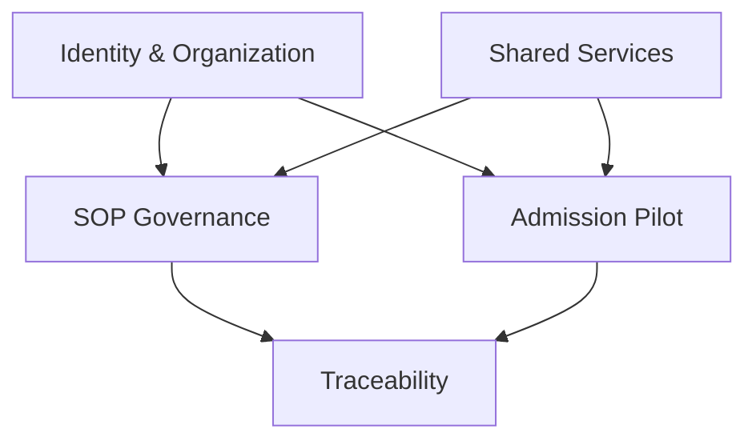
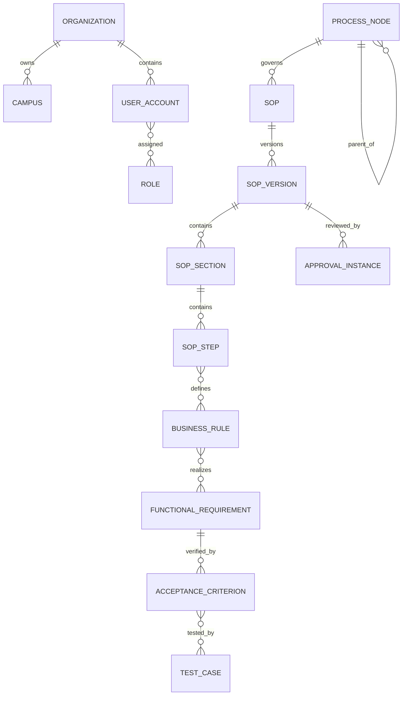
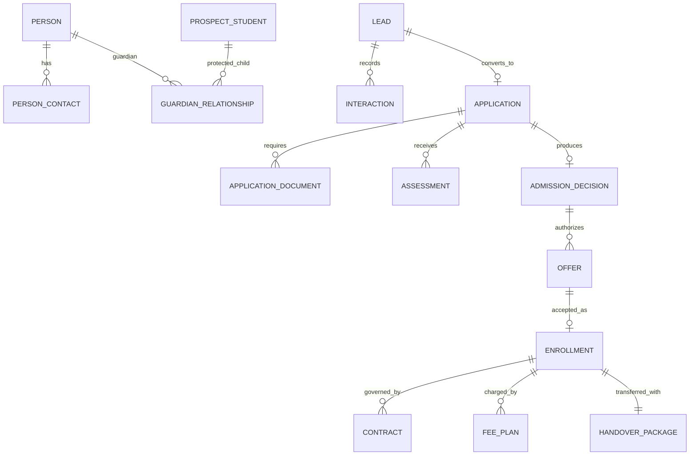

# CANONICAL DATA MODEL & DATA DICTIONARY — SOP WEB APP MVP

| Thuộc tính | Giá trị |
|---|---|
| Mã tài liệu | CDM-MVP-001 |
| Phiên bản | 0.1 — Proposed |
| Phạm vi | SOP Platform + Lead-to-Enrollment Pilot |
| Database định hướng | PostgreSQL |
| Kiến trúc dữ liệu | Logical model, modular monolith ready |
| Multi-campus | Bắt buộc |
| Ngôn ngữ dữ liệu | English technical names; Vietnamese UI labels |

## 1. Mục tiêu

Tài liệu định nghĩa nguồn dữ liệu chuẩn để đội Product, BA, UX, Developer và QA cùng sử dụng. Mục tiêu là tránh việc SOP, workflow, admission và permission tự tạo entity/status không nhất quán.

Data model gồm hai bounded context:

1. **SOP Governance Platform:** quản trị process, SOP, version, approval, rule, requirement và audit.
2. **Admission Pilot:** kiểm chứng SOP bằng quy trình Lead-to-Enrollment.

Hai context dùng chung Organization, Campus, Identity, Document, Task, Notification và Audit services.

## 2. Quy ước mô hình

### 2.1 Quy ước đặt tên

- Database table/column: `snake_case`, tiếng Anh.
- Entity trong tài liệu: `PascalCase`.
- Primary key: `id` kiểu UUID.
- Foreign key: `<entity>_id`.
- Business code: `code`, duy nhất trong scope tương ứng.
- Timestamps: `timestamptz`, lưu UTC, hiển thị theo timezone tổ chức/campus.
- Trường ngày thuần túy: `date`; không dùng timestamp cho ngày sinh.
- Tiền: `numeric(19,4)` + `currency_code`; không dùng floating point.
- Soft archive: `archived_at`, không lạm dụng `is_deleted`.
- Optimistic locking: `row_version bigint` tăng đơn điệu.

### 2.2 Cột chuẩn

Các entity nghiệp vụ có tối thiểu:

| Field | Type | Mô tả |
|---|---|---|
| id | uuid | Technical primary key |
| organization_id | uuid | Tenant/organization scope |
| created_at | timestamptz | Thời điểm tạo |
| created_by | uuid | User tạo |
| updated_at | timestamptz | Thời điểm cập nhật |
| updated_by | uuid | User cập nhật |
| row_version | bigint | Kiểm soát concurrent update |
| archived_at | timestamptz nullable | Thời điểm archive nếu áp dụng |

Không thêm `campus_id` cho mọi bảng. Campus scope được đặt ở entity cần thiết hoặc bảng liên kết scope.

### 2.3 Phân loại dữ liệu

| Level | Code | Ví dụ | Control baseline |
|---|---|---|---|
| Public | PUB | Tên chương trình công khai | Không chứa PII |
| Internal | INT | Process map, SOP nội bộ | Authenticated access |
| Confidential | CON | Lead contact, pricing nội bộ | RBAC, audit export |
| Highly Restricted | HRI | Dữ liệu trẻ em, assessment, y tế, contract | Need-to-know, masking, detailed audit |

### 2.4 Retention

Retention period chưa được pháp lý/doanh nghiệp xác nhận sẽ lưu bằng policy reference, không hard-code trong logic:

- `retention_policy_id`
- `retention_start_at`
- `retention_until`
- `legal_hold` boolean
- `disposition_status`

Mọi thời hạn trong tài liệu là `TBD` cho đến khi đối chiếu quy định hiện hành và policy nhà trường.

## 3. Context map

Shared Services gồm Document, Task, Notification và Audit. Admission tham chiếu SOP/Rule bằng stable ID nhưng không được phụ thuộc trực tiếp cấu trúc nội dung của SOP version.

## 4. Logical ERD — SOP Governance

## 5. Logical ERD — Admission Pilot

## 6. Entity catalog tổng thể

| Domain | Entity | Purpose | Classification |
|---|---|---|---|
| Organization | Organization | Tenant/business unit gốc | INT |
| Organization | Campus | Cơ sở áp dụng | INT |
| Organization | Department | Phòng ban | INT |
| Identity | UserAccount | Tài khoản người dùng | CON |
| Identity | Role | Vai trò bảo mật | INT |
| Identity | Permission | Action/resource permission | INT |
| Identity | UserRoleScope | Gán role theo campus/domain | CON |
| Process | ProcessNode | Cây L0–L3 | INT |
| Process | ProcessDependency | Upstream/downstream | INT |
| SOP | SOP | Identity ổn định của SOP | INT |
| SOP | SOPVersion | Version nội dung | INT |
| SOP | SOPSection | Section theo template | INT |
| SOP | SOPStep | Bước nghiệp vụ cấu trúc | INT |
| SOP | RACIEntry | Trách nhiệm theo activity | INT |
| SOP | SOPScope | Phạm vi campus/organization | INT |
| Governance | ApprovalDefinition | Mẫu workflow phê duyệt | INT |
| Governance | ApprovalInstance | Một lần approval thực tế | CON |
| Governance | ApprovalAction | Approve/reject/rework history | CON |
| Traceability | BusinessRule | Rule có ID/version | INT/CON |
| Traceability | FunctionalRequirement | Yêu cầu hệ thống | INT |
| Traceability | AcceptanceCriterion | Tiêu chí nghiệm thu | INT |
| Traceability | TestCase | Test scenario | INT |
| Traceability | TraceLink | Liên kết truy vết có kiểu | INT |
| Admission | Person | Master cá nhân | HRI |
| Admission | PersonContact | Email/phone/address | HRI |
| Admission | ProspectStudent | Hồ sơ trẻ tiềm năng | HRI |
| Admission | GuardianRelationship | Quan hệ và thẩm quyền giám hộ | HRI |
| Admission | Lead | Cơ hội tuyển sinh | CON |
| Admission | Interaction | Nhật ký tương tác | CON |
| Admission | SchoolTour | Lịch tham quan | CON |
| Admission | Application | Hồ sơ ứng tuyển | HRI |
| Admission | ApplicationDocument | Checklist tài liệu | HRI |
| Admission | Assessment | Kết quả đánh giá | HRI |
| Admission | AdmissionDecision | Quyết định tuyển sinh | HRI |
| Admission | Offer | Đề nghị nhập học | CON/HRI |
| Admission | Enrollment | Ghi nhận nhập học | HRI |
| Finance | Contract | Hợp đồng | HRI |
| Finance | FeePlan | Kế hoạch phí | HRI |
| Finance | FeePlanLine | Chi tiết khoản phí | HRI |
| Finance | DiscountRequest | Xin giảm giá/học bổng | HRI |
| Handover | HandoverPackage | Hồ sơ bàn giao | HRI |
| Handover | HandoverItem | Checklist bàn giao | HRI |
| Shared | DocumentAsset | Metadata tệp/tài liệu | Theo object |
| Shared | Task | Việc cần làm/SLA | CON |
| Shared | Comment | Bình luận theo context | CON |
| Shared | Notification | Thông báo | CON |
| Shared | AuditEvent | Audit bất biến | HRI |

## 7. Data dictionary — Organization & Identity

### 7.1 Organization

| Field | Type | Required | Rule |
|---|---|---:|---|
| id | uuid | Yes | PK |
| code | varchar(30) | Yes | Unique, immutable |
| name | varchar(255) | Yes | Tên hiển thị |
| legal_name | varchar(255) | No | Tên pháp lý |
| default_timezone | varchar(64) | Yes | IANA timezone |
| default_locale | varchar(16) | Yes | Ví dụ `vi-VN` |
| status | enum | Yes | ACTIVE/INACTIVE |

### 7.2 Campus

| Field | Type | Required | Rule |
|---|---|---:|---|
| id | uuid | Yes | PK |
| organization_id | uuid | Yes | FK Organization |
| code | varchar(30) | Yes | Unique trong organization |
| name | varchar(255) | Yes |  |
| address_json | jsonb | No | Structured address; tránh nhiều cột cứng |
| timezone | varchar(64) | No | Inherit organization nếu null |
| status | enum | Yes | ACTIVE/INACTIVE |

### 7.3 Department

| Field | Type | Required | Rule |
|---|---|---:|---|
| id | uuid | Yes | PK |
| organization_id | uuid | Yes | FK |
| campus_id | uuid | No | Null nếu department toàn hệ thống |
| parent_department_id | uuid | No | Self-reference |
| code | varchar(30) | Yes | Unique trong scope |
| name | varchar(255) | Yes |  |
| status | enum | Yes | ACTIVE/INACTIVE |

### 7.4 UserAccount

| Field | Type | Required | Rule |
|---|---|---:|---|
| id | uuid | Yes | PK |
| organization_id | uuid | Yes | FK |
| external_subject | varchar(255) | No | SSO immutable subject |
| email_normalized | varchar(320) | Yes | Unique trong organization |
| display_name | varchar(255) | Yes |  |
| account_type | enum | Yes | STAFF/PARENT/SERVICE |
| status | enum | Yes | INVITED/ACTIVE/SUSPENDED/DISABLED |
| last_login_at | timestamptz | No |  |
| mfa_state | enum | No | Provider dependent |

Không lưu password plaintext; nếu có local authentication phải dùng identity provider/library chuẩn.

### 7.5 Role, Permission, UserRoleScope

| Entity | Field chính | Rule |
|---|---|---|
| Role | code, name, role_type, status | Không đồng nhất Role nghiệp vụ và Job Title nếu khác nhau |
| Permission | resource, action, condition_key | Ví dụ `sop:approve`, `assessment:view` |
| RolePermission | role_id, permission_id, effect | MVP ưu tiên allow list; deny dùng thận trọng |
| UserRoleScope | user_id, role_id, campus_id, domain_code, valid_from/to | Scope null chỉ khi quyền toàn organization được cấp rõ |

## 8. Data dictionary — Process & SOP

### 8.1 ProcessNode

| Field | Type | Required | Rule |
|---|---|---:|---|
| id | uuid | Yes | PK |
| organization_id | uuid | Yes | FK |
| parent_id | uuid | No | Null chỉ cho L0 |
| level | enum | Yes | L0/L1/L2/L3 |
| code | varchar(50) | Yes | Unique trong organization |
| name | varchar(255) | Yes |  |
| description | text | No |  |
| process_owner_role_id | uuid | No | TBD trước Approved |
| priority | enum | Yes | P0/P1/P2 |
| process_type | enum | Yes | OPERATIONAL/CONTROL/MANAGEMENT/COMPLIANCE |
| status | enum | Yes | PROPOSED/APPROVED/RETIRED |
| sort_order | integer | Yes | >= 0 |

Constraint: parent level phải đúng thứ tự; không được tạo cycle.

### 8.2 ProcessDependency

| Field | Type | Required | Rule |
|---|---|---:|---|
| id | uuid | Yes | PK |
| source_process_id | uuid | Yes | FK ProcessNode |
| target_process_id | uuid | Yes | FK ProcessNode |
| dependency_type | enum | Yes | UPSTREAM/DOWNSTREAM/SHARED_SERVICE/DATA/EVENT |
| description | text | No |  |

Unique: source + target + type. Source không được bằng target.

### 8.3 SOP

SOP là identity ổn định, không chứa nội dung versioned.

| Field | Type | Required | Rule |
|---|---|---:|---|
| id | uuid | Yes | PK |
| organization_id | uuid | Yes | FK |
| process_node_id | uuid | Yes | Phải là L3 hoặc policy cho phép |
| code | varchar(50) | Yes | Ví dụ ADM-001; unique |
| title | varchar(255) | Yes | Tên hiện hành để tìm kiếm |
| sop_type | enum | Yes | OPERATIONAL/CONTROL/MANAGEMENT/COMPLIANCE |
| owner_role_id | uuid | Yes trước publish | Process Owner |
| priority | enum | Yes | P0/P1/P2 |
| lifecycle_status | enum | Yes | ACTIVE/RETIRED; version có trạng thái chi tiết |
| review_cycle_months | smallint | No | > 0 hoặc policy reference |

### 8.4 SOPScope

| Field | Type | Required | Rule |
|---|---|---:|---|
| id | uuid | Yes | PK |
| sop_id | uuid | Yes | FK SOP |
| scope_type | enum | Yes | ORGANIZATION/CAMPUS/PROGRAM |
| scope_ref_id | uuid | No | Null chỉ với ORGANIZATION |
| valid_from | date | No |  |
| valid_to | date | No | >= valid_from |

### 8.5 SOPVersion

| Field | Type | Required | Rule |
|---|---|---:|---|
| id | uuid | Yes | PK |
| sop_id | uuid | Yes | FK SOP |
| version_number | integer | Yes | Tăng dần, unique theo SOP |
| version_label | varchar(30) | Yes | Ví dụ `1.0` |
| status | enum | Yes | DRAFT/IN_REVIEW/REVISION_REQUIRED/APPROVED/SCHEDULED/EFFECTIVE/SUPERSEDED/ARCHIVED |
| based_on_version_id | uuid | No | Lineage |
| change_summary | text | No | Required khi submit version > 1 |
| effective_from | timestamptz | No | Required cho SCHEDULED/EFFECTIVE |
| effective_to | timestamptz | No | System set khi superseded |
| review_due_at | date | No | Tính từ policy |
| approved_at | timestamptz | No | System controlled |
| approved_by | uuid | No | System controlled |
| content_hash | varchar(128) | No | Integrity/export comparison |
| locked_at | timestamptz | No | Lock immutable state |

Constraint quan trọng: chỉ một version `EFFECTIVE` cho mỗi SOP và scope tại một thời điểm. Dùng exclusion constraint hoặc transaction guard.

### 8.6 SOPSection

| Field | Type | Required | Rule |
|---|---|---:|---|
| id | uuid | Yes | PK |
| sop_version_id | uuid | Yes | FK |
| section_key | varchar(50) | Yes | Stable key, ví dụ PURPOSE/RACI/TO_BE |
| title | varchar(255) | Yes |  |
| content_json | jsonb | No | Rich-text structured content |
| sort_order | smallint | Yes | Unique theo version |
| completeness_state | enum | Yes | EMPTY/DRAFT/VALID/NEEDS_REVIEW |

Không lưu chỉ HTML thô. Editor content cần schema version để migration an toàn.

### 8.7 SOPStep

| Field | Type | Required | Rule |
|---|---|---:|---|
| id | uuid | Yes | PK |
| sop_version_id | uuid | Yes | FK |
| section_id | uuid | No | Thường thuộc TO_BE section |
| step_no | integer | Yes | Unique theo version |
| name | varchar(255) | Yes |  |
| actor_role_id | uuid | Yes | FK Role |
| action_text | text | Yes |  |
| input_json | jsonb | No | Structured refs |
| output_json | jsonb | No | Structured refs |
| status_before | varchar(50) | No | Ref enum catalog nếu có |
| status_after | varchar(50) | No | Ref enum catalog nếu có |
| sla_definition_id | uuid | No |  |
| notification_rule_id | uuid | No |  |
| exception_summary | text | No |  |
| automation_type | enum | No | MANUAL/AUTO/AI/RULE/WORKFLOW/INTEGRATION/OCR/RPA |

### 8.8 RACIEntry

| Field | Type | Required | Rule |
|---|---|---:|---|
| id | uuid | Yes | PK |
| sop_version_id | uuid | Yes | FK |
| sop_step_id | uuid | No | Null nếu activity ở cấp SOP |
| activity_name | varchar(255) | Yes |  |
| role_id | uuid | Yes | FK Role |
| responsibility | enum | Yes | R/A/C/I |

Constraint: mỗi activity chỉ có một `A`; có ít nhất một `R` trước publish.

## 9. Data dictionary — Approval & Traceability

### 9.1 ApprovalDefinition

| Field | Type | Required | Rule |
|---|---|---:|---|
| id | uuid | Yes | PK |
| code | varchar(50) | Yes | Unique |
| object_type | varchar(50) | Yes | SOP_VERSION/OFFER/DISCOUNT/... |
| name | varchar(255) | Yes |  |
| definition_version | integer | Yes | Immutable after use |
| steps_json | jsonb | Yes | Ordered approver rules |
| status | enum | Yes | DRAFT/ACTIVE/RETIRED |

### 9.2 ApprovalInstance và ApprovalAction

| Entity | Field chính | Rule |
|---|---|---|
| ApprovalInstance | definition_id/version, object_type/id, status, started_at, due_at, completed_at | Snapshot definition version tại thời điểm start |
| ApprovalAction | instance_id, step_no, actor_id, action, reason, acted_at, delegated_from | Append-only |

Approval status: `PENDING/IN_PROGRESS/APPROVED/REJECTED/CANCELLED/EXPIRED`.

### 9.3 BusinessRule

| Field | Type | Required | Rule |
|---|---|---:|---|
| id | uuid | Yes | PK |
| code | varchar(50) | Yes | Ví dụ BR-ADM-001 |
| title | varchar(255) | Yes |  |
| statement | text | Yes | Testable, không mơ hồ |
| rule_type | enum | Yes | VALIDATION/ELIGIBILITY/CALCULATION/APPROVAL/SECURITY/TRANSITION |
| severity | enum | Yes | BLOCK/WARN/INFO |
| implementation_mode | enum | Yes | MANUAL/SYSTEM/CONFIGURABLE |
| status | enum | Yes | DRAFT/APPROVED/ACTIVE/RETIRED |
| effective_from/to | timestamptz | No |  |
| owner_role_id | uuid | Yes |  |

Rule versioning nên theo entity `BusinessRuleVersion` ở Phase 2 nếu rule thay đổi độc lập thường xuyên; MVP có thể khóa bản ghi Active và tạo record kế nhiệm.

### 9.4 FunctionalRequirement

| Field | Type | Required | Rule |
|---|---|---:|---|
| id | uuid | Yes | PK |
| code | varchar(50) | Yes | Ví dụ FR-ADM-001 |
| title | varchar(255) | Yes |  |
| requirement_text | text | Yes | “Hệ thống phải...” |
| priority | enum | Yes | MUST/SHOULD/COULD/WONT |
| module_code | varchar(50) | Yes |  |
| status | enum | Yes | PROPOSED/APPROVED/IN_BUILD/IMPLEMENTED/VERIFIED/RETIRED |
| owner_id | uuid | No | Product/BA owner |
| release_ref | varchar(100) | No | Không hard FK khi chưa có Release module |

### 9.5 AcceptanceCriterion, TestCase, TraceLink

| Entity | Field chính | Rule |
|---|---|---|
| AcceptanceCriterion | code, requirement_id, given_text, when_text, then_text, status | Một FR có nhiều AC |
| TestCase | code, title, test_type, precondition, steps_json, expected_result, status | Test type: HAPPY/VALIDATION/BOUNDARY/EXCEPTION/PERMISSION/APPROVAL/AUDIT/INTEGRATION |
| TraceLink | source_type/id, target_type/id, link_type | Không dùng polymorphic FK không kiểm soát ở DB mà không có validation service |

Link type: `DERIVES_FROM/IMPLEMENTS/VERIFIES/TESTS/DEPENDS_ON/IMPACTS/SUPERSEDES`.

## 10. Data dictionary — Admission master

### 10.1 Person

Person là identity của con người, không đồng nghĩa UserAccount.

| Field | Type | Required | Rule |
|---|---|---:|---|
| id | uuid | Yes | PK |
| organization_id | uuid | Yes | FK |
| first_name | varchar(100) | Yes |  |
| middle_name | varchar(100) | No |  |
| last_name | varchar(100) | Yes |  |
| preferred_name | varchar(100) | No |  |
| date_of_birth | date | No | Required tùy role/stage |
| gender_code | varchar(30) | No | Configurable; hạn chế dùng nếu không cần |
| nationality_code | char(2) | No | ISO khi thu thập hợp lệ |
| identity_match_key | varchar(128) | No | Hash/derived, restricted |
| data_classification | enum | Yes | HRI |

### 10.2 PersonContact

| Field | Type | Required | Rule |
|---|---|---:|---|
| id | uuid | Yes | PK |
| person_id | uuid | Yes | FK |
| contact_type | enum | Yes | EMAIL/PHONE/ADDRESS |
| value_encrypted | text | Yes | Encrypt phù hợp architecture |
| value_normalized_hash | varchar(128) | No | Duplicate/search without plaintext index |
| is_primary | boolean | Yes | Một primary mỗi type/person |
| verified_at | timestamptz | No |  |
| consent_id | uuid | No | Nếu purpose yêu cầu |

### 10.3 ProspectStudent

| Field | Type | Required | Rule |
|---|---|---:|---|
| id | uuid | Yes | PK |
| person_id | uuid | Yes | Unique FK Person |
| preferred_campus_id | uuid | No | FK Campus |
| preferred_program_id | uuid | No | Master reference |
| expected_start_date | date | No |  |
| current_stage | enum | Yes | PROSPECT/APPLICANT/OFFERED/ENROLLED/CLOSED |
| student_id | uuid | No | Populated after Student Master creation |

### 10.4 GuardianRelationship

| Field | Type | Required | Rule |
|---|---|---:|---|
| id | uuid | Yes | PK |
| guardian_person_id | uuid | Yes | FK Person |
| prospect_student_id | uuid | Yes | FK |
| relationship_type | enum | Yes | PARENT/GUARDIAN/OTHER |
| legal_authority_status | enum | Yes | DECLARED/VERIFIED/RESTRICTED/TBD |
| is_primary_contact | boolean | Yes |  |
| may_submit_application | boolean | Yes |  |
| may_accept_offer | boolean | Yes |  |
| valid_from/to | date | No |  |

Không suy ra quyền ký/đón trẻ chỉ từ relationship type.

### 10.5 Consent

| Field | Type | Required | Rule |
|---|---|---:|---|
| id | uuid | Yes | PK |
| subject_person_id | uuid | No | Người liên quan |
| granted_by_person_id | uuid | Yes | Người cấp consent |
| consent_type | enum | Yes | MARKETING/DATA_PROCESSING/IMAGE/MEDICAL/... |
| policy_version | varchar(50) | Yes |  |
| status | enum | Yes | GRANTED/WITHDRAWN/EXPIRED |
| granted_at | timestamptz | Yes |  |
| withdrawn_at | timestamptz | No |  |
| evidence_document_id | uuid | No |  |

## 11. Data dictionary — Lead & Engagement

### 11.1 Lead

| Field | Type | Required | Rule |
|---|---|---:|---|
| id | uuid | Yes | PK |
| code | varchar(50) | Yes | Unique business ID |
| primary_contact_person_id | uuid | Yes | FK Person |
| prospect_student_id | uuid | No | Có thể bổ sung sau contact đầu tiên |
| campus_id | uuid | No | Required trước Qualified |
| source_type | enum | Yes | WEBSITE/REFERRAL/WALK_IN/HOTLINE/CAMPAIGN/IMPORT/OTHER |
| source_ref | varchar(100) | No | Campaign/referral ref |
| owner_user_id | uuid | No | Required sau Assigned |
| status | enum | Yes | Theo Lead lifecycle |
| priority | enum | Yes | LOW/NORMAL/HIGH |
| program_interest_id | uuid | No |  |
| first_response_at | timestamptz | No | KPI |
| qualified_at | timestamptz | No |  |
| closed_at | timestamptz | No |  |
| close_reason_code | varchar(50) | No | Required khi closed branch |
| duplicate_of_lead_id | uuid | No | Chỉ khi DUPLICATE |
| next_action_at | timestamptz | No | Required cho active lead theo rule |

### 11.2 Interaction

| Field | Type | Required | Rule |
|---|---|---:|---|
| id | uuid | Yes | PK |
| lead_id | uuid | Yes | FK |
| channel | enum | Yes | PHONE/EMAIL/SMS/ZALO/IN_PERSON/PORTAL/OTHER |
| direction | enum | Yes | INBOUND/OUTBOUND |
| occurred_at | timestamptz | Yes |  |
| actor_user_id | uuid | No | Null với inbound automated import |
| subject | varchar(255) | No |  |
| summary | text | Yes | Không lưu dữ liệu nhạy cảm dư thừa |
| outcome_code | varchar(50) | No |  |
| next_action_at | timestamptz | No |  |

### 11.3 SchoolTour

| Field | Type | Required | Rule |
|---|---|---:|---|
| id | uuid | Yes | PK |
| lead_id | uuid | Yes | FK |
| campus_id | uuid | Yes | FK |
| scheduled_start/end | timestamptz | Yes | end > start |
| host_user_id | uuid | Yes |  |
| status | enum | Yes | REQUESTED/CONFIRMED/COMPLETED/NO_SHOW/CANCELLED/RESCHEDULED |
| attendee_count | smallint | No | >= 0 |
| outcome_code | varchar(50) | No | Required khi Completed |
| follow_up_at | timestamptz | No |  |

## 12. Data dictionary — Application & Assessment

### 12.1 Application

| Field | Type | Required | Rule |
|---|---|---:|---|
| id | uuid | Yes | PK |
| code | varchar(50) | Yes | Unique |
| lead_id | uuid | No | Cho phép direct application theo policy |
| prospect_student_id | uuid | Yes | FK |
| campus_id | uuid | Yes | FK |
| program_id | uuid | Yes | FK master |
| intake_id | uuid | Yes | FK master |
| academic_year_id | uuid | Yes | FK master |
| submitted_by_person_id | uuid | No | Required khi Submitted |
| status | enum | Yes | Application lifecycle |
| submitted_at | timestamptz | No |  |
| verified_at | timestamptz | No |  |
| assigned_user_id | uuid | No |  |
| current_checklist_version | integer | Yes | Snapshot requirement |
| decision_due_at | timestamptz | No | SLA |

Unique rule đề xuất: không có hai Application active cùng student + campus + program + intake, trừ khi policy cho phép.

### 12.2 ApplicationDocument

| Field | Type | Required | Rule |
|---|---|---:|---|
| id | uuid | Yes | PK |
| application_id | uuid | Yes | FK |
| document_type_id | uuid | Yes | FK master |
| requirement_key | varchar(100) | Yes | Snapshot checklist item |
| required_state | enum | Yes | REQUIRED/OPTIONAL/CONDITIONAL |
| document_asset_id | uuid | No | Null khi chưa nộp |
| verification_status | enum | Yes | MISSING/SUBMITTED/VERIFIED/REJECTED/EXPIRED |
| verified_by | uuid | No |  |
| verified_at | timestamptz | No |  |
| rejection_reason_code | varchar(50) | No | Required khi Rejected |
| valid_until | date | No |  |

### 12.3 Assessment

| Field | Type | Required | Rule |
|---|---|---:|---|
| id | uuid | Yes | PK |
| application_id | uuid | Yes | FK |
| assessment_type_id | uuid | Yes | Template reference |
| template_version | integer | Yes | Snapshot |
| assessor_user_id | uuid | Yes | Qualified actor |
| scheduled_at | timestamptz | No |  |
| completed_at | timestamptz | No |  |
| status | enum | Yes | PENDING/SCHEDULED/IN_PROGRESS/COMPLETED/NO_SHOW/CANCELLED/INCONCLUSIVE |
| result_code | varchar(50) | No | Required khi finalized |
| score_json | jsonb | No | Schema-versioned |
| recommendation_code | varchar(50) | No |  |
| finalized_at | timestamptz | No | Sau đó immutable |
| revision_of_id | uuid | No | Sửa bằng revision |

## 13. Data dictionary — Decision, Offer & Enrollment

### 13.1 AdmissionDecision

| Field | Type | Required | Rule |
|---|---|---:|---|
| id | uuid | Yes | PK |
| application_id | uuid | Yes | FK |
| outcome | enum | Yes | ACCEPT/CONDITIONAL/WAITLIST/REJECT |
| reason_code | varchar(50) | Yes |  |
| condition_json | jsonb | No | Required khi CONDITIONAL |
| decided_by | uuid | Yes |  |
| decided_at | timestamptz | Yes |  |
| approval_instance_id | uuid | No | Theo scenario |
| status | enum | Yes | DRAFT/PENDING_APPROVAL/FINALIZED/SUPERSEDED |

### 13.2 Offer

| Field | Type | Required | Rule |
|---|---|---:|---|
| id | uuid | Yes | PK |
| code | varchar(50) | Yes | Unique |
| admission_decision_id | uuid | Yes | FK |
| version_number | integer | Yes | Unique theo offer lineage |
| supersedes_offer_id | uuid | No |  |
| program_id | uuid | Yes |  |
| campus_id | uuid | Yes |  |
| proposed_start_date | date | Yes |  |
| terms_json | jsonb | Yes | Schema-versioned snapshot |
| expires_at | timestamptz | Yes | > issued_at |
| status | enum | Yes | Offer lifecycle |
| approval_instance_id | uuid | No |  |
| issued_at | timestamptz | No |  |
| viewed_at | timestamptz | No |  |
| response_at | timestamptz | No |  |
| responded_by_person_id | uuid | No | Kiểm tra authority |
| response_channel | enum | No | PORTAL/STAFF_RECORDED/SIGNATURE/OTHER |

### 13.3 Enrollment

| Field | Type | Required | Rule |
|---|---|---:|---|
| id | uuid | Yes | PK |
| code | varchar(50) | Yes | Unique |
| offer_id | uuid | Yes | FK accepted Offer |
| prospect_student_id | uuid | Yes | FK |
| student_id | uuid | No | Set khi Student Master được tạo |
| campus_id | uuid | Yes | FK |
| program_id | uuid | Yes | FK |
| intake_id | uuid | Yes | FK |
| start_date | date | Yes |  |
| end_date | date | No |  |
| status | enum | Yes | Enrollment lifecycle |
| confirmed_at | timestamptz | No |  |
| confirmed_by | uuid | No |  |
| capacity_reservation_id | uuid | No | Integration ref |
| blocker_summary_json | jsonb | No | Derived/cached; source vẫn là conditions |

## 14. Data dictionary — Contract, Fee & Handover

### 14.1 Contract

| Field | Type | Required | Rule |
|---|---|---:|---|
| id | uuid | Yes | PK |
| code | varchar(50) | Yes | Unique |
| enrollment_id | uuid | Yes | FK |
| template_id | uuid | Yes |  |
| template_version | integer | Yes | Snapshot |
| version_number | integer | Yes |  |
| status | enum | Yes | DRAFT/PENDING_REVIEW/PENDING_SIGNATURE/ACTIVE/REJECTED/VOIDED/TERMINATED/EXPIRED |
| terms_json | jsonb | Yes | Schema-versioned |
| valid_from/to | date | No |  |
| signed_at | timestamptz | No |  |
| activated_at | timestamptz | No |  |
| document_asset_id | uuid | No | Final rendered/signed artifact |
| supersedes_contract_id | uuid | No |  |

Active Contract immutable; amendment tạo version/record mới.

### 14.2 FeePlan và FeePlanLine

| Entity | Field chính | Rule |
|---|---|---|
| FeePlan | enrollment_id, fee_schedule_id/version, currency_code, status, effective dates, total_before/after_discount | Totals calculated, không nhập tay tùy ý |
| FeePlanLine | fee_plan_id, fee_type_id, description, quantity, unit_amount, discount_amount, tax_amount, due_rule_json | Currency đồng nhất trong plan |

FeePlan status: `DRAFT/PENDING_APPROVAL/APPROVED/ACTIVE/SUPERSEDED/CANCELLED`.

### 14.3 DiscountRequest

| Field | Type | Required | Rule |
|---|---|---:|---|
| id | uuid | Yes | PK |
| fee_plan_id | uuid | Yes | FK |
| discount_type_id | uuid | Yes |  |
| calculation_type | enum | Yes | PERCENT/FIXED |
| requested_value | numeric(19,4) | Yes | > 0 |
| reason_code | varchar(50) | Yes |  |
| requested_by | uuid | Yes |  |
| status | enum | Yes | DRAFT/PENDING/APPROVED/REJECTED/CANCELLED |
| approval_instance_id | uuid | No | Required khi vượt threshold |
| approved_value | numeric(19,4) | No | Không vượt requested nếu policy không cho phép |

### 14.4 HandoverPackage và HandoverItem

| Entity | Field chính | Rule |
|---|---|---|
| HandoverPackage | enrollment_id, checklist_template/version, status, submitted/returned/accepted timestamps, receiver_id | Một active package/enrollment |
| HandoverItem | package_id, item_key, label, required_state, completion_status, source_object_type/id, exception_approval_id | Snapshot checklist; không chỉ lưu boolean |

Handover status: `NOT_READY/READY/SUBMITTED/RETURNED_FOR_COMPLETION/ACCEPTED`.

## 15. Shared services dictionary

### 15.1 DocumentAsset

| Field | Type | Required | Rule |
|---|---|---:|---|
| id | uuid | Yes | PK |
| storage_key | varchar(1024) | Yes | Không lưu public URL vĩnh viễn |
| original_filename | varchar(255) | Yes | Sanitize khi hiển thị |
| mime_type | varchar(255) | Yes | Verify server-side |
| size_bytes | bigint | Yes | > 0, limit cấu hình |
| sha256 | char(64) | Yes | Integrity/duplicate aid |
| classification | enum | Yes | Inherit hoặc nâng mức object |
| malware_scan_status | enum | Yes | PENDING/CLEAN/QUARANTINED/FAILED |
| uploaded_by | uuid | Yes |  |
| uploaded_at | timestamptz | Yes |  |
| retention_policy_id | uuid | No |  |

### 15.2 Task

| Field chính | Rule |
|---|---|
| object_type/id, task_type, title, assignee_user/role, status, priority, due_at, completed_at, sla_policy_id | Object ref phải được application validation; status OPEN/IN_PROGRESS/COMPLETED/CANCELLED/OVERDUE |

### 15.3 Comment

| Field chính | Rule |
|---|---|
| object_type/id, section_ref, author_id, body_json, visibility, parent_comment_id, resolved_at | Không cho sửa im lặng sau approval; giữ edit history nếu cho phép |

### 15.4 Notification

| Field chính | Rule |
|---|---|
| recipient_id, event_type, channel, template/version, payload_json, status, scheduled/sent/delivered/read/failed timestamps | Payload không chứa dữ liệu HRI dư thừa |

### 15.5 AuditEvent

| Field | Type | Required | Rule |
|---|---|---:|---|
| id | uuid/uuidv7 | Yes | PK, time-sortable nếu chọn |
| organization_id | uuid | Yes |  |
| occurred_at | timestamptz | Yes | Server time |
| actor_type | enum | Yes | USER/SERVICE/SYSTEM |
| actor_id | uuid | No | Null chỉ cho system event |
| action | varchar(100) | Yes | Canonical verb |
| object_type | varchar(100) | Yes |  |
| object_id | uuid | Yes |  |
| before_json | jsonb | No | Mask/encrypt sensitive field |
| after_json | jsonb | No | Mask/encrypt sensitive field |
| reason | text | No | Required cho privileged action |
| source_ip | inet | No | Theo privacy policy |
| user_agent | text | No |  |
| correlation_id | uuid | No | Trace workflow/API |
| integrity_hash | varchar(128) | No | Tamper-evidence option |

AuditEvent append-only; không expose generic update/delete API.

## 16. Canonical enum catalog

### 16.1 SOP

- `sop_version_status`: DRAFT, IN_REVIEW, REVISION_REQUIRED, APPROVED, SCHEDULED, EFFECTIVE, SUPERSEDED, ARCHIVED.
- `sop_type`: OPERATIONAL, CONTROL, MANAGEMENT, COMPLIANCE.
- `priority`: P0, P1, P2.

### 16.2 Admission

- `lead_status`: NEW, ASSIGNED, CONTACTED, QUALIFIED, NURTURING, CONVERTED, DISQUALIFIED, LOST, DUPLICATE, ARCHIVED.
- `application_status`: DRAFT, SUBMITTED, DOCUMENT_REVIEW, INCOMPLETE, VERIFIED, ASSESSMENT_PENDING, ASSESSED, DECISION_PENDING, OFFERED, WAITLISTED, REJECTED.
- `offer_status`: DRAFT, PENDING_APPROVAL, APPROVED, ISSUED, VIEWED, ACCEPTED, DECLINED, EXPIRED, WITHDRAWN.
- `enrollment_status`: PENDING_CONFIRMATION, CONFIRMED, PENDING_CONTRACT, PENDING_FINANCIAL_CONDITION, READY_FOR_HANDOVER, HANDED_OVER, ON_HOLD, CANCELLED.

### 16.3 Governance

- `approval_action`: SUBMIT, APPROVE, REJECT, REQUEST_CHANGES, CANCEL, DELEGATE, ESCALATE.
- `trace_link_type`: DERIVES_FROM, IMPLEMENTS, VERIFIES, TESTS, DEPENDS_ON, IMPACTS, SUPERSEDES.
- `data_classification`: PUB, INT, CON, HRI.

Lookup có thể thay đổi theo doanh nghiệp (reason code, program type, assessment type) phải dùng master table, không dùng database enum cứng. Enum chỉ dành cho lifecycle/technical states ổn định.

## 17. Core constraints và indexes

### Constraints

1. Business code unique trong organization hoặc scope được định nghĩa.
2. `effective_to > effective_from` nếu cả hai có giá trị.
3. Một SOP chỉ có một Effective version trong cùng scope/time range.
4. Không xóa SOPVersion đã In Review trở lên.
5. Một RACI activity chỉ có một Accountable.
6. Offer Accepted phải có authorized responder và response timestamp.
7. Assessment finalized immutable; sửa qua revision.
8. Contract Active immutable; sửa qua amendment/version.
9. Handover Accepted không quay lại trạng thái trước nếu không có privileged correction event.
10. Child data không cascade delete theo UserAccount.

### Indexes baseline

- Unique indexes cho `organization_id + code`.
- Partial index cho active/open status.
- Composite index theo `campus_id, status, created_at` cho operational list.
- Full-text index cho SOP title/content projection; không index plaintext HRI rộng rãi.
- Index cho due/expiry: task due, offer expiry, review due.
- Hash/functional index cho normalized contact matching.
- Audit index theo object type/id/time và actor/time.

## 18. Versioning strategy

| Object | Strategy |
|---|---|
| SOP | Stable identity + immutable SOPVersion |
| SOP section/step | Thuộc trọn một SOPVersion; copy-on-new-version |
| Approval definition | Versioned snapshot khi instance bắt đầu |
| Assessment | Finalize + revision lineage |
| Offer | Version record + supersedes relation |
| Contract | Version/amendment record; Active immutable |
| Fee schedule/template | Reference kèm version snapshot |
| Master data | Valid-from/to hoặc successor record khi ảnh hưởng lịch sử |
| Audit | Append-only event |

Không dùng một cột JSON history chung thay cho version model ở các đối tượng có ý nghĩa pháp lý/nghiệp vụ.

## 19. Security và privacy model

### Row scope

- `organization_id` là boundary bắt buộc.
- Campus filtering áp dụng qua campus_id hoặc object relationship.
- Query service phải enforce scope; UI filter không phải security control.

### Field access

- Assessment result, contact detail, contract amount và identity document cần permission riêng.
- API response phải omit/mask field, không chỉ ẩn bằng CSS.
- Export là permission độc lập và audit bắt buộc.

### Encryption

- TLS in transit.
- Storage/database encryption at rest.
- Xem xét application-level encryption cho contact/identity/medical data.
- Key rotation và backup encryption thuộc Technical Security Design.

### Data subject controls

- Consent version và withdrawal.
- Access/correction request workflow ở phase phù hợp.
- Legal hold chặn disposition.
- Anonymization/pseudonymization qua job có audit, không dùng ad-hoc SQL.

## 20. Retention matrix — Proposed

| Data category | Trigger bắt đầu | Retention | Disposition |
|---|---|---|---|
| Lead không chuyển đổi | Close/last interaction | TBD | Anonymize/delete theo consent/policy |
| Application không nhập học | Final close | TBD | Controlled disposition |
| Student/enrollment record | End relationship | TBD | Theo quy định/policy giáo dục |
| Assessment | Finalized/end relationship | TBD | Restricted archive/disposition |
| Offer/Contract | Expiry/termination | TBD | Theo pháp lý/kế toán |
| Consent evidence | Withdrawal/expiry | TBD | Preserve evidence theo policy |
| SOP version | Superseded/archived | TBD | Preserve governance history |
| Audit log | Event time | TBD | Append-only archive |

`Cần kiểm tra/đối chiếu quy định hiện hành trước khi áp dụng chính thức.`

## 21. Mapping entity → SOP

| SOP | Entity chính | Entity hỗ trợ |
|---|---|---|
| ADM-001 | Lead, Person, PersonContact | Consent, Task, AuditEvent |
| ADM-002 | Interaction, Lead | ProspectStudent, Task, Notification |
| ADM-003 | SchoolTour | Lead, Task, Notification |
| ADM-004 | Application, GuardianRelationship | ProspectStudent, Consent, DocumentAsset |
| ADM-005 | ApplicationDocument | Application, DocumentAsset, AuditEvent |
| ADM-006 | Assessment | Application, ApprovalInstance, DocumentAsset |
| ADM-007 | AdmissionDecision, Offer | ApprovalInstance, Notification, AuditEvent |
| ADM-008 | Enrollment | Offer, Capacity reference, Task |
| ADM-009 | Contract, FeePlan, DiscountRequest | ApprovalInstance, DocumentAsset |
| ADM-010 | HandoverPackage, HandoverItem | Enrollment, Task, Notification |

## 22. Mapping entity → Web app screen

| Screen | Read/write entities | Chức năng chính |
|---|---|---|
| Process Map | ProcessNode, ProcessDependency | Cây L0–L3 và dependency |
| SOP Library | SOP, SOPVersion, SOPScope | Search/filter/current version |
| SOP Studio | SOPVersion, SOPSection, SOPStep, RACIEntry | Authoring và validation |
| Approval Inbox | ApprovalInstance, ApprovalAction, Comment | Review/approve/rework |
| Traceability | BusinessRule, FR, AC, TestCase, TraceLink | Matrix và impact |
| Lead List/Board | Lead, Task, Person projection | Pipeline và SLA |
| Lead Detail | Lead, Interaction, SchoolTour | Timeline và next action |
| Application Workspace | Application, Guardian, Document | Checklist và verification |
| Assessment Workspace | Assessment | Schedule/result/finalize |
| Offer Workspace | Decision, Offer, Approval | Version/issue/response |
| Enrollment Workspace | Enrollment, Contract, FeePlan | Blocker và confirmation |
| Handover Workspace | HandoverPackage/Item | Checklist/submit/accept |
| Audit Explorer | AuditEvent | Filter/export theo quyền |
| Administration | Master data, Role, Permission | Cấu hình có kiểm soát |

## 23. API aggregate boundaries

Để tránh API CRUD tùy tiện, MVP nên dùng aggregate/command:

| Aggregate | Ví dụ command |
|---|---|
| SOP | CreateSOP, CreateVersion, SubmitForReview, PublishVersion, SupersedeVersion |
| Lead | CreateLead, AssignLead, QualifyLead, MergeDuplicateLead, CloseLead |
| Application | StartApplication, SubmitApplication, MarkIncomplete, VerifyDocuments |
| Assessment | ScheduleAssessment, RecordResult, FinalizeAssessment, CreateRevision |
| Offer | DraftOffer, SubmitOfferApproval, IssueOffer, AcceptOffer, ExpireOffer |
| Enrollment | ConfirmEnrollment, PutOnHold, CancelEnrollment, MarkReadyForHandover |
| Contract/Fee | GenerateContract, ActivateContract, RequestDiscount, ApproveFeePlan |
| Handover | PreparePackage, SubmitHandover, ReturnHandover, AcceptHandover |

Command handler kiểm tra permission, current status, Business Rule, optimistic lock và ghi audit trong cùng transaction/outbox boundary phù hợp.

## 24. Transaction và event consistency

- Update aggregate + audit event + outbox event trong một database transaction.
- Notification gửi bất đồng bộ từ outbox; không rollback nghiệp vụ chỉ vì email lỗi.
- Consumer phải idempotent bằng event ID.
- External integration retry có backoff và dead-letter handling.
- UI nhận trạng thái `processing/failed` rõ khi workflow bất đồng bộ.
- Không dùng distributed transaction cho MVP nếu có thể tránh.

## 25. Search model

### Được index full-text

- SOP code/title/approved content projection.
- Process code/name.
- Business Rule và Functional Requirement.
- Lead code và dữ liệu contact được phép qua secure exact/normalized matching.

### Không index rộng

- Assessment narrative.
- Identity documents.
- Contract attachment content.
- Child health/safeguarding data.

Search result phải enforce RBAC trước khi trả snippet.

## 26. Reporting model

Không chạy dashboard phức tạp trực tiếp trên JSON authoring tables. MVP có thể dùng view/materialized view:

- `vw_sop_current_version`
- `vw_sop_completeness`
- `vw_approval_aging`
- `vw_admission_funnel_daily`
- `vw_lead_response_sla`
- `vw_offer_conversion`
- `vw_enrollment_cycle_time`
- `vw_handover_quality`

Metric definition lấy từ KPI Catalog; timezone và stage transition history phải nhất quán.

## 27. Migration/import rules

1. Import theo staging table, không ghi trực tiếp production entity.
2. Validate organization/campus/master references trước commit.
3. Normalize email/phone và chạy duplicate detection.
4. Tệp phải malware scan trước khi liên kết.
5. Mọi batch có import ID, source, row count, reject reason và audit.
6. Dry-run và reconciliation report trước final import.
7. Không tự biến tài liệu Word/PDF thành Effective SOP; import thành Draft.

## 28. Minimum seed data cho MVP

- 1 Organization.
- Ít nhất 1 Campus pilot.
- Department: Admission, Academic, Finance, IT/Admin.
- Roles: Sponsor, Product Owner, Process Owner, SOP Author, Reviewer, Approver, Admission Officer/Manager, Academic Assessor/Manager, Finance Officer/Manager, Auditor, System Admin.
- Process nodes L0-03, ADM, ADM-E2E-01 và ADM-001…ADM-010.
- SOP template sections và canonical statuses.
- Lead source, interaction channel, close reason.
- Program, intake, academic year.
- Document and assessment types.
- Offer/contract/fee templates ở trạng thái Draft/Proposed.
- Notification templates cho assignment, incomplete, assessment, offer, approval và handover.

## 29. Data quality KPIs

| KPI | Formula | Target MVP |
|---|---|---|
| Orphan foreign keys | Số reference không hợp lệ | 0 |
| Duplicate active lead | Lead duplicate chưa xử lý / active lead | TBD; trend giảm |
| Missing owner | Active object thiếu owner | 0 với stage yêu cầu |
| Invalid status transition | Transition bị hệ thống chặn | Theo dõi, không coi mọi lần chặn là lỗi |
| SOP trace coverage | SOP pilot có BR-FR-AC-Test | 100% |
| Sensitive export audit | Export HRI có audit / tổng export HRI | 100% |
| Version conflict overwrite | Lost update không phát hiện | 0 |

## 30. Architecture decisions cần lập ADR

| ADR | Chủ đề | Khuyến nghị ban đầu |
|---|---|---|
| ADR-001 | UUID version | UUIDv7 nếu stack hỗ trợ ổn định |
| ADR-002 | Multi-tenancy | Shared DB/schema + organization_id cho MVP; enforce nghiêm |
| ADR-003 | Rich text format | Structured JSON schema-versioned |
| ADR-004 | Workflow engine | State machine/config trước; chưa dùng BPMN engine phức tạp |
| ADR-005 | Search | PostgreSQL FTS trước |
| ADR-006 | Audit | Append-only table + application service + DB protection |
| ADR-007 | File storage | Object storage, signed access, malware scan |
| ADR-008 | Events | Transactional outbox |
| ADR-009 | Secrets/PII encryption | KMS/provider và field encryption strategy |
| ADR-010 | Authentication | SSO adapter; IdP quyết định sau workshop |

## 31. Acceptance criteria cho Data Model

1. **Given** một entity, **when** tra Data Dictionary, **then** có owner, primary ID, field cốt lõi và classification.
2. **Given** một SOP pilot, **when** xem mapping, **then** xác định được entity tạo/đọc/cập nhật.
3. **Given** hai user sửa cùng record, **when** row_version khác, **then** hệ thống chặn silent overwrite.
4. **Given** SOP Effective, Assessment Finalized hoặc Contract Active, **when** yêu cầu sửa, **then** hệ thống tạo version/revision thay vì update trực tiếp.
5. **Given** user không có campus/data scope, **when** gọi API trực tiếp, **then** dữ liệu không được trả về.
6. **Given** privileged transition/export, **when** thực hiện, **then** audit event đầy đủ được tạo.
7. **Given** notification external thất bại, **when** retry, **then** nghiệp vụ gốc vẫn nhất quán và không tạo event trùng.
8. **Given** retention chưa xác định, **when** cấu hình, **then** hệ thống không tự xóa bằng thời hạn giả định.

## 32. Validation checklist

- [ ] Entity boundary được Product, BA và Tech thống nhất.
- [ ] Organization/campus scope có trên mọi access path.
- [ ] Lifecycle enum khớp Process Architecture.
- [ ] Không có plaintext secret/password.
- [ ] PII/HRI field được gắn classification.
- [ ] Entity immutable/versioned được xác định.
- [ ] Audit event list đủ cho SOP ADM-001…010.
- [ ] Retention vẫn TBD nơi chưa có policy.
- [ ] Index/search không làm lộ HRI.
- [ ] API dùng command thay vì unrestricted generic CRUD.
- [ ] Migration/import có staging và reconciliation.
- [ ] Reporting definitions không mâu thuẫn operational model.

## 33. Open decisions

| ID | Quyết định | Ảnh hưởng |
|---|---|---|
| DD-01 | IdP Microsoft 365, Google hay local | UserAccount/auth mapping |
| DD-02 | Có Parent Portal trong MVP | UserAccount, consent, Offer response UX |
| DD-03 | Một organization hay nhiều school chain tenant | Tenant isolation |
| DD-04 | Program/Intake/Class master có sẵn ở hệ thống nào | Master ownership/integration |
| DD-05 | Payment/deposit là blocker hay downstream event | Enrollment status/rule |
| DD-06 | Chữ ký Offer/Contract | Document/signature integration |
| DD-07 | Retention từng data category | Storage/disposition jobs |
| DD-08 | Field nào cần application-level encryption | Search/performance/key management |
| DD-09 | Có dùng PostgreSQL RLS không | Defense-in-depth/complexity |
| DD-10 | Approval engine cấu hình đến mức nào trong MVP | Schema/UI/scope |

## 34. Bước kế tiếp

Sau khi Data Model này làm baseline, bước tiếp theo là xây **Information Architecture, User Flows và Screen Specification cho Web app MVP**, bao gồm:

- Sitemap và navigation theo role.
- Dashboard theo persona.
- User flow tạo/review/publish SOP.
- User flow Lead-to-Enrollment.
- Screen inventory.
- Wireframe specification.
- Field/action/permission/validation trên từng màn hình.
- Responsive và accessibility behavior.
- Mapping màn hình → API command → entity → SOP.

Data model `0.1 — Proposed` đủ để thiết kế UX và backlog; các open decision sẽ được quản lý bằng Decision Log/ADR thay vì chặn toàn bộ tiến độ.
