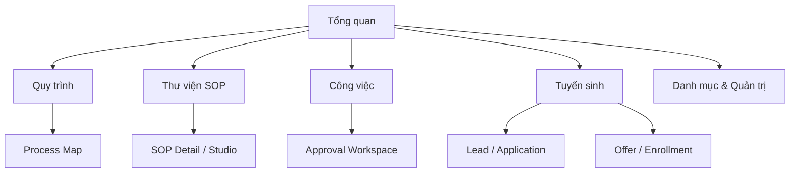
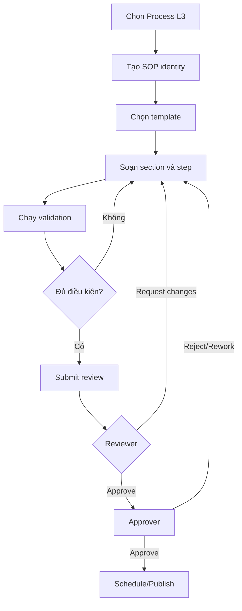
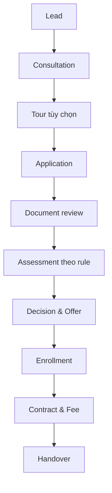

# INFORMATION ARCHITECTURE, USER FLOWS & SCREEN SPECIFICATION — SOP WEB APP MVP

| Thuộc tính | Giá trị |
|---|---|
| Mã tài liệu | UX-MVP-001 |
| Phiên bản | 0.1 — Proposed |
| Phạm vi | SOP Governance + Lead-to-Enrollment Pilot |
| Thiết bị | Desktop-first authoring; responsive approval/execution |
| Ngôn ngữ | Tiếng Việt; thuật ngữ ERP giữ tiếng Anh |

## 1. UX vision

Web app phải giúp người dùng trả lời nhanh bốn câu hỏi:

1. Tôi cần làm gì hôm nay?
2. Quy trình/SOP nào đang có hiệu lực?
3. Hồ sơ đang ở bước nào và bị chặn vì lý do gì?
4. Ai đã thay đổi hoặc phê duyệt điều gì?

Giao diện không mô phỏng một hệ thống ERP “nhiều menu”. Nó tổ chức công việc theo **role, process, task và exception**, trong khi dữ liệu chi tiết vẫn được truy cập theo business object.

## 2. UX principles

1. **Action before information:** việc cần xử lý đứng trước báo cáo.
2. **Progressive disclosure:** overview trước, chi tiết mở theo nhu cầu.
3. **One primary action:** mỗi trạng thái có một hành động chính rõ ràng.
4. **Status with meaning:** status luôn đi cùng owner, next step và blocker.
5. **Context preserved:** code, version, campus và object không mất khi chuyển tab.
6. **No hidden workflow:** người dùng biết điều kiện để chuyển bước.
7. **Safe by default:** action nhạy cảm yêu cầu quyền, reason và confirmation.
8. **Role-aware, not role-locked:** cùng màn hình nhưng action/data thay đổi theo quyền.
9. **Desktop-first authoring; mobile-friendly review/approval.**
10. **Accessible:** keyboard, focus, label, contrast và không phụ thuộc màu.

## 3. Global information architecture

### 3.1 Primary navigation

| Menu | Mục đích | Personas chính |
|---|---|---|
| Tổng quan | Công việc, KPI và exception theo role | Tất cả |
| Quy trình | Process Architecture L0–L3 | Management, BA, Process Owner |
| Thư viện SOP | Tìm, xem, tạo và quản lý SOP | Tất cả theo quyền |
| Công việc | Task, review, approval và SLA | Author, Reviewer, Approver |
| Tuyển sinh | Lead-to-Enrollment workspace | Admission, Academic, Finance |
| Danh mục | Rule, Requirement, Form, KPI, Risk | BA, Product, Admin |
| Báo cáo | Operational/Management/Executive | Management, Owner, Auditor |
| Quản trị | User, role, campus, configuration | System Admin |

Primary navigation chỉ hiển thị menu user có quyền. Không hiển thị menu disabled hàng loạt.

### 3.2 Secondary navigation

- **Quy trình:** Bản đồ quy trình · Process Register · Dependencies.
- **SOP:** Tất cả · Của tôi · Đang review · Sắp đến hạn · Đã lưu.
- **Công việc:** Việc của tôi · Approval Inbox · Quá hạn · Đã hoàn thành.
- **Tuyển sinh:** Pipeline · Lead · Application · Assessment · Offer · Enrollment · Handover.
- **Danh mục:** Business Rules · Requirements · Test Cases · Forms · KPI/SLA · Risk/Control.
- **Quản trị:** Organization · Campus · Users · Roles · Permissions · Master Data · Templates · Audit.

### 3.3 Global app shell

- Logo/product name.
- Campus switcher khi user có nhiều campus.
- Global search.
- Notification center.
- Help/contextual documentation.
- User menu.
- Left navigation có thể collapse trên desktop; drawer trên mobile.

Campus switcher là scope control, không phải security control. API vẫn enforce permission.

## 4. Sitemap

## 5. Persona navigation và landing page

| Persona | Landing page | Primary actions | Thông tin ưu tiên |
|---|---|---|---|
| Executive | Executive Dashboard | Drill-down, export có quyền | Funnel, compliance, risk |
| Process Owner | Process Dashboard | Create version, assign reviewer | SOP health, due review, exceptions |
| SOP Author/BA | My Work | Continue draft, resolve comments | Draft completeness, traceability gaps |
| Reviewer | Approval Inbox | Review, request changes | Diff, checklist, comment |
| Approver | Approval Inbox | Approve/reject | Impact, previous approvals, risk |
| Admission Officer | Admission Workspace | Create lead, follow-up | My pipeline, overdue tasks |
| Academic Assessor | Assessment Queue | Schedule/finalize assessment | Pending, upcoming, overdue |
| Finance | Enrollment Finance Queue | Fee plan, discount, contract | Financial blockers, approval |
| Auditor | Audit Dashboard | Inspect/export | Version, approval, privileged action |
| System Admin | Administration | User/role/config | Access anomaly, failed jobs |

## 6. Dashboard specification

### 6.1 Dashboard layout

1. Header: lời chào ngắn, current campus/scope, date range nếu có.
2. `Cần xử lý`: task và approval có deadline.
3. `Ngoại lệ`: blocker, overdue, returned item.
4. `Tiến độ`: KPI/funnel theo role.
5. `Hoạt động gần đây`: chỉ event liên quan.

Không dùng hơn 4 KPI cards trong một view. Không hiển thị vanity metric không có hành động.

### 6.2 Process Owner dashboard

| Widget | Nội dung | Action |
|---|---|---|
| SOP cần review | Review due trong 30/60/90 ngày | Mở SOP/version |
| Draft đang chờ | Draft/Revision Required | Assign/continue |
| Approval overdue | Instance quá SLA | Escalate/reassign theo quyền |
| Quality gaps | Thiếu owner/RACI/rule/test | Mở validation |
| Recent changes | Version/change request | Compare |

### 6.3 Admission dashboard

- Lead chưa assigned.
- Follow-up hôm nay/quá hạn.
- Application incomplete.
- Assessment pending.
- Offer sắp hết hạn.
- Enrollment blockers.
- Handover returned.
- Funnel theo stage và owner.

## 7. Global search behavior

### Searchable objects

- Process code/name.
- SOP code/title/effective content.
- Business Rule/Requirement/Test Case.
- Lead/Application/Offer/Enrollment theo quyền.

### Result grouping

Kết quả chia theo object type, không trộn thành danh sách khó hiểu. Mỗi result hiển thị:

- Code + title/name.
- Status/version.
- Campus/scope.
- Snippet an toàn.
- Owner/updated time nếu phù hợp.

Search không được trả snippet HRI trước khi permission được kiểm tra.

## 8. Core user flow — SOP authoring

### Flow rules

- Create SOP và Create Version là hai command khác nhau.
- Autosave không đồng nghĩa Submit.
- Validation phân biệt `Blocking`, `Warning`, `Info`.
- Submit hiển thị change summary, reviewer/approver và due date.
- Effective version không có nút Edit; dùng `Tạo phiên bản mới`.

## 9. Core user flow — Review & approval

1. Reviewer mở Approval Inbox.
2. Chọn item theo due date/risk.
3. Xem summary, version diff, validation và impact links.
4. Comment theo section/step.
5. Chọn `Request changes` hoặc `Complete review`.
6. Approver xem review outcome, exception và SoD warning.
7. Approve/Reject với reason theo rule.
8. Nếu Approved, schedule effective date hoặc publish ngay theo quyền.
9. Hệ thống khóa version, tạo audit và notification.

Trên mobile chỉ hỗ trợ xem, comment, approve/reject; authoring cấu trúc sâu chuyển sang desktop.

## 10. Core user flow — Lead-to-Enrollment

### UX pattern xuyên suốt

Mỗi hồ sơ dùng cùng một `Object Workspace`:

- Header: code, person/student, campus, program, status, owner.
- Stage tracker.
- Primary action theo trạng thái.
- Blocker panel.
- Tabs: Overview, Activity, Documents, Related, Audit.
- Right rail: tasks, SLA, approvals.

Không tạo 10 trải nghiệm hoàn toàn khác nhau cho 10 SOP.

## 11. Screen inventory

| ID | Screen | Route đề xuất | Priority |
|---|---|---|---|
| SCR-001 | Sign in | `/sign-in` | P0 |
| SCR-002 | Role Dashboard | `/dashboard` | P0 |
| SCR-003 | Process Map | `/processes/map` | P0 |
| SCR-004 | Process Detail | `/processes/:id` | P0 |
| SCR-005 | SOP Library | `/sops` | P0 |
| SCR-006 | SOP Detail | `/sops/:id` | P0 |
| SCR-007 | SOP Studio | `/sops/:id/versions/:versionId/edit` | P0 |
| SCR-008 | Version Compare | `/sops/:id/compare` | P0 |
| SCR-009 | Approval Inbox | `/work/approvals` | P0 |
| SCR-010 | Approval Workspace | `/work/approvals/:id` | P0 |
| SCR-011 | My Tasks | `/work/tasks` | P0 |
| SCR-012 | Traceability Matrix | `/catalogs/traceability` | P1 |
| SCR-013 | Business Rule Detail | `/catalogs/rules/:id` | P1 |
| SCR-014 | Requirement Detail | `/catalogs/requirements/:id` | P1 |
| SCR-015 | Admission Pipeline | `/admission/pipeline` | P0 pilot |
| SCR-016 | Lead List | `/admission/leads` | P0 pilot |
| SCR-017 | Lead Workspace | `/admission/leads/:id` | P0 pilot |
| SCR-018 | Application Workspace | `/admission/applications/:id` | P0 pilot |
| SCR-019 | Assessment Workspace | `/admission/assessments/:id` | P0 pilot |
| SCR-020 | Offer Workspace | `/admission/offers/:id` | P0 pilot |
| SCR-021 | Enrollment Workspace | `/admission/enrollments/:id` | P0 pilot |
| SCR-022 | Handover Workspace | `/admission/handovers/:id` | P0 pilot |
| SCR-023 | Reports | `/reports` | P1 |
| SCR-024 | Audit Explorer | `/admin/audit` | P0 security |
| SCR-025 | Users & Roles | `/admin/access` | P0 |
| SCR-026 | Master Data | `/admin/master-data` | P0 |
| SCR-027 | Templates & Workflow | `/admin/configuration` | P1 |
| SCR-028 | Notification Center | `/notifications` | P0 |

## 12. Screen specification — Process Map

### Purpose

Cho phép nhìn kiến trúc L0–L3, mức độ hoàn thiện và dependency.

### Layout

- Toolbar: scope, search, view mode.
- Tree/graph area.
- Detail drawer khi chọn node.
- Legend tối giản cho level/status.

### Node content

- Process code và name.
- Level.
- Owner.
- SOP count và completeness.
- Risk/overdue indicator nếu có.

### Actions

- View detail.
- Add child nếu có quyền.
- Link dependency.
- Open SOP list.
- Retire qua controlled action.

### Validation

- Parent level hợp lệ.
- Code unique.
- Không có cycle.
- L3 cần owner trước Approved.

## 13. Screen specification — SOP Library

### Table columns mặc định

`Code · Title · Process · Version · Status · Owner · Scope · Review due · Updated`

### Filters

- Keyword/code.
- Domain/process.
- Status.
- Owner.
- Campus/scope.
- SOP type.
- Priority.
- Review due.

### Row actions

- Open.
- Continue draft.
- Create version.
- Compare.
- Save view.

Không đặt Approve/Archive thành inline row action phổ biến để tránh thao tác nhầm.

### Empty states

- Không có dữ liệu: giải thích và `Tạo SOP` nếu có quyền.
- Không có kết quả filter: `Xóa bộ lọc`.
- Không có quyền: không hiển thị dữ liệu, không dùng empty state giả.

## 14. Screen specification — SOP Detail

### Header

- SOP code/title.
- Current effective version.
- Status badge + text.
- Process path L0–L3.
- Owner, scope, effective/review date.
- Primary action theo state.

### Tabs

`Nội dung · Versions · Traceability · Approvals · Activity`

### Content mode

- Cột trái: sticky section navigation.
- Cột giữa: rendered SOP.
- Cột phải: metadata/linked objects tùy tab.

### Permission behavior

- Viewer: read/export theo quyền.
- Author: tạo/sửa Draft.
- Reviewer: comment và review.
- Approver: approve/reject.
- Auditor: read version/audit, không edit.

## 15. Screen specification — SOP Studio

### Header bar

- Breadcrumb.
- Code/title/version/status.
- Save indicator.
- `Preview`, `Validate`, `Submit review`.

### Three-pane layout

1. **Section navigator:** 30 section nhóm thành 5 group.
2. **Editor canvas:** form/rich text/structured step editor.
3. **Context rail:** validation, comments, linked objects, history.

### Section groups

| Group | Sections |
|---|---|
| Overview | Metadata, Purpose, Scope, Terms, Trigger |
| Process | RACI, Input, AS-IS, Pain Points, TO-BE, Workflow, Exceptions, Status |
| Control | Business Rules, Approval, Permission, Audit, Internal Controls, Risk |
| System | Data Model, Forms, Requirements, Automation, Notification, Integration |
| Assurance | KPI/SLA, Reports, Acceptance Criteria, Tests, Implementation Notes |

### Structured step editor

Mỗi step có:

- Step number/name.
- Actor.
- Action.
- ERP Function.
- Input/output references.
- Business Rules.
- Status before/after.
- SLA/notification.
- Exception.

### Validation levels

- Blocking: thiếu owner, trigger, RACI A/R, required section, invalid transition.
- Warning: KPI target TBD, chưa link test, thiếu downstream.
- Info: automation opportunity, suggested duplicate.

### Concurrency

Nếu row version conflict:

- Không overwrite.
- Hiển thị bản của tôi và bản mới nhất.
- Cho copy section hoặc reload; merge tự động chỉ với field an toàn.

## 16. Screen specification — Approval Workspace

### Header

- Object code/title/version.
- Requested by, submitted at, due at.
- Approval step và approver scope.

### Main area

- Change summary.
- Side-by-side hoặc inline diff.
- Validation result.
- Impacted rules/requirements/SOP.
- Section comments.

### Actions

- Approve.
- Request changes.
- Reject.
- Delegate/escalate nếu policy cho phép.

Reason bắt buộc cho Request changes, Reject, override và delegate. Approve có thể yêu cầu comment với risk cao.

## 17. Screen specification — Admission Pipeline

### Views

- Board theo stage.
- Table cho bulk analysis.
- Funnel report.

### Board card

- Lead/student display name tối thiểu cần thiết.
- Code.
- Campus/program.
- Owner.
- Next action/SLA.
- Blocker/priority.

Không hiển thị assessment, y tế, contract amount trên board.

### Drag-and-drop

Không cho đổi status chỉ bằng kéo thả nếu transition có validation/approval. Drag có thể mở transition dialog; command phía server vẫn kiểm tra rule.

## 18. Screen specification — Lead Workspace

### Header

Code, contact display, campus, program interest, status, owner, next action.

### Tabs

`Tổng quan · Tương tác · School Tour · Application · Tasks · Audit`

### Primary action by state

| State | Primary action |
|---|---|
| New | Assign lead |
| Assigned | Record first contact |
| Contacted | Qualify |
| Qualified | Start application / Schedule tour |
| Nurturing | Schedule follow-up |
| Closed | Reopen theo quyền hoặc view only |

### Duplicate UX

Duplicate warning hiển thị candidates có masked contact, confidence reason và action `Merge/Mark not duplicate`. Merge phải preview dữ liệu giữ/bỏ và ghi audit.

## 19. Screen specification — Application Workspace

### Header

Application code, prospect, campus/program/intake, status, owner, SLA.

### Main layout

- Stage tracker.
- Checklist progress.
- Student/guardian information.
- Document table.
- Validation/blocker panel.
- Timeline.

### Document row

Type, required state, filename, validity, verification status, uploaded by/time, action.

### Actions

- Submit.
- Request document.
- Verify/reject document.
- Mark incomplete/verified.
- Schedule assessment khi đủ điều kiện.

Reject document yêu cầu reason code + comment tùy policy.

## 20. Screen specification — Assessment Workspace

- Restricted header label.
- Application context tối thiểu.
- Assessment template/version.
- Schedule và assessor.
- Structured score/result.
- Recommendation.
- Finalize action.
- Revision history.

Sau Finalize, fields read-only; action duy nhất là `Create revision` theo quyền.

## 21. Screen specification — Offer Workspace

- Offer code/version/status/expiry.
- Program/campus/start date.
- Terms summary.
- Approval status.
- Preview rendered offer.
- Issue/send status.
- Parent response/evidence.
- Version lineage.

Primary actions theo trạng thái: Submit approval, Approve, Issue, Record response, Extend/Reissue, Withdraw.

Không chỉnh Offer đã Issued; thay đổi terms tạo version mới.

## 22. Screen specification — Enrollment Workspace

### Header

Enrollment code, student, campus/program, start date, status.

### Readiness panel

- Offer accepted.
- Capacity reserved.
- Contract state.
- Fee plan state.
- Required consent/document.
- Handover readiness.

Mỗi blocker có owner, action và source object; không chỉ hiển thị “Incomplete”.

### Tabs

`Overview · Contract & Fee · Conditions · Handover · Related · Audit`

## 23. Screen specification — Handover Workspace

- Checklist group theo Admission, Academic, Health, Finance, Operations.
- Item state: Missing, Ready, Exception requested, Approved exception, Completed.
- Source link tới document/object.
- Submit/return/accept history.
- Receiver và due date.

Accept chỉ khả dụng khi checklist đạt hoặc exception được duyệt.

## 24. Screen specification — Traceability Matrix

### Axes

`Process/SOP Step → Business Rule → Functional Requirement → Acceptance Criterion → Test Case → Release`

### Behaviors

- Filter by SOP/module/status/coverage gap.
- Expand/collapse chain.
- Create link theo permission.
- Detect orphan/gap.
- Impact view khi version/rule thay đổi.

Không render toàn bộ matrix lớn một lần; dùng progressive expansion và server pagination.

## 25. Screen specification — Audit Explorer

### Filters

Date/time, actor, action, object type/code, campus, privileged action, correlation ID.

### Result columns

Time, actor, action, object, summary, source, reason.

### Detail

Before/after diff đã mask, correlation timeline và linked approval.

Export cần permission riêng, reason và audit event mới.

## 26. Role/action matrix cấp màn hình

| Screen | Viewer | Author/Officer | Reviewer | Approver | Admin | Auditor |
|---|---|---|---|---|---|---|
| Process Map | View | Propose edit | Review | Approve architecture | Configure | View |
| SOP Library | View | Create/edit Draft | Comment | Approve | Configure template | View/export scoped |
| SOP Studio | No edit | Edit Draft | Comment | Read | Template/admin only | Read |
| Approval Workspace | Own/related | Submit/respond | Review | Approve/reject | Reassign by policy | Read |
| Admission Workspace | Scoped view | Operational commands | Domain review | Exception approval | Config only | Read scoped |
| Audit Explorer | No/default | Own activity limited | Limited | Limited | Security admin | Full scoped read |

Backend permission remains nguồn quyết định; matrix này là UX exposure baseline.

## 27. Common component inventory

- App Shell.
- Breadcrumb.
- Campus/Scope Switcher.
- Global Search.
- Status Badge + text.
- Owner Avatar/Role label.
- Stage Tracker.
- Object Header.
- Blocker Panel.
- Task/SLA Indicator.
- Filter Bar.
- Data Table.
- Saved View.
- Timeline/Activity Feed.
- Comment Thread.
- Version Diff.
- Approval Stepper.
- Section Navigator.
- Structured Step Editor.
- Document Uploader/Verifier.
- Validation Summary.
- Command Confirmation Dialog.
- Empty/Error/No-permission States.

Không tạo component riêng chỉ vì khác domain; ưu tiên variant/config của Object Workspace.

## 28. Design system direction

### Visual language

- Sạch, hiện đại, nhiều khoảng thở nhưng không lãng phí diện tích.
- Neutral surfaces; một màu primary cho action/selection.
- Màu trạng thái luôn đi với label/icon.
- Typography ưu tiên khả năng đọc tiếng Việt.
- Border nhẹ; hạn chế shadow và card lồng nhau.

### Density

- `Comfortable` mặc định.
- Cho phép `Compact` ở table-heavy screens nếu cần.
- Không giảm font để nhồi dữ liệu; dùng column chooser và responsive reflow.

### Recommended tokens — proposed

- Font: Inter hoặc system sans; kiểm thử dấu tiếng Việt.
- Base spacing: 4/8px scale.
- Border radius: vừa phải, thống nhất.
- Focus ring rõ.
- Light/dark ready nhưng MVP có thể ưu tiên light nếu nguồn lực hạn chế.

## 29. Responsive behavior

### Desktop ≥ 1200px

- Left nav + main content + optional context rail.
- Tables đầy đủ.
- SOP Studio 3 pane.

### Tablet 768–1199px

- Collapsible nav.
- Context rail thành drawer.
- Table ẩn cột secondary.
- SOP Studio 2 pane; section nav drawer.

### Mobile < 768px

- Bottom/slide navigation theo khả năng framework.
- Object header rút gọn.
- Cards/list thay table khi phù hợp.
- Sticky primary action.
- Review/approval/read/checklist; không hỗ trợ full SOP authoring.

## 30. Accessibility requirements

- WCAG 2.2 AA làm baseline mục tiêu.
- Semantic headings/landmarks.
- Label rõ cho mọi input.
- Keyboard navigation và visible focus.
- Status không phụ thuộc màu.
- Error summary + inline error liên kết field.
- Modal trap focus đúng và trả focus khi đóng.
- Tables có header/caption; responsive vẫn giữ context.
- Dynamic update dùng thông báo phù hợp, không spam screen reader.
- Touch target đủ lớn trên thiết bị cảm ứng.

## 31. Form behavior

- Validate khi blur/submit; không báo lỗi đỏ khi user chưa tương tác.
- Preserve input khi lỗi server.
- Required field phụ thuộc stage; UI phải giải thích “cần trước khi Submit”.
- Save Draft cho phép thiếu field không blocking ở Draft.
- Confirmation dialog chỉ cho destructive/privileged action.
- Reason field xuất hiện theo action và policy.
- Date/time hiển thị timezone; lưu UTC.
- Autosave có trạng thái `Đang lưu/Đã lưu/Lỗi lưu`, không dùng toast liên tục.

## 32. Error and exception states

| Scenario | UX response |
|---|---|
| 403 | Không hiển thị dữ liệu; giải thích quyền/phạm vi |
| 404 | Object không tồn tại hoặc không nằm trong scope; không tiết lộ |
| 409 version conflict | Compare/reload/copy; không overwrite |
| 422 rule validation | Blocker list liên kết field/step |
| Notification failed | Business state giữ nguyên; hiển thị retry/status cho người có quyền |
| Integration pending | Processing state + last update |
| File quarantined | Không cho mở/link; hướng dẫn upload lại/contact admin |
| Approval overdue | Escalation indicator/action theo policy |

## 33. Notification UX

Notification center nhóm theo:

- Requires action.
- Updates.
- System/security.

Mỗi notification có object link, action, time và read state. Không tạo notification cho mọi autosave hoặc field edit. Email/SMS dùng cho sự kiện có business value và theo preference/policy.

## 34. Screen → command → entity → SOP mapping

| Screen | Primary command | Aggregate/entity | SOP |
|---|---|---|---|
| SOP Studio | CreateVersion/SaveDraft/SubmitForReview | SOP/SOPVersion | SOP governance |
| Approval Workspace | Approve/RequestChanges/Reject | ApprovalInstance | SOP governance/all |
| Lead Workspace | Create/Assign/Qualify/CloseLead | Lead | ADM-001/002 |
| Tour | Schedule/CompleteTour | SchoolTour | ADM-003 |
| Application | Start/Submit/VerifyApplication | Application | ADM-004/005 |
| Assessment | Schedule/Finalize/CreateRevision | Assessment | ADM-006 |
| Offer | Draft/Approve/Issue/Respond | Offer | ADM-007 |
| Enrollment | Confirm/OnHold/Cancel | Enrollment | ADM-008 |
| Contract & Fee | Generate/Activate/ApproveFeePlan | Contract/FeePlan | ADM-009 |
| Handover | Prepare/Submit/Return/Accept | HandoverPackage | ADM-010 |

## 35. Analytics instrumentation

Không ghi PII vào analytics payload. Event UX tối thiểu:

- `screen_viewed` với screen ID, role category, campus scope.
- `search_performed` với query category/length, không ghi raw HRI query.
- `sop_validation_run` với counts by severity.
- `approval_action_completed` với action/elapsed, không ghi content.
- `workflow_transition_attempted/completed/blocked` với object type/status/reason code.
- `form_error` với field key/error code.
- `task_completed` với task type/SLA state.

## 36. Performance UX budgets — Proposed

- App shell/primary route usable nhanh trên mạng văn phòng thông thường.
- Table pagination/filter server-side.
- Search debounce và cancellation.
- Large SOP content load theo section/tab.
- Diff và traceability tính toán bất đồng bộ nếu lớn.
- Skeleton chỉ dùng khi cần; tránh spinner toàn màn hình.
- Optimistic UI chỉ cho action có thể rollback an toàn; approval/status transition chờ server confirmation.

Target số cụ thể được chốt trong Non-functional Requirement workshop.

## 37. UAT scenarios cấp UX

1. Author tạo SOP, hoàn tất section, validate và submit.
2. Reviewer comment từng section, request changes; Author xử lý và resubmit.
3. Approver xem diff và publish theo effective date.
4. Viewer tìm đúng Effective version; không thấy Draft nếu không có quyền.
5. Hai author sửa cùng version; hệ thống chặn lost update.
6. Admission Officer xử lý Lead đến Application.
7. Document incomplete quay lại bổ sung mà không mất dữ liệu.
8. Assessment finalized không sửa trực tiếp.
9. Offer expired không thể accept nếu chưa reissue/extend hợp lệ.
10. Enrollment blocker chỉ rõ owner/action.
11. Discount exception đi đúng approval.
12. Handover bị trả lại rồi resubmit/accept.
13. User khác campus không truy cập được object qua URL trực tiếp.
14. Auditor tra được before/after và approval correlation.
15. Mobile reviewer hoàn tất review/approval cơ bản.

## 38. UX quality gates

### Gate UX-1 — IA approved

- Menu không trùng chức năng.
- Persona tìm được task/object trong tối đa 3 cấp.
- Route và object ownership rõ.

### Gate UX-2 — Flow approved

- Happy/exception/permission paths đầy đủ.
- Status transition khớp Process Architecture.
- Không có action chỉ tồn tại ở UI mà thiếu command.

### Gate UX-3 — Wireframe approved

- 8 màn hình chính có desktop wireframe.
- Approval/read/checklist có responsive state.
- Empty/error/blocked states được thiết kế.

### Gate UX-4 — Prototype tested

- 5 persona chính hoàn thành task quan trọng.
- Vấn đề severity cao được xử lý trước UI build.

## 39. Wireframe set cần dựng

### P0

1. Role Dashboard.
2. Process Map.
3. SOP Library.
4. SOP Detail.
5. SOP Studio.
6. Approval Workspace.
7. Admission Pipeline.
8. Lead Workspace.
9. Application Workspace.
10. Enrollment/Handover Workspace.

### P1

11. Version Compare.
12. Traceability Matrix.
13. Audit Explorer.
14. User/Role Administration.
15. Mobile Approval.

## 40. Open UX decisions

| ID | Quyết định | Khuyến nghị |
|---|---|---|
| UX-OD-01 | Parent Portal trong MVP | Staff-first; thiết kế API/data sẵn cho Parent Portal |
| UX-OD-02 | Light/dark | Light-first, tokens dark-ready |
| UX-OD-03 | Board drag-drop | Chỉ mở transition dialog, không bypass rules |
| UX-OD-04 | Rich text editor | Structured editor, không raw HTML |
| UX-OD-05 | BPMN visual editor | Phase sau; MVP read-only process visual |
| UX-OD-06 | Mobile authoring | Không hỗ trợ full authoring trong MVP |
| UX-OD-07 | Zalo channel | Integration option, không core UX |
| UX-OD-08 | Saved views chia sẻ | Personal trước; shared view P1 |

## 41. Deliverables cho bước UI Design

- Low-fidelity wireframes cho 10 màn hình P0.
- Interactive prototype cho SOP Authoring/Approval và Admission flow.
- Component inventory + states.
- Design tokens và typography.
- Field-level screen specification.
- Accessibility annotations.
- Responsive variants.
- Prototype usability test script.

## 42. Bước kế tiếp

Sau tài liệu này, bước tiếp theo là xây **Product Backlog & Functional Specification**, bao gồm:

- Epic → Feature → User Story.
- Given/When/Then acceptance criteria.
- Business Rule/permission/audit mapping.
- API command/event mapping.
- Priority, dependency và release slice.
- Sprint 0–7 backlog.
- Definition of Ready/Done.
- UAT traceability.

Wireframe/prototype có thể phát triển song song sau khi IA và core flows được chấp nhận.
