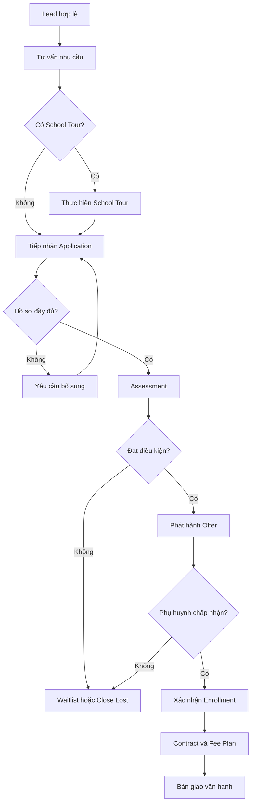
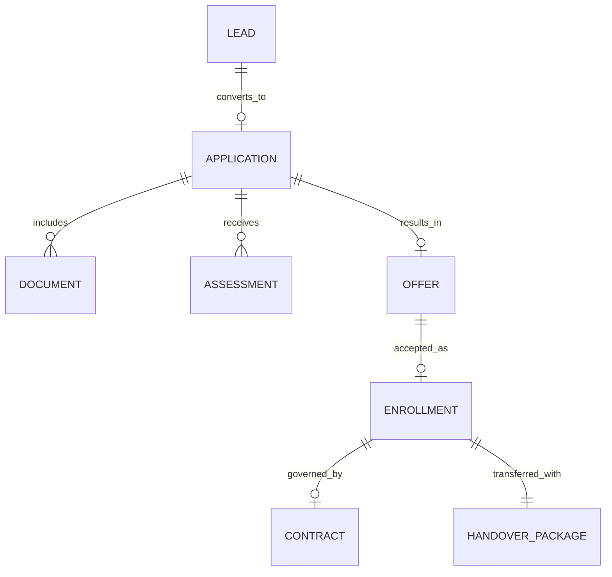

# MASTER PROCESS ARCHITECTURE — LEAD-TO-ENROLLMENT

| Thuộc tính | Giá trị |
|---|---|
| Mã kiến trúc | MPA-ADM-001 |
| Phiên bản | 0.1 — Proposed |
| Domain chính | Admission / Tuyển sinh |
| End-to-End Process | Lead-to-Enrollment |
| Phạm vi pilot | Một cơ sở đại diện, multi-campus ready |
| Process Owner | Admission Manager — Proposed |
| Upstream | Market-to-Lead |
| Downstream | Student Onboarding, Academic Operations, Bill-to-Cash |

## 1. Mục tiêu kiến trúc

Tài liệu này chuẩn hóa quy trình từ khi phát sinh Lead đến khi học sinh được xác nhận nhập học và bàn giao sang vận hành. Đây là nguồn tham chiếu cho:

- SOP Master Register.
- Workflow và status trong Web app.
- Business Object/Data Model.
- RACI và Permission Matrix.
- Business Rules và Functional Requirements.
- Dashboard, KPI, notification và audit trail.

Đây là bản Best Practice `Proposed`; cần workshop với Admission, Academic và Finance trước khi chuyển `Approved`.

## 2. Process hierarchy L0–L3

### 2.1 Cấu trúc phân cấp

| Level | Process ID | Tên quy trình | Mô tả |
|---|---|---|---|
| L0 | L0-03 | Student Acquisition & Enrollment | Thu hút, đánh giá và chuyển đổi gia đình thành học sinh chính thức |
| L1 | ADM | Admission Management | Quản trị toàn bộ hoạt động tuyển sinh |
| L2 | ADM-E2E-01 | Lead-to-Enrollment | Từ Lead đủ điều kiện đến bàn giao học sinh |
| L3 | ADM-001 | Lead Intake & Qualification | Tiếp nhận, kiểm tra trùng và phân loại Lead |
| L3 | ADM-002 | Consultation & Needs Assessment | Tư vấn và ghi nhận nhu cầu |
| L3 | ADM-003 | School Tour Management | Đặt lịch và thực hiện School Tour |
| L3 | ADM-004 | Application Intake | Tiếp nhận Application |
| L3 | ADM-005 | Document Verification | Kiểm tra hồ sơ nhập học |
| L3 | ADM-006 | Student Assessment | Tổ chức và ghi nhận Assessment |
| L3 | ADM-007 | Offer Management | Phát hành, theo dõi và xử lý Offer |
| L3 | ADM-008 | Enrollment Confirmation | Xác nhận Enrollment |
| L3 | ADM-009 | Contract & Fee Plan Setup | Tạo Contract và Fee Plan |
| L3 | ADM-010 | Operational Handover | Bàn giao sang Academic/Operations |

### 2.2 Phạm vi bắt đầu và kết thúc

**Start event:** một Lead hợp lệ được tạo từ campaign, website, referral, walk-in, hotline hoặc import được kiểm soát.

**End event:** Enrollment được xác nhận, Contract/Fee Plan được thiết lập theo điều kiện áp dụng, Student Profile được tạo và hồ sơ bàn giao được đơn vị vận hành tiếp nhận.

### 2.3 Ngoài phạm vi quy trình

- Thiết kế và thực hiện Marketing Campaign.
- Thu học phí và đối soát ngân hàng hoàn chỉnh.
- Phân lớp chi tiết, timetable và attendance hằng ngày.
- Student onboarding sau ngày nhập học.
- Withdrawal, re-enrollment và graduation.

## 3. End-to-end process map

School Tour, Assessment và Contract/Fee Plan có thể được cấu hình theo loại trường, độ tuổi, chương trình và policy; không hard-code mọi trường hợp là bắt buộc.

## 4. Process decomposition L2 → L3

| Seq. | SOP ID | Trigger | Kết quả chính | Upstream | Downstream |
|---:|---|---|---|---|---|
| 1 | ADM-001 | Lead được gửi/tạo/import | Lead hợp lệ, có owner và trạng thái | Marketing/Referral | ADM-002 |
| 2 | ADM-002 | Lead được phân công | Nhu cầu, chương trình, campus và next action | ADM-001 | ADM-003/ADM-004 |
| 3 | ADM-003 | Gia đình yêu cầu/được mời tham quan | Tour outcome và follow-up | ADM-002 | ADM-004 |
| 4 | ADM-004 | Phụ huynh quyết định nộp hồ sơ | Application có ID và checklist | ADM-002/003 | ADM-005 |
| 5 | ADM-005 | Application được submit | Hồ sơ Verified hoặc yêu cầu bổ sung | ADM-004 | ADM-006 |
| 6 | ADM-006 | Hồ sơ đủ điều kiện assessment | Assessment result/recommendation | ADM-005 | ADM-007 |
| 7 | ADM-007 | Có quyết định tuyển sinh | Offer có version và thời hạn | ADM-006 | ADM-008 |
| 8 | ADM-008 | Offer được chấp nhận | Enrollment được confirm/reserve | ADM-007 | ADM-009 |
| 9 | ADM-009 | Enrollment đủ điều kiện tài chính | Contract và Fee Plan được thiết lập | ADM-008 | ADM-010/Bill-to-Cash |
| 10 | ADM-010 | Hồ sơ enrollment sẵn sàng bàn giao | Academic/Operations tiếp nhận | ADM-009 | Student Onboarding |

## 5. Actor map

| Actor | Vai trò trong quy trình | Phạm vi dữ liệu |
|---|---|---|
| Parent/Guardian | Cung cấp thông tin, hồ sơ, quyết định Offer/Contract | Hồ sơ gia đình/học sinh liên quan |
| Admission Officer | Tạo/cập nhật Lead, tư vấn, application, follow-up | Campus được phân công |
| Admission Manager | Owner quy trình, phân công, exception, approval theo policy | Domain Admission/campus |
| Marketing | Cung cấp lead source/campaign attribution | Lead marketing, hạn chế dữ liệu nhạy cảm |
| Academic Assessor | Thực hiện Assessment và recommendation | Hồ sơ cần thiết cho assessment |
| Academic Manager | Phê duyệt/kiểm soát kết quả học thuật theo policy | Academic assessment |
| Finance Officer | Thiết lập/kiểm tra fee plan, deposit, discount | Dữ liệu tài chính được phân quyền |
| Finance Manager | Phê duyệt exception tài chính/discount/refund | Finance domain |
| School Principal | Phê duyệt ngoại lệ theo thẩm quyền | Campus/domain được giao |
| Customer Service | Hỗ trợ giao tiếp và complaint | Thông tin liên hệ, interaction cần thiết |
| System Administrator | Quản trị cấu hình và tài khoản | Không mặc định được xem nội dung nhạy cảm |
| Auditor | Đọc log, version, approval và evidence | Read-only theo phạm vi audit |

## 6. RACI cấp L3 — Proposed

Ký hiệu: `R` Responsible, `A` Accountable, `C` Consulted, `I` Informed.

| SOP | Admission Officer | Admission Manager | Academic | Finance | Principal | Parent |
|---|---|---|---|---|---|---|
| ADM-001 | R | A | I | I | I | C |
| ADM-002 | R | A | C | I | I | C |
| ADM-003 | R | A | C | I | I | C |
| ADM-004 | R | A | I | I | I | C |
| ADM-005 | R | A | C | I | I | C |
| ADM-006 | C | I | R/A | I | C | C |
| ADM-007 | R | A | C | C | C theo ngoại lệ | I/C |
| ADM-008 | R | A | I | C | I | C |
| ADM-009 | C | C | I | R/A | C theo ngoại lệ | C |
| ADM-010 | R | A | R/C | C | I | I |

Nguyên tắc: mỗi activity chỉ có một `A`; RACI chi tiết sẽ được xác định trong từng SOP.

## 7. Canonical status lifecycle

Không dùng một status duy nhất cho mọi entity. Mỗi business object có lifecycle riêng và mapping rõ ràng.

### 7.1 Lead status

`New → Assigned → Contacted → Qualified → Nurturing → Converted`

Nhánh kết thúc: `Disqualified`, `Lost`, `Duplicate`, `Archived`.

### 7.2 Application status

`Draft → Submitted → Document Review → Incomplete/Verified → Assessment Pending → Assessed → Decision Pending → Offered/Waitlisted/Rejected`

### 7.3 Offer status

`Draft → Pending Approval → Approved → Issued → Viewed → Accepted/Declined/Expired/Withdrawn`

### 7.4 Enrollment status

`Pending Confirmation → Confirmed → Pending Contract/Financial Condition → Ready for Handover → Handed Over`

Nhánh ngoại lệ: `On Hold`, `Cancelled`.

### 7.5 Contract status

`Draft → Pending Review → Pending Signature → Active`

Nhánh kết thúc/ngoại lệ: `Rejected`, `Voided`, `Terminated`, `Expired`.

### 7.6 Handover status

`Not Ready → Ready → Submitted → Accepted`

Nhánh sửa lỗi: `Returned for Completion`.

## 8. Status transition control

| Object | From | To | Điều kiện tối thiểu | Actor/Approval |
|---|---|---|---|---|
| Lead | New | Assigned | Có campus và owner | Admission Manager/system rule |
| Lead | Qualified | Converted | Application được tạo và liên kết | Admission Officer |
| Application | Draft | Submitted | Trường bắt buộc hợp lệ | Parent/Admission Officer |
| Application | Incomplete | Document Review | Có bổ sung tài liệu | Admission Officer |
| Application | Assessed | Offered | Decision đạt và approval cần thiết hoàn tất | Admission Manager |
| Offer | Approved | Issued | Có version, expiry, chương trình và fee reference | Admission Officer |
| Offer | Issued | Accepted | Xác nhận người có thẩm quyền và timestamp | Parent/Guardian |
| Enrollment | Pending Confirmation | Confirmed | Offer Accepted và không có blocker | Admission Manager/rule |
| Contract | Pending Signature | Active | Đủ chữ ký/xác nhận theo policy | Finance/authorized party |
| Handover | Submitted | Accepted | Checklist đạt hoặc exception được duyệt | Academic/Operations |

Mọi transition ngược, override hoặc skip bước phải có quyền riêng và lý do bắt buộc.

## 9. Business object map

| Object | Primary ID | Owner | Dữ liệu chính | Classification |
|---|---|---|---|---|
| Lead | Lead ID | Admission | Source, contact, interest, owner, status | Confidential |
| Person | Person ID | Master Data | Name, DOB, contact identity | Confidential |
| Parent/Guardian | Guardian ID | Admission/SIS | Relationship, authority, contact | Confidential |
| Prospective Student | Prospect ID | Admission | DOB, program interest, campus | Highly Restricted khi có hồ sơ nhạy cảm |
| Interaction | Interaction ID | Admission | Channel, time, outcome, next action | Confidential |
| School Tour | Tour ID | Admission | Schedule, attendees, outcome | Internal/Confidential |
| Application | Application ID | Admission | Intake, program, checklist, status | Highly Restricted |
| Document | Document ID | Record Owner | Type, version, validity, storage pointer | Theo loại tài liệu |
| Assessment | Assessment ID | Academic | Tool, assessor, result, recommendation | Highly Restricted |
| Admission Decision | Decision ID | Admission/Academic | Outcome, reason, approval | Confidential |
| Offer | Offer ID | Admission | Program, campus, terms, expiry, version | Confidential |
| Enrollment | Enrollment ID | Admission/SIS | Start date, program, campus, status | Highly Restricted |
| Contract | Contract ID | Finance/Admin | Parties, terms, signature, status | Highly Restricted |
| Fee Plan | Fee Plan ID | Finance | Tuition, fee schedule, discount | Highly Restricted |
| Discount Request | Discount Request ID | Finance | Rule, amount/rate, reason, approval | Highly Restricted |
| Handover Package | Handover ID | Admission/Academic | Checklist, missing items, acceptance | Highly Restricted |
| Consent | Consent ID | Parent/School | Type, scope, version, validity | Highly Restricted |
| Task | Task ID | Assigned Actor | Due date, SLA, status, relation | Internal |
| Audit Event | Event ID | System | Actor, action, before/after, source, time | Highly Restricted |

## 10. Object relationships

Các quan hệ Person–Guardian–Student và Consent cần được thiết kế riêng trong Logical Data Model để xử lý một người giám hộ có nhiều học sinh và một học sinh có nhiều người liên quan.

## 11. Master data dependencies

Trước khi vận hành quy trình cần có:

- Organization, Campus, Academic Year, Intake và Term.
- Program, Age Group, Grade/Class Level.
- Lead Source, Campaign, Referral Source.
- Admission Checklist và Document Type.
- Assessment Type, Assessment Template và Result Scale.
- Capacity/Seat Rule và Waitlist Rule.
- Offer Template, Contract Template và Fee Schedule.
- Discount Type và Approval Threshold.
- Role, User, Team, Assignment Rule và Escalation Rule.
- Communication Template và Notification Channel.
- Data Classification, Retention Policy và Consent Type.

## 12. Process dependency map

| Process/Module | Loại phụ thuộc | Dữ liệu/Event trao đổi |
|---|---|---|
| Marketing & Campaign | Upstream | Lead source, campaign, consent, attribution |
| CRM | Core | Lead, interaction, task, pipeline |
| SIS | Downstream/Core | Student master, guardian, enrollment |
| Academic | Downstream | Assessment, program, readiness, handover |
| Tuition/Billing | Downstream | Fee plan, deposit, invoice trigger |
| Finance | Control | Discount, payment condition, reconciliation |
| Document Management | Shared service | Application documents, offer, contract |
| Notification | Shared service | Email/SMS/push templates and delivery status |
| Identity/RBAC | Shared service | User, role, campus/domain scope |
| Audit | Shared service | Immutable business and security events |
| Capacity Management | Decision support | Seat availability, waitlist |
| Reporting/BI | Consumer | Funnel, conversion, SLA, forecast |

## 13. Cross-process business events

| Event ID | Event | Producer | Consumer |
|---|---|---|---|
| EVT-ADM-001 | LeadCreated | ADM-001 | Assignment, notification, analytics |
| EVT-ADM-002 | LeadQualified | ADM-001/002 | Application, forecast |
| EVT-ADM-003 | TourCompleted | ADM-003 | Follow-up, application |
| EVT-ADM-004 | ApplicationSubmitted | ADM-004 | Document review |
| EVT-ADM-005 | DocumentsVerified | ADM-005 | Assessment scheduling |
| EVT-ADM-006 | AssessmentCompleted | ADM-006 | Admission decision |
| EVT-ADM-007 | OfferIssued | ADM-007 | Parent communication, expiry task |
| EVT-ADM-008 | OfferAccepted | ADM-007 | Enrollment confirmation |
| EVT-ADM-009 | EnrollmentConfirmed | ADM-008 | SIS, contract, capacity reservation |
| EVT-ADM-010 | FeePlanActivated | ADM-009 | Billing/invoice |
| EVT-ADM-011 | HandoverAccepted | ADM-010 | Student onboarding, academic operations |
| EVT-ADM-012 | AdmissionClosedLost | Any controlled close | Funnel analytics, nurture policy |

Tên event là logical contract; schema và delivery mechanism sẽ được khóa trong Technical Architecture.

## 14. SOP Master Register

| SOP ID | Tên | Type | Owner | Reviewer | Approver | Priority | Status |
|---|---|---|---|---|---|---|---|
| ADM-001 | Tiếp nhận và phân loại Lead | Operational | Admission Manager | Marketing/CRM Owner | Business Owner | P0 | Proposed |
| ADM-002 | Tư vấn và ghi nhận nhu cầu | Operational | Admission Manager | Academic/CS | Business Owner | P0 | Proposed |
| ADM-003 | School Tour Management | Operational | Admission Manager | Campus Operations | Principal | P0 | Proposed |
| ADM-004 | Tiếp nhận Application | Operational | Admission Manager | Academic/Admin | Business Owner | P0 | Proposed |
| ADM-005 | Kiểm tra hồ sơ nhập học | Control | Admission Manager | Academic/Admin | Principal | P0 | Proposed |
| ADM-006 | Student Assessment | Operational/Control | Academic Manager | Admission | Principal | P0 | Proposed |
| ADM-007 | Offer Management | Control | Admission Manager | Academic/Finance | Business Owner | P0 | Proposed |
| ADM-008 | Enrollment Confirmation | Control | Admission Manager | Finance/SIS | Business Owner | P0 | Proposed |
| ADM-009 | Contract & Fee Plan Setup | Control | Finance Manager | Admission/Legal TBD | Authorized Approver | P0 | Proposed |
| ADM-010 | Operational Handover | Operational/Control | Academic Manager | Admission/Health/Operations | Principal | P0 | Proposed |

## 15. SOP-level functional outline

### ADM-001 — Lead Intake & Qualification

- **Input:** Contact, source, consent, program/campus interest.
- **Control:** Duplicate detection, consent, assignment rule.
- **Output:** Valid Lead, owner, priority, next action.
- **Exceptions:** Duplicate, spam, missing consent, out-of-service-area.
- **Core objects:** Lead, Person, Campaign, Task.

### ADM-002 — Consultation & Needs Assessment

- **Input:** Qualified Lead.
- **Control:** Mandatory needs profile and interaction log.
- **Output:** Fit assessment, program/campus interest, next step.
- **Exceptions:** Unreachable, nurture, no-fit, language support.
- **Core objects:** Interaction, Need Profile, Task.

### ADM-003 — School Tour Management

- **Input:** Tour request/offer.
- **Control:** Capacity, host assignment, visitor policy.
- **Output:** Tour outcome and follow-up.
- **Exceptions:** Reschedule, no-show, cancellation.
- **Core objects:** School Tour, Calendar Slot, Attendee.

### ADM-004 — Application Intake

- **Input:** Parent decision to apply.
- **Control:** Required fields, identity matching, consent.
- **Output:** Submitted Application and checklist.
- **Exceptions:** Duplicate application, draft expiry, wrong intake.
- **Core objects:** Application, Prospect, Guardian, Consent.

### ADM-005 — Document Verification

- **Input:** Submitted Application/documents.
- **Control:** Checklist, validity, four-eyes review where required.
- **Output:** Verified or Incomplete status.
- **Exceptions:** Expired, unreadable, inconsistent, suspected fraud.
- **Core objects:** Document, Verification, Checklist Item.

### ADM-006 — Student Assessment

- **Input:** Verified Application.
- **Control:** Approved assessment template, qualified assessor, restricted access.
- **Output:** Result and recommendation.
- **Exceptions:** No-show, reschedule, special support, inconclusive result.
- **Core objects:** Assessment, Result, Recommendation.

### ADM-007 — Offer Management

- **Input:** Approved admission decision.
- **Control:** Seat/capacity, terms, version, expiry, approval.
- **Output:** Issued Offer and response status.
- **Exceptions:** Waitlist, expiry, revised offer, withdrawal.
- **Core objects:** Decision, Offer, Offer Version.

### ADM-008 — Enrollment Confirmation

- **Input:** Accepted Offer.
- **Control:** Blocker check, unique enrollment, capacity reservation.
- **Output:** Confirmed Enrollment.
- **Exceptions:** Deposit pending, conditional acceptance, cancellation.
- **Core objects:** Enrollment, Capacity Reservation, Condition.

### ADM-009 — Contract & Fee Plan Setup

- **Input:** Confirmed Enrollment and pricing policy.
- **Control:** Approved template, discount threshold, payment schedule.
- **Output:** Active Contract/Fee Plan or pending condition.
- **Exceptions:** Custom terms, scholarship, discount override, signature delay.
- **Core objects:** Contract, Fee Plan, Discount Request.

### ADM-010 — Operational Handover

- **Input:** Enrollment ready for handover.
- **Control:** Mandatory handover checklist, receiver acceptance.
- **Output:** Student Profile ready for onboarding.
- **Exceptions:** Missing health/consent/pickup data, returned package.
- **Core objects:** Handover Package, Student Profile, Checklist.

## 16. Business rule catalog — architecture baseline

| Rule ID | Quy tắc đề xuất | Source SOP |
|---|---|---|
| BR-ADM-001 | Lead phải được kiểm tra trùng trước khi tạo mới | ADM-001 |
| BR-ADM-002 | Lead hợp lệ phải có owner và next action | ADM-001 |
| BR-ADM-003 | Application chỉ được Submit khi đủ trường bắt buộc theo cấu hình | ADM-004 |
| BR-ADM-004 | Document requirement phụ thuộc program, age group, campus và intake | ADM-005 |
| BR-ADM-005 | Người assessment không được sửa kết quả sau khi đã finalized nếu không tạo revision | ADM-006 |
| BR-ADM-006 | Offer phải có version, validity period và approved terms | ADM-007 |
| BR-ADM-007 | Offer hết hạn không thể Accept nếu chưa được gia hạn hợp lệ | ADM-007 |
| BR-ADM-008 | Enrollment chỉ Confirm khi Offer đã Accepted và blocker bắt buộc được giải quyết | ADM-008 |
| BR-ADM-009 | Một học sinh không được có enrollment trùng thời gian trong cùng program/campus nếu policy cấm | ADM-008 |
| BR-ADM-010 | Discount vượt threshold cấu hình phải được approval | ADM-009 |
| BR-ADM-011 | Bản Contract Active không được sửa trực tiếp | ADM-009 |
| BR-ADM-012 | Handover chỉ Accepted khi checklist đạt hoặc exception được duyệt | ADM-010 |
| BR-ADM-013 | Transition ngược/skip/override phải có quyền và reason | All |
| BR-ADM-014 | Dữ liệu y tế/assessment chỉ hiển thị theo need-to-know | ADM-006/010 |
| BR-ADM-015 | Mọi thay đổi approval, offer, enrollment, contract phải ghi audit before/after | ADM-007–010 |

## 17. Approval matrix — baseline

| Scenario | Level 1 | Level 2 | Level 3 |
|---|---|---|---|
| Admission theo rule chuẩn | Admission Manager | — | — |
| Kết quả assessment cần review | Academic Manager | Principal nếu exception | — |
| Offer điều khoản chuẩn | Admission Manager | — | — |
| Offer ngoại lệ chương trình/capacity | Admission Manager | Academic Manager | Principal/Business Owner |
| Discount trong threshold | Finance Manager hoặc rule | — | — |
| Discount vượt threshold | Finance Manager | Authorized Approver | Business Owner nếu vượt cấp |
| Override hồ sơ thiếu | Admission Manager | Principal | Compliance nếu policy yêu cầu |
| Handover còn exception | Academic Manager | Principal | — |

Ngưỡng số tiền/tỷ lệ và thẩm quyền thực tế là `TBD`.

## 18. Notification matrix — baseline

| Event | Recipient | Channel | Timing |
|---|---|---|---|
| Lead assigned | Admission Officer | In-app/email | Ngay |
| Follow-up due/overdue | Owner/Manager | In-app/email | Theo SLA |
| Tour confirmed/changed | Parent, host | Email/SMS/push tùy cấu hình | Ngay |
| Application incomplete | Parent, Admission Officer | Email/in-app | Sau review |
| Assessment scheduled | Parent, assessor | Email/SMS/in-app | Khi xác nhận + reminder |
| Offer issued | Parent, Admission Owner | Email/portal/in-app | Ngay |
| Offer near expiry | Parent, Owner | Email/SMS/in-app | Theo cấu hình |
| Enrollment confirmed | Parent, Admission, Finance | Email/in-app | Ngay |
| Approval overdue | Approver, escalation owner | In-app/email | Theo SLA |
| Handover submitted/returned/accepted | Admission, receiver | In-app/email | Ngay |

## 19. KPI framework

| KPI ID | KPI | Công thức | Owner | Target |
|---|---|---|---|---|
| KPI-ADM-001 | Lead response time | First contact time − Lead created time | Admission Manager | TBD |
| KPI-ADM-002 | Lead qualification rate | Qualified leads / valid leads | Admission Manager | TBD |
| KPI-ADM-003 | Tour show rate | Completed tours / confirmed tours | Admission Manager | TBD |
| KPI-ADM-004 | Application completion rate | Submitted applications / started applications | Admission Manager | TBD |
| KPI-ADM-005 | Document first-pass rate | Verified first review / reviewed applications | Admission Manager | TBD |
| KPI-ADM-006 | Assessment turnaround | Completed time − Ready for assessment time | Academic Manager | TBD |
| KPI-ADM-007 | Offer acceptance rate | Accepted offers / issued offers | Admission Manager | TBD |
| KPI-ADM-008 | Lead-to-enrollment conversion | Confirmed enrollment / valid leads | Business Owner | TBD |
| KPI-ADM-009 | Enrollment cycle time | Confirmed time − Lead created time | Admission Manager | TBD |
| KPI-ADM-010 | Clean handover rate | Accepted first submission / submitted handovers | Academic Manager | TBD |

KPI phải hỗ trợ filter theo campus, intake, program, source, owner và time period; tránh hiển thị dữ liệu cá nhân không cần thiết trên dashboard.

## 20. Audit requirements

Bắt buộc log:

- Lead merge/duplicate resolution.
- Thay đổi contact, guardian relationship và consent.
- Submit/reopen Application.
- Upload, replace, verify hoặc reject Document.
- Tạo/finalize/revise Assessment.
- Admission Decision và lý do.
- Tạo/approve/issue/revise/withdraw Offer.
- Accept/decline Offer và phương thức xác nhận.
- Confirm/cancel Enrollment.
- Tạo/approve discount và Fee Plan.
- Kích hoạt/void Contract.
- Submit/return/accept Handover.
- Override, skip transition, export dữ liệu và thay đổi quyền.

Audit event tối thiểu gồm: actor, timestamp, action, object/type/ID, before, after, reason, source/channel và correlation ID nếu có.

## 21. Permission principles

- Parent chỉ truy cập hồ sơ liên quan và hành động được mời thực hiện.
- Admission Officer không mặc định phê duyệt ngoại lệ do chính mình tạo.
- Academic chỉ xem dữ liệu cần cho assessment/handover.
- Finance chỉ xem dữ liệu cần cho pricing, contract và payment condition.
- System Admin quản trị cấu hình nhưng không mặc định có quyền đọc hồ sơ nhạy cảm.
- Auditor là read-only; export cần quyền riêng và được log.
- Quyền được scope theo campus, domain, action và data classification.
- Truy cập dữ liệu y tế, assessment và authorized pickup theo need-to-know.

## 22. Dashboard requirements

### Operational

- Lead chưa assigned/chưa contact.
- Task hôm nay/quá hạn.
- Application thiếu hồ sơ.
- Assessment chờ xếp lịch/chờ kết quả.
- Offer sắp hết hạn.
- Enrollment còn blocker.
- Handover bị trả lại.

### Management

- Funnel theo source/campus/program/intake.
- Conversion và cycle time theo owner.
- Aging theo stage.
- Capacity và expected enrollment.
- Approval overdue và exception trend.

### Executive

- Enrollment forecast so với plan.
- Conversion trend.
- Source effectiveness.
- Capacity risk.
- Process compliance và top exceptions.

## 23. Web app implications

Kiến trúc này yêu cầu Web app có tối thiểu:

1. Process Tree và dependency viewer.
2. SOP Registry dùng canonical IDs.
3. Status transition engine có guard condition.
4. Business object registry và relationship viewer.
5. RACI/Role catalog và scoped permission.
6. Approval workflow theo scenario/threshold.
7. Rule catalog liên kết SOP step.
8. Event/notification configuration.
9. Version, audit và reason capture.
10. Traceability từ process đến requirement/test.

## 24. Data quality rules

- ID do hệ thống tạo, duy nhất và không tái sử dụng.
- Person matching tách khỏi Lead matching.
- Email/số điện thoại được normalize trước duplicate check.
- Status chỉ đổi qua transition được định nghĩa.
- Không xóa vật lý business record đã có audit/approval; sử dụng archive hoặc controlled anonymization.
- Mandatory field phụ thuộc stage và configuration, không chỉ phụ thuộc form.
- Document phải lưu type, version, upload time, owner, validation state và retention class.
- Mọi reference đến program/campus/intake dùng master ID, không lưu text tự do.

## 25. Acceptance criteria cho Process Architecture

1. **Given** danh sách L0–L3, **when** mở một SOP, **then** xác định được parent process và upstream/downstream.
2. **Given** một business object, **when** xem lifecycle, **then** mọi status và allowed transition được định nghĩa.
3. **Given** một SOP pilot, **when** kiểm tra register, **then** có ID, owner, type, priority và trạng thái.
4. **Given** một transition đặc biệt, **when** thực hiện override, **then** hệ thống yêu cầu quyền và reason.
5. **Given** một event chính, **when** phát sinh, **then** producer, consumer và audit requirement được xác định.
6. **Given** dữ liệu nhạy cảm, **when** actor không có scope phù hợp, **then** dữ liệu không được hiển thị hoặc export.
7. **Given** một KPI, **when** định nghĩa, **then** có formula, owner và target/TBD rõ ràng.

## 26. Validation checklist trước khi Approved

- [ ] Business Owner và Process Owner đã được chỉ định.
- [ ] Tên/mã L0–L3 không trùng catalog doanh nghiệp.
- [ ] Ranh giới start/end được chấp nhận.
- [ ] 10 SOP pilot đủ và không chồng lấn.
- [ ] RACI cấp L3 được Admission, Academic và Finance xác nhận.
- [ ] Lifecycle và exception status được duyệt.
- [ ] Business objects có owner và classification.
- [ ] Approval authority/threshold được điền.
- [ ] Data retention và consent được đối chiếu policy/pháp lý.
- [ ] KPI có baseline hoặc kế hoạch thu baseline.
- [ ] Audit và permission đáp ứng security review.
- [ ] Dependency với SIS, Finance và Notification được chấp nhận.

## 27. Open decisions

| ID | Câu hỏi cần chốt | Tác động |
|---|---|---|
| OD-01 | Có bắt buộc School Tour không? | Workflow/configuration |
| OD-02 | Nhóm tuổi/chương trình nào bắt buộc Assessment? | Rule và checklist |
| OD-03 | Điều kiện giữ chỗ/deposit là gì? | Enrollment/Billing boundary |
| OD-04 | Offer và Contract có cần chữ ký điện tử? | Integration và legal control |
| OD-05 | Approval threshold cho discount/exception? | Approval engine |
| OD-06 | Principal hay Business Owner phê duyệt admission exception? | RACI/RBAC |
| OD-07 | Chính sách retention hồ sơ không nhập học? | Privacy/storage |
| OD-08 | Microsoft 365 hay Google Workspace làm identity provider? | Authentication/integration |
| OD-09 | Có cổng Parent trong MVP hay chỉ staff nhập thay? | Scope và UX |
| OD-10 | Handover bắt buộc những hồ sơ nào? | ADM-010 checklist |

## 28. Bước kế tiếp

Sau khi dùng tài liệu này làm baseline, bước tiếp theo là xây **Canonical Data Model & Data Dictionary cho MVP**, bao gồm:

- ERD logical chi tiết.
- Entity/field definition.
- Primary/foreign keys.
- Cardinality và ownership.
- Data classification và retention.
- Status/enum catalog.
- Audit/versioning strategy.
- Mapping entity với 10 SOP và màn hình Web app.

Không cần chờ toàn bộ open decision mới tạo bản data model `Proposed`; các điểm phụ thuộc sẽ được đánh dấu configurable/TBD.
