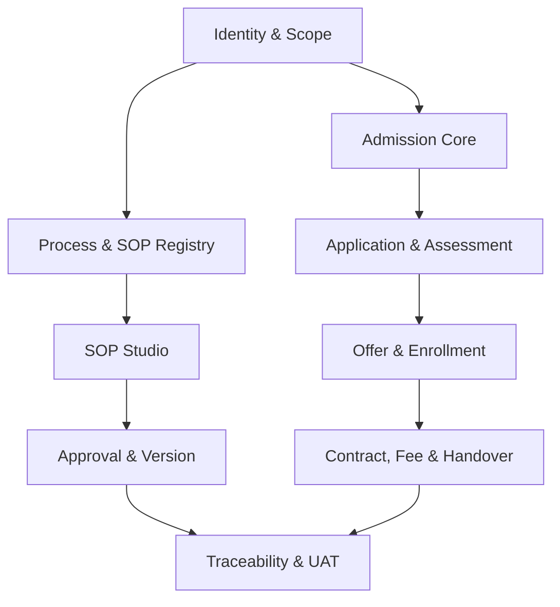

# PRODUCT BACKLOG & FUNCTIONAL SPECIFICATION — SOP WEB APP MVP

| Thuộc tính | Giá trị |
|---|---|
| Mã tài liệu | PB-FS-MVP-001 |
| Phiên bản | 0.1 — Proposed |
| Phạm vi | SOP Governance + Lead-to-Enrollment Pilot |
| Delivery cadence | Sprint 2 tuần — Proposed |
| Estimation | T-shirt size: XS/S/M/L/XL |
| Release | MVP Pilot |

## 1. Mục tiêu backlog

Tài liệu chuyển Product Charter, Process Architecture, Data Model và UX Specification thành backlog triển khai được. Mỗi item quan trọng phải truy vết được đến:

`Epic → Feature → User Story → Acceptance Criteria → Business Rule → API Command/Event → Permission → Audit → Test Case`

Estimate trong tài liệu là mức tương đối, không phải ngày công. Velocity và capacity chỉ được lập sau khi biết đội hình, năng lực và Definition of Done thực tế.

## 2. Backlog hierarchy và ID convention

| Level | ID format | Ví dụ |
|---|---|---|
| Epic | EPIC-XX | EPIC-03 SOP Registry |
| Feature | FT-XX-YY | FT-03-02 SOP search |
| User Story | US-XX-YYY | US-03-004 Filter SOP |
| Acceptance Criterion | AC-US-ID-NN | AC-US-03-004-01 |
| Technical Task | TS-XX-YYY | TS-03-001 Search index |
| Test Case | TC-XX-YYY | TC-03-004 |

## 3. Prioritization

- **P0:** bắt buộc để pilot vận hành an toàn.
- **P1:** quan trọng, có thể release sau core workflow nếu cần.
- **P2:** nâng cao/optimization.
- **MoSCoW:** MUST, SHOULD, COULD, WON'T cho release hiện tại.

## 4. Epic portfolio

| Epic | Tên | Outcome | Priority |
|---|---|---|---|
| EPIC-01 | Identity & Access | Đăng nhập và truy cập đúng organization/campus/role | P0 |
| EPIC-02 | Process Architecture | Quản lý L0–L3 và dependency | P0 |
| EPIC-03 | SOP Registry & Discovery | Nguồn SOP duy nhất, tìm đúng Effective version | P0 |
| EPIC-04 | SOP Studio | Soạn SOP có cấu trúc và validation | P0 |
| EPIC-05 | Review & Approval | Review, comment, approve, reject, SLA | P0 |
| EPIC-06 | Version & Publication | Immutable version, schedule, effective, supersede | P0 |
| EPIC-07 | Traceability Catalog | Rule, Requirement, AC, Test và impact | P1, pilot-required subset |
| EPIC-08 | Admission Operations | Lead-to-Enrollment ADM-001…010 | P0 pilot |
| EPIC-09 | Shared Services & Audit | Task, notification, document, audit | P0 |
| EPIC-10 | Dashboard & Reporting | Actionable dashboard và funnel | P1/P0 subset |
| EPIC-11 | Administration & Configuration | Master data, template, workflow config | P0 |
| EPIC-12 | Platform Quality | Security, observability, backup, performance, CI/CD | P0 |

## 5. EPIC-01 — Identity & Access

### Feature list

| Feature | Nội dung | Priority |
|---|---|---|
| FT-01-01 | Authentication adapter | P0 |
| FT-01-02 | Organization/campus context | P0 |
| FT-01-03 | Role/permission/scoped assignment | P0 |
| FT-01-04 | Access administration | P0 |
| FT-01-05 | Security session controls | P1 |

### User stories

| Story | User story | AC summary | Command/API | Size |
|---|---|---|---|---|
| US-01-001 | Là user, tôi muốn đăng nhập qua IdP được cấu hình để không dùng tài khoản rời rạc | Valid identity; disabled user rejected; login audit | Authenticate/Callback | L |
| US-01-002 | Là user nhiều campus, tôi muốn chọn scope làm việc | Chỉ hiện campus được cấp; scope giữ giữa routes | SetWorkingScope | S |
| US-01-003 | Là admin, tôi muốn tạo/mời user | Email unique; role chưa được cấp ngầm | InviteUser | M |
| US-01-004 | Là admin, tôi muốn gán role theo campus/domain | Scope required; effective dates; audit | AssignUserRoleScope | M |
| US-01-005 | Là security admin, tôi muốn suspend user | Session revoke; reason required; audit | SuspendUser | M |
| US-01-006 | Là user, tôi chỉ xem action mình có quyền | UI và API cùng enforce; direct URL denied | AuthorizeRequest | L |
| US-01-007 | Là auditor, tôi muốn xem lịch sử thay đổi quyền | Before/after, actor, reason | ListAccessAudit | S |

### Detailed acceptance criteria

**US-01-004 — Gán role theo scope**

- AC-01: Given admin có `access:assign`, when chọn user, role và campus hợp lệ, then assignment được tạo với valid period.
- AC-02: Given admin không có quyền quản trị campus đích, when gọi API trực tiếp, then trả 403 và không tạo assignment.
- AC-03: Given assignment trùng active scope, when submit, then hệ thống chặn duplicate.
- AC-04: Given role nhạy cảm, when assign, then reason bắt buộc và audit before/after được tạo.
- AC-05: Given assignment hết hạn, when user gọi API, then quyền không còn hiệu lực dù UI chưa refresh.

## 6. EPIC-02 — Process Architecture

| Story | User story | Priority | Command/Event | Size |
|---|---|---|---|---|
| US-02-001 | BA tạo Process Node L0–L3 | P0 | CreateProcessNode / ProcessNodeCreated | M |
| US-02-002 | BA chỉnh sửa node Proposed | P0 | UpdateProcessNode | S |
| US-02-003 | Architect phê duyệt Process Architecture | P0 | ApproveProcessNode | M |
| US-02-004 | User xem cây L0–L3 | P0 | QueryProcessTree | M |
| US-02-005 | User xem dependency upstream/downstream | P0 | LinkProcessDependency | M |
| US-02-006 | Owner xem SOP thuộc Process | P0 | QueryProcessSOPs | S |
| US-02-007 | Architect retire process có kiểm soát | P1 | RetireProcessNode | M |

### Rules

- Parent level phải đúng thứ tự.
- Code unique trong organization.
- Không được tạo cycle.
- L3 cần owner trước Approved.
- Process có SOP Effective không được retire nếu chưa có impact resolution.

## 7. EPIC-03 — SOP Registry & Discovery

| Story | User story | Priority | Command/API | Size |
|---|---|---|---|---|
| US-03-001 | Author tạo SOP identity dưới Process L3 | P0 | CreateSOP | M |
| US-03-002 | Viewer xem SOP Effective | P0 | GetEffectiveSOP | M |
| US-03-003 | User tìm SOP theo code/title/content | P0 | SearchSOP | L |
| US-03-004 | User lọc SOP theo process/status/owner/scope | P0 | ListSOP | M |
| US-03-005 | User lưu personal view | P1 | SaveSOPView | S |
| US-03-006 | Owner xem SOP đến hạn review | P0 | ListReviewDueSOP | S |
| US-03-007 | User export SOP theo quyền | P0 | ExportSOP | M |
| US-03-008 | User mở SOP theo deep link | P0 | ResolveSOPRoute | S |

### Detailed acceptance criteria

**US-03-001 — Tạo SOP identity**

- Given Process L3 Approved/Proposed theo policy, when Author nhập code/title/type/owner/scope hợp lệ, then SOP identity và Draft v1 được tạo.
- Code phải unique trong organization.
- Owner required trước Submit Review; có thể TBD trong Draft nếu policy cho phép.
- Create action ghi audit; không tự publish.

**US-03-002 — Xem SOP Effective**

- User không có quyền draft chỉ nhận Effective version phù hợp scope/time.
- Nếu có Scheduled future version, viewer không được thấy nội dung trừ quyền riêng.
- URL cũ đến Superseded version hiển thị banner và link Current Effective.

**US-03-007 — Export SOP**

- Export format tối thiểu PDF/HTML hoặc DOCX quyết định trong technical spike.
- HRI/Confidential attachment không tự nhúng nếu thiếu permission.
- Export privileged yêu cầu reason nếu policy cấu hình.
- Audit ghi user, version, format, time và scope.

## 8. EPIC-04 — SOP Studio

| Story | User story | Priority | Command | Size |
|---|---|---|---|---|
| US-04-001 | Author chọn template khi tạo version | P0 | InitializeSOPVersion | M |
| US-04-002 | Author sửa SOP section | P0 | SaveSOPSection | L |
| US-04-003 | Author tạo structured SOP steps | P0 | UpsertSOPStep | L |
| US-04-004 | Author xây RACI | P0 | UpsertRACIEntry | M |
| US-04-005 | Author liên kết Rule/Form/KPI/Requirement | P1/pilot MUST | CreateTraceLink | M |
| US-04-006 | Author chạy validation | P0 | ValidateSOPVersion | L |
| US-04-007 | Author xem completeness | P0 | CalculateCompleteness | M |
| US-04-008 | System autosave draft | P0 | SaveDraft | M |
| US-04-009 | System xử lý concurrent edit | P0 | CheckRowVersion | L |
| US-04-010 | Author preview SOP | P0 | RenderSOPPreview | M |
| US-04-011 | Author copy content từ version cũ | P0 | CreateVersionFrom | M |

### Validation specification

| Severity | Ví dụ | Submit allowed |
|---|---|---|
| BLOCKING | Thiếu owner, trigger, R/A, invalid transition | Không |
| WARNING | KPI target TBD, thiếu test link | Có theo policy |
| INFO | Automation suggestion | Có |

### Detailed acceptance criteria

**US-04-003 — Structured steps**

- Step number unique và có thứ tự trong version.
- Actor, action required.
- Status before/after phải thuộc lifecycle catalog nếu được chọn.
- Input/output là reference có cấu trúc; không chỉ text tự do nếu object đã có catalog.
- Delete/reorder step trong Draft ghi activity; version In Review bị khóa theo policy.

**US-04-009 — Concurrent edit**

- Given Author A và B mở cùng row_version, when A lưu trước, then B nhận 409 khi lưu bản cũ.
- UI hiển thị latest version và nội dung của B.
- Không silent overwrite.
- B có thể reload hoặc copy nội dung chưa lưu; merge chỉ cho field an toàn.

## 9. EPIC-05 — Review & Approval

| Story | User story | Priority | Command/Event | Size |
|---|---|---|---|---|
| US-05-001 | Author submit version review | P0 | SubmitSOPReview / ReviewRequested | M |
| US-05-002 | Reviewer comment theo section/step | P0 | AddReviewComment | M |
| US-05-003 | Reviewer request changes | P0 | RequestSOPChanges | M |
| US-05-004 | Reviewer complete review | P0 | CompleteSOPReview | M |
| US-05-005 | Approver approve version | P0 | ApproveSOPVersion | L |
| US-05-006 | Approver reject version | P0 | RejectSOPVersion | M |
| US-05-007 | User xem Approval Inbox | P0 | ListApprovalInbox | M |
| US-05-008 | Manager escalate/delegate approval | P1 | Escalate/DelegateApproval | L |
| US-05-009 | System theo dõi approval SLA | P0 | ApprovalOverdue event | M |
| US-05-010 | User xem diff và impact | P0 | CompareSOPVersions | L |

### Approval guards

- Reviewer/Approver phải thuộc scope hợp lệ.
- SoD: author không tự approve nếu policy cấm.
- Request changes/Reject/Delegate bắt buộc reason.
- Approve chặn nếu còn Blocking validation.
- Action append-only; không sửa lịch sử approval.

## 10. EPIC-06 — Version & Publication

| Story | User story | Priority | Command/Event | Size |
|---|---|---|---|---|
| US-06-001 | Owner tạo version mới từ Effective | P0 | CreateSOPVersion | M |
| US-06-002 | Approver schedule effective date | P0 | ScheduleSOPVersion | M |
| US-06-003 | System activate Scheduled version | P0 | ActivateSOPVersion | L |
| US-06-004 | System supersede old version | P0 | SOPVersionSuperseded | M |
| US-06-005 | User xem version history | P0 | ListSOPVersions | S |
| US-06-006 | User compare two versions | P0 | CompareSOPVersions | L |
| US-06-007 | Owner archive/retire SOP | P1 | ArchiveSOP/RetireSOP | M |
| US-06-008 | System tạo review reminder | P0 | SOPReviewDue event | S |

### Effective version invariant

Một SOP chỉ có một version Effective trong cùng scope/time. Activation và supersede phải chạy trong một transaction hoặc locking strategy đảm bảo invariant.

## 11. EPIC-07 — Traceability Catalog

| Story | User story | Priority | Command | Size |
|---|---|---|---|---|
| US-07-001 | BA tạo Business Rule | P1/MUST pilot | CreateBusinessRule | M |
| US-07-002 | BA tạo Functional Requirement | P1/MUST pilot | CreateRequirement | M |
| US-07-003 | BA viết Given/When/Then AC | P1/MUST pilot | CreateAcceptanceCriterion | S |
| US-07-004 | QA tạo Test Case | P1/MUST pilot | CreateTestCase | M |
| US-07-005 | BA liên kết trace chain | P1/MUST pilot | CreateTraceLink | M |
| US-07-006 | Product xem coverage gaps | P1 | CalculateTraceCoverage | L |
| US-07-007 | BA xem impact khi SOP/rule thay đổi | P1 | QueryImpactGraph | XL |
| US-07-008 | User export traceability matrix | P1 | ExportTraceability | M |

### MVP scope cut

MVP bắt buộc CRUD có kiểm soát và trace chain cho 10 SOP pilot. Impact graph tự động nâng cao có thể lùi sau pilot nếu cần.

## 12. EPIC-08 — Admission Operations

### Feature map theo SOP

| Feature | SOP | Outcome |
|---|---|---|
| FT-08-01 Lead Intake | ADM-001 | Lead hợp lệ, owner, duplicate control |
| FT-08-02 Consultation | ADM-002 | Nhu cầu và next action |
| FT-08-03 School Tour | ADM-003 | Tour outcome |
| FT-08-04 Application | ADM-004 | Submitted Application |
| FT-08-05 Document Verification | ADM-005 | Verified/Incomplete |
| FT-08-06 Assessment | ADM-006 | Finalized result/recommendation |
| FT-08-07 Offer | ADM-007 | Approved/Issued/Responded Offer |
| FT-08-08 Enrollment | ADM-008 | Confirmed Enrollment |
| FT-08-09 Contract & Fee | ADM-009 | Active contract/fee plan |
| FT-08-10 Handover | ADM-010 | Accepted handover |

### FT-08-01 — Lead Intake

| Story | User story | Rule | Command/Event | Size |
|---|---|---|---|---|
| US-08-001 | Officer tạo Lead | BR-ADM-001/002 | CreateLead / LeadCreated | L |
| US-08-002 | System kiểm tra duplicate | BR-ADM-001 | CheckLeadDuplicate | L |
| US-08-003 | Manager assign Lead | BR-ADM-002 | AssignLead / LeadAssigned | M |
| US-08-004 | Officer qualify/disqualify Lead | Status rule | QualifyLead/DisqualifyLead | M |
| US-08-005 | Officer merge duplicate Lead | Audit/permission | MergeLead | XL |

**US-08-001 AC:**

- Contact và source required; campus/program có thể bổ sung trước Qualified.
- Normalize contact trước duplicate check.
- Nếu duplicate confidence vượt rule, Create bị chặn hoặc cảnh báo theo policy.
- Lead active cần owner và next action sau assignment.
- Event không chứa plaintext HRI dư thừa.

### FT-08-02 — Consultation

| Story | User story | Command | Size |
|---|---|---|---|
| US-08-006 | Officer ghi nhận interaction | RecordInteraction | M |
| US-08-007 | Officer ghi nhu cầu campus/program/intake | UpdateLeadNeeds | M |
| US-08-008 | Officer tạo follow-up task | ScheduleFollowUp | S |
| US-08-009 | Manager xem overdue follow-up | ListOverdueLeadTasks | S |

### FT-08-03 — School Tour

| Story | User story | Command/Event | Size |
|---|---|---|---|
| US-08-010 | Officer đặt lịch tour | ScheduleSchoolTour / TourScheduled | M |
| US-08-011 | Officer reschedule/cancel | Reschedule/CancelTour | M |
| US-08-012 | Host complete/no-show tour | CompleteTour/MarkNoShow | M |
| US-08-013 | System gửi confirmation/reminder | TourReminderRequested | M |

### FT-08-04/05 — Application & Documents

| Story | User story | Rule | Command | Size |
|---|---|---|---|---|
| US-08-014 | Officer start Application từ Lead | BR-ADM-003 | StartApplication | L |
| US-08-015 | Officer quản lý guardian relationship | Authority rule | UpsertGuardianRelationship | L |
| US-08-016 | User upload document | Security/file rule | UploadApplicationDocument | L |
| US-08-017 | Officer submit Application | BR-ADM-003 | SubmitApplication | M |
| US-08-018 | Reviewer verify/reject document | BR-ADM-004 | Verify/RejectDocument | M |
| US-08-019 | Officer mark Incomplete/Verified | Checklist rule | MarkApplicationState | M |
| US-08-020 | System tạo checklist theo context | BR-ADM-004 | GenerateApplicationChecklist | L |

**Security AC cho upload:**

- MIME/size kiểm tra server-side.
- File malware scan trước khi available.
- Storage key không phải public URL.
- Classification inherit từ Application/Document type.
- Reject/quarantine event audit đầy đủ.

### FT-08-06 — Assessment

| Story | User story | Rule | Command | Size |
|---|---|---|---|---|
| US-08-021 | Officer schedule assessment | Eligibility | ScheduleAssessment | M |
| US-08-022 | Assessor record structured result | Template version | RecordAssessmentResult | L |
| US-08-023 | Assessor finalize result | BR-ADM-005 | FinalizeAssessment | M |
| US-08-024 | Authorized user create revision | BR-ADM-005 | CreateAssessmentRevision | M |
| US-08-025 | Manager record admission decision | Approval rule | FinalizeAdmissionDecision | L |

### FT-08-07 — Offer

| Story | User story | Rule | Command/Event | Size |
|---|---|---|---|---|
| US-08-026 | Officer draft Offer | BR-ADM-006 | DraftOffer | L |
| US-08-027 | Officer submit Offer approval | Approval matrix | SubmitOfferApproval | M |
| US-08-028 | Approver approve/reject Offer | SoD/terms | Approve/RejectOffer | M |
| US-08-029 | Officer issue Offer | BR-ADM-006 | IssueOffer / OfferIssued | M |
| US-08-030 | Authorized guardian accept/decline | BR-ADM-007 | RespondToOffer | L |
| US-08-031 | System expire Offer | BR-ADM-007 | ExpireOffer / OfferExpired | M |
| US-08-032 | Officer extend/reissue Offer | Version rule | ReissueOffer | L |

### FT-08-08 — Enrollment

| Story | User story | Rule | Command/Event | Size |
|---|---|---|---|---|
| US-08-033 | Officer xem readiness blockers | BR-ADM-008 | GetEnrollmentReadiness | L |
| US-08-034 | Manager confirm Enrollment | BR-ADM-008/009 | ConfirmEnrollment / EnrollmentConfirmed | L |
| US-08-035 | Authorized user put On Hold | Reason/permission | HoldEnrollment | M |
| US-08-036 | Authorized user cancel Enrollment | Reason/impact | CancelEnrollment | L |

### FT-08-09 — Contract & Fee

| Story | User story | Rule | Command | Size |
|---|---|---|---|---|
| US-08-037 | Finance generate Contract từ template | BR-ADM-011 | GenerateContract | L |
| US-08-038 | Authorized party activate Contract | Immutable rule | ActivateContract | L |
| US-08-039 | Finance generate Fee Plan | Pricing rule | GenerateFeePlan | XL |
| US-08-040 | Officer request Discount | BR-ADM-010 | RequestDiscount | M |
| US-08-041 | Approver approve/reject Discount | Threshold/SoD | DecideDiscount | L |
| US-08-042 | Finance activate Fee Plan | Approval state | ActivateFeePlan | M |

### FT-08-10 — Handover

| Story | User story | Rule | Command/Event | Size |
|---|---|---|---|---|
| US-08-043 | System create Handover checklist | Template/context | PrepareHandover | L |
| US-08-044 | Officer complete item/link evidence | Item rule | CompleteHandoverItem | M |
| US-08-045 | Officer request exception | Approval rule | RequestHandoverException | M |
| US-08-046 | Admission submit Handover | BR-ADM-012 | SubmitHandover | M |
| US-08-047 | Receiver return Handover | Reason required | ReturnHandover | M |
| US-08-048 | Receiver accept Handover | BR-ADM-012 | AcceptHandover / HandoverAccepted | L |

## 13. EPIC-09 — Shared Services & Audit

| Story | User story | Priority | Size |
|---|---|---|---|
| US-09-001 | User xem My Tasks theo SLA | P0 | M |
| US-09-002 | System tạo/assign/complete task | P0 | L |
| US-09-003 | User nhận in-app notification | P0 | M |
| US-09-004 | System gửi email qua outbox | P0 | L |
| US-09-005 | System retry/dead-letter failed notification | P0 | L |
| US-09-006 | User upload/download document theo permission | P0 | L |
| US-09-007 | System malware scan/quarantine file | P0 | L |
| US-09-008 | System ghi append-only AuditEvent | P0 | XL |
| US-09-009 | Auditor search audit | P0 | L |
| US-09-010 | Auditor export audit có kiểm soát | P1 | M |
| US-09-011 | User comment/resolve thread | P0 | M |

### Audit acceptance baseline

- Business command quan trọng tạo audit trong cùng transaction boundary.
- Audit gồm actor, action, object, time, before/after, reason, correlation.
- Sensitive field mask/encrypt theo policy.
- Không có generic update/delete endpoint cho AuditEvent.
- Export audit tự tạo audit event mới.

## 14. EPIC-10 — Dashboard & Reporting

| Story | User story | Priority | Size |
|---|---|---|---|
| US-10-001 | User xem role-based dashboard | P0 subset | L |
| US-10-002 | Process Owner xem SOP health | P1 | L |
| US-10-003 | Admission Manager xem funnel | P0 pilot | L |
| US-10-004 | Officer xem overdue/action queue | P0 | M |
| US-10-005 | Manager filter report campus/program/time | P1 | M |
| US-10-006 | Executive xem conversion/cycle/capacity | P1 | XL |
| US-10-007 | Authorized user export report | P1 | M |

Dashboard query dùng view/materialized view; không trả PII không cần thiết.

## 15. EPIC-11 — Administration & Configuration

| Story | User story | Priority | Size |
|---|---|---|---|
| US-11-001 | Admin quản lý campus/department | P0 | M |
| US-11-002 | Admin quản lý master data | P0 | L |
| US-11-003 | Admin quản lý SOP templates | P0 | L |
| US-11-004 | Admin quản lý approval definition version | P0 | XL |
| US-11-005 | Admin quản lý notification template | P1 | M |
| US-11-006 | Admin cấu hình SLA/escalation | P1 | L |
| US-11-007 | Admin xem configuration change history | P0 | M |
| US-11-008 | Admin import seed/master data có validation | P0 | L |

Definition/template đã được sử dụng không sửa trực tiếp; tạo version mới.

## 16. EPIC-12 — Platform Quality

| Technical story | Outcome | Priority |
|---|---|---|
| TS-12-001 | Monorepo/module boundaries và coding standards | P0 |
| TS-12-002 | CI: lint, typecheck, unit/integration test, build | P0 |
| TS-12-003 | Docker dev/staging/production baseline | P0 |
| TS-12-004 | Database migration và seed strategy | P0 |
| TS-12-005 | Structured logging/correlation ID | P0 |
| TS-12-006 | Health/readiness endpoints | P0 |
| TS-12-007 | Metrics/error monitoring | P0 |
| TS-12-008 | Backup/restore automation và test | P0 |
| TS-12-009 | Secrets management | P0 |
| TS-12-010 | Dependency/SAST/container scan | P0 |
| TS-12-011 | Rate limit/input validation/security headers | P0 |
| TS-12-012 | Performance test baseline | P1 |
| TS-12-013 | Accessibility automated/manual checks | P0 |
| TS-12-014 | Transactional outbox worker | P0 |
| TS-12-015 | File storage/signed access/malware integration | P0 |

## 17. Permission catalog baseline

| Resource | Actions |
|---|---|
| process | view, create, edit, approve, retire |
| sop | view_effective, view_draft, create, edit, submit, approve, publish, export, retire |
| approval | view, review, approve, reject, delegate, escalate |
| rule/requirement/test | view, create, edit, approve, retire |
| lead | view, create, edit, assign, qualify, merge, close, export |
| application | view, create, edit, submit, verify_document, decide |
| assessment | view, schedule, record, finalize, revise |
| offer | view, draft, approve, issue, respond, reissue, withdraw |
| enrollment | view, confirm, hold, cancel |
| contract/fee | view, generate, approve, activate, export |
| handover | view, prepare, submit, return, accept, exception |
| audit | view, export |
| administration | user, role, master, template, workflow, security |

Mỗi permission được kết hợp organization/campus/domain/data classification scope.

## 18. Event catalog baseline

| Event | Producer | Consumer |
|---|---|---|
| SOPReviewRequested | SOP | Approval, notification, task |
| SOPVersionApproved | Approval | Publication |
| SOPVersionEffective | Publication | Search, notification, reporting |
| SOPReviewDue | Scheduler | Task, notification |
| LeadCreated/Assigned/Qualified | Admission | Task, dashboard, analytics |
| ApplicationSubmitted/DocumentsVerified | Admission | Task, assessment |
| AssessmentCompleted | Academic | Decision queue |
| OfferIssued/Accepted/Expired | Offer | Notification, enrollment |
| EnrollmentConfirmed | Enrollment | Contract, fee, capacity, handover |
| FeePlanActivated | Finance | Billing/integration |
| HandoverAccepted | Handover | Student onboarding |
| ApprovalOverdue | Approval scheduler | Escalation/notification |
| DocumentQuarantined | File service | Owner/admin notification |

Events dùng transactional outbox, có event ID và consumer idempotency.

## 19. API functional conventions

- REST/HTTP hoặc framework tương đương, nhưng business transition dùng command endpoint rõ.
- Query endpoints filter/paginate server-side.
- Mutation yêu cầu `row_version`/ETag khi có concurrency risk.
- 409 cho conflict, 422 cho business validation, 403 cho permission.
- Idempotency key cho command có retry risk như submit/issue/accept.
- Không expose generic status update.
- Error payload gồm code, message an toàn, field/object reference và correlation ID.

Ví dụ:

```text
POST /api/sops/{id}/versions/{versionId}/submit-review
POST /api/offers/{id}/issue
POST /api/enrollments/{id}/confirm
POST /api/handovers/{id}/accept
```

## 20. Non-functional backlog and release criteria

### Security

- AuthN/AuthZ enforced server-side.
- Tenant/campus isolation tests.
- No plaintext secret.
- File scan và signed access.
- Privileged action audit.
- OWASP baseline review.

### Reliability

- Backup và successful restore test trước pilot.
- Outbox retry/dead-letter.
- Database migration rollback/forward plan.
- Health/readiness and alerting.

### Performance

- Server pagination.
- Search/index baseline.
- No unbounded list/export.
- Performance targets `TBD` sau workload workshop; test dữ liệu pilot representative.

### Accessibility

- Keyboard navigation.
- Visible focus.
- Label/error summary.
- Status không phụ thuộc màu.
- Automated axe/lighthouse-equivalent + manual core flow test.

## 21. Sprint roadmap — Proposed

| Sprint | Goal | Stories/Deliverables chính |
|---|---|---|
| Sprint 0 | Foundation & decisions | ADR, repo, CI/CD, Docker, schema, tokens, test strategy |
| Sprint 1 | Identity & organization | US-01, campus, role scope, audit skeleton |
| Sprint 2 | Process & SOP registry | US-02, US-03 core, Process Map/SOP Library |
| Sprint 3 | SOP Studio | US-04 editor, step, RACI, validation, autosave |
| Sprint 4 | Approval & version | US-05/06, diff, publication, notification |
| Sprint 5 | Admission part 1 | Lead, interaction, tour, application, document |
| Sprint 6 | Admission part 2 | Assessment, decision, offer, enrollment |
| Sprint 7 | Finance/handover & pilot hardening | Contract/fee, handover, dashboard, UAT/security/performance |

Sprint assignment là release slice tham chiếu. Product Owner điều chỉnh theo velocity và dependency sau refinement.

## 22. Dependency map



Shared Audit/Task/Notification/File services bắt đầu từ Sprint 1 và phát triển xuyên sprint.

## 23. Definition of Ready

Một story chỉ được đưa vào sprint khi:

- Persona và business outcome rõ.
- Acceptance criteria testable.
- Rule/status/permission xác định.
- UI flow/wireframe hoặc interaction đủ hiểu.
- API command/query và entity liên quan được xác định.
- Dependency và open decision được xử lý hoặc có assumption chấp nhận.
- Test data và security classification được biết.
- Size không vượt mức đội thống nhất; story lớn được split.

## 24. Definition of Done

- Code review hoàn tất.
- Unit/integration test đạt.
- Acceptance criteria được chứng minh.
- Permission, tenant/campus scope test đạt.
- Audit/notification/event đúng nếu story yêu cầu.
- Migration/seed cập nhật và test.
- UI responsive/accessibility core checks đạt.
- Logging/error handling/correlation ID đúng.
- Documentation/API contract cập nhật.
- Deployed staging và QA accepted.
- Không còn blocker/critical defect.

## 25. Test strategy

| Layer | Mục tiêu |
|---|---|
| Unit | Rule, state transition, calculation, validation |
| Integration | DB constraints, repository, outbox, file, auth |
| API contract | Request/response/error/idempotency |
| E2E | SOP authoring/approval và Lead-to-Enrollment |
| Permission | Role, campus, domain, direct URL/API |
| Audit | Event completeness và masking |
| Security | Auth, injection, upload, access control |
| Accessibility | Keyboard, label, focus, status, screen reader basics |
| Performance | Search/list/report/export và concurrent edit |
| Recovery | Backup/restore và failed event retry |

## 26. UAT traceability matrix

| UAT | Flow | Stories | SOP/Rule |
|---|---|---|---|
| UAT-001 | Tạo → validate → submit SOP | US-03-001, US-04-001…010, US-05-001 | SOP Governance |
| UAT-002 | Review → changes → resubmit | US-05-002…004 | SOP Governance |
| UAT-003 | Approve → schedule → effective | US-05-005, US-06-002…004 | SOP Governance |
| UAT-004 | Effective viewer + version history | US-03-002, US-06-005/006 | Version rule |
| UAT-005 | Concurrent edit conflict | US-04-009 | Optimistic lock |
| UAT-006 | Lead create/duplicate/assign/qualify | US-08-001…005 | ADM-001, BR-ADM-001/002 |
| UAT-007 | Consultation/tour | US-08-006…013 | ADM-002/003 |
| UAT-008 | Application/documents | US-08-014…020 | ADM-004/005, BR-ADM-003/004 |
| UAT-009 | Assessment finalize/revision | US-08-021…025 | ADM-006, BR-ADM-005 |
| UAT-010 | Offer approval/issue/response/expiry | US-08-026…032 | ADM-007, BR-ADM-006/007 |
| UAT-011 | Enrollment blocker/confirm | US-08-033…036 | ADM-008, BR-ADM-008/009 |
| UAT-012 | Contract/fee/discount | US-08-037…042 | ADM-009, BR-ADM-010/011 |
| UAT-013 | Handover return/exception/accept | US-08-043…048 | ADM-010, BR-ADM-012 |
| UAT-014 | Cross-campus access denial | US-01-002/004/006 | RBAC/data scope |
| UAT-015 | Audit privileged actions | US-09-008…010 | BR-ADM-013/015 |

## 27. Release scope

### MVP MUST

- EPIC-01 core identity/scope/RBAC.
- EPIC-02 Process L0–L3.
- EPIC-03 SOP Registry/search/effective view.
- EPIC-04 structured authoring/validation/concurrency.
- EPIC-05 review/approval.
- EPIC-06 version/publication.
- EPIC-07 minimum trace chain cho 10 SOP.
- EPIC-08 end-to-end pilot.
- EPIC-09 task/notification/document/audit.
- EPIC-10 admission operational dashboard subset.
- EPIC-11 master/template/approval config tối thiểu.
- EPIC-12 security/quality/backup/observability.

### Can defer after pilot

- Advanced impact graph.
- Shared saved views.
- Executive BI nâng cao.
- Full Parent Portal.
- BPMN visual editor.
- AI/OCR/RPA.
- Mobile native.

## 28. Risk-based backlog controls

| Risk | Backlog response |
|---|---|
| Scope tăng | MVP label + change control + release cut line |
| Dữ liệu trẻ em lộ | HRI field scope, masking, audit, security tests |
| Workflow bypass | Command endpoints + state machine server-side |
| Lost update | row_version/ETag + conflict UX |
| Email lỗi làm hỏng nghiệp vụ | Transactional outbox |
| File độc hại | Scan/quarantine/signed access |
| Approval sai SoD | Policy guard + permission test |
| Version Effective trùng | DB constraint + transactional activation |
| Report metric sai | KPI definition + stage history + UAT reconciliation |

## 29. Initial refinement questions

1. IdP dùng Microsoft 365 hay phương án khác?
2. Parent có trực tiếp nhập Application/Accept Offer trong MVP không?
3. Deposit/payment có phải blocker trước Confirm Enrollment?
4. Ngưỡng Discount và approval authority?
5. School Tour/Assessment bắt buộc theo rule nào?
6. Contract/Offer có chữ ký điện tử không?
7. Handover checklist chính thức gồm những gì?
8. Retention và privacy policy được ai phê duyệt?
9. Đội phát triển có bao nhiêu người và stack hiện hữu?
10. Môi trường deploy dự kiến on-premise, cloud hay hybrid?

Các câu hỏi chưa trả lời không chặn Sprint 0; chúng trở thành Decision/Spike có owner và deadline.

## 30. Sprint 0 task list

| Task | Output |
|---|---|
| SP0-01 | Xác nhận team topology và responsibility |
| SP0-02 | Khóa stack và ADR-001…010 |
| SP0-03 | Repo/module boundary/coding convention |
| SP0-04 | CI/CD và branch/review policy |
| SP0-05 | Dev/staging environment bằng Docker |
| SP0-06 | Database schema baseline và migration |
| SP0-07 | Auth/IdP technical spike |
| SP0-08 | Rich-text/structured editor spike |
| SP0-09 | Workflow/state machine spike |
| SP0-10 | File storage/malware scan spike |
| SP0-11 | Test strategy và test data policy |
| SP0-12 | Security/privacy threat modeling |
| SP0-13 | Observability và audit architecture |
| SP0-14 | Backlog refinement Sprint 1–2 |

## 31. Bước kế tiếp

Sau backlog này, bước tiếp theo là xây **Technical Architecture & ADR Pack**, gồm:

- System context/container/component architecture.
- Frontend/backend/module boundaries.
- Database/schema/migration strategy.
- Authentication/RBAC/security architecture.
- State machine/workflow design.
- Event/outbox/notification architecture.
- File/document architecture.
- Deployment, environments, CI/CD.
- Observability, backup, disaster recovery.
- ADR-001…010 và threat model.

Technical Architecture có thể dùng Product Backlog làm trace source để đảm bảo không thiết kế hạ tầng vượt quá nhu cầu MVP.
