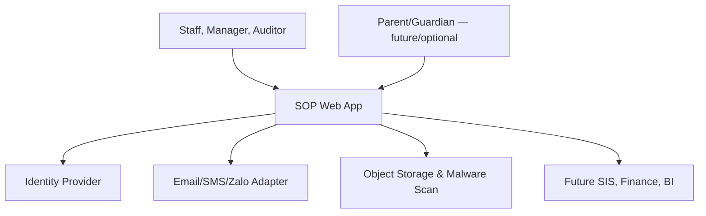
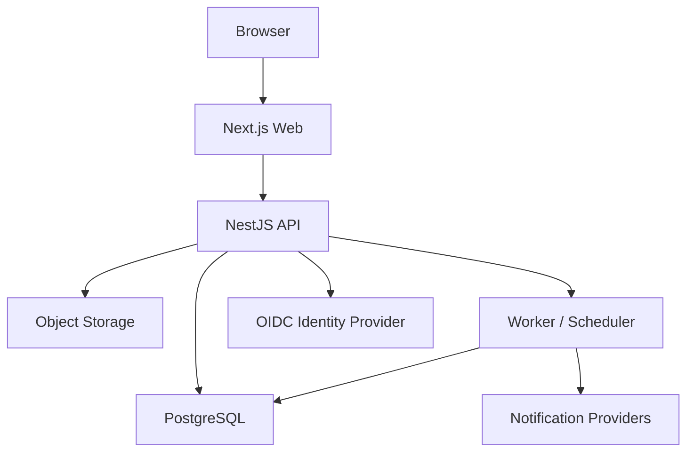
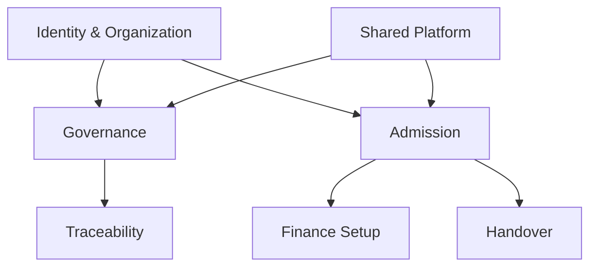
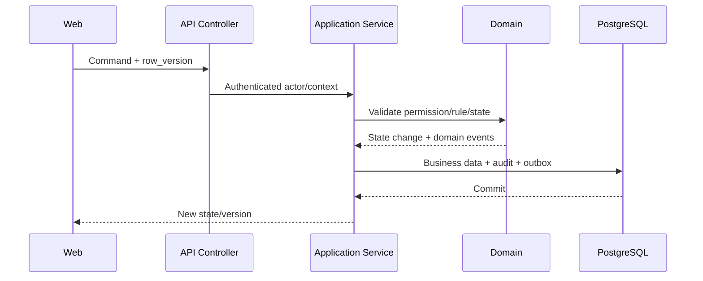
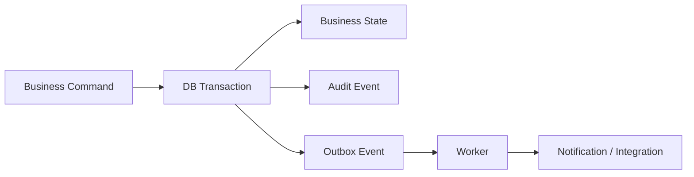
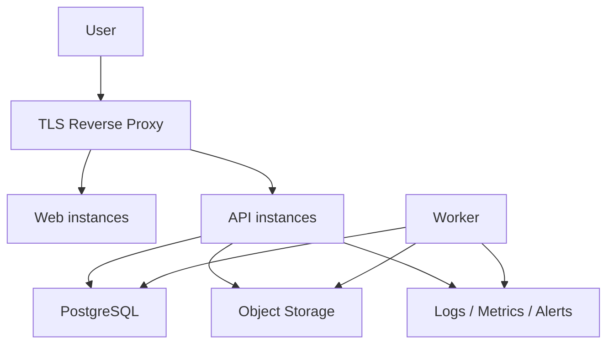

# TECHNICAL ARCHITECTURE & ADR PACK — SOP WEB APP MVP

| Thuộc tính | Giá trị |
|---|---|
| Mã tài liệu | TA-ADR-MVP-001 |
| Phiên bản | 0.1 — Proposed |
| Kiến trúc | Modular Monolith + Transactional Outbox |
| Frontend | Next.js + TypeScript — Proposed |
| Backend | NestJS + TypeScript — Proposed |
| Database | PostgreSQL |
| Deployment | Docker, tách Dev/Staging/Production |
| Phạm vi | SOP Governance + Lead-to-Enrollment Pilot |

## 1. Architecture goals

Kiến trúc phải đáp ứng:

1. Triển khai MVP nhanh nhưng không khóa khả năng mở rộng multi-campus.
2. Kiểm soát chặt status transition, permission, version và audit.
3. Không để frontend trở thành nơi thực thi Business Rule.
4. Không phát sinh độ phức tạp microservices trước khi có nhu cầu thực.
5. Có khả năng tách module/service sau này bằng ranh giới rõ.
6. Bảo vệ dữ liệu trẻ em, assessment, contract và guardian.
7. Có backup, restore, monitoring và deployment lặp lại được.

## 2. Quality attribute priorities

| Priority | Attribute | Yêu cầu kiến trúc |
|---:|---|---|
| 1 | Security & Privacy | Server-side RBAC/scope, audit, encryption, file control |
| 2 | Data Integrity | Transaction, constraints, immutable version, optimistic lock |
| 3 | Auditability | Append-only event, before/after, correlation |
| 4 | Maintainability | Module boundary, contract test, migration version |
| 5 | Usability | API hỗ trợ task/exception-driven UX |
| 6 | Reliability | Retry/outbox, backup/restore, health checks |
| 7 | Performance | Pagination, indexes, PostgreSQL FTS, async jobs |
| 8 | Scalability | Scale app/worker ngang trước khi tách service |

## 3. Architecture principles

- Backend là policy enforcement point.
- Mọi business transition dùng command rõ, không dùng generic status update.
- Module không truy cập trực tiếp repository/table của module khác.
- Dữ liệu liên module trao đổi qua application service, domain event hoặc read model.
- Audit và outbox ghi trong cùng transaction với business state.
- Effective/Finalized/Active objects là immutable.
- Configuration có version nếu ảnh hưởng hồ sơ lịch sử.
- External integration không nằm trong transaction nghiệp vụ chính.
- Không chứa secret hoặc production config trong repository.

## 4. System context



External systems là adapter boundary. MVP không hard-code Microsoft 365, Google, Zalo hoặc payment provider vào domain model.

## 5. Container architecture



### Containers

| Container | Trách nhiệm | Scale |
|---|---|---|
| Web | Rendering, interaction, BFF-light nếu cần | Horizontal |
| API | AuthZ, commands, queries, rules, transactions | Horizontal |
| Worker | Outbox, schedule, notification, export, retention jobs | Horizontal với locking |
| PostgreSQL | Source of truth, FTS MVP, constraints | Primary + backup; HA theo môi trường |
| Object Storage | Attachment/export bytes | Provider-managed hoặc S3-compatible |
| Reverse Proxy | TLS, routing, headers, rate limit hỗ trợ | Redundant theo production |

Redis không bắt buộc trong MVP. Chỉ bổ sung khi có use case rõ như distributed cache, rate limit coordination hoặc job queue vượt khả năng PostgreSQL outbox/worker.

## 6. Module architecture



### Module boundaries

| Module | Aggregate/Capability chính |
|---|---|
| Identity | UserAccount, Role, Permission, UserRoleScope |
| Organization | Organization, Campus, Department |
| Process | ProcessNode, ProcessDependency |
| SOP | SOP, SOPVersion, Section, Step, RACI, Scope |
| Approval | ApprovalDefinition, Instance, Action |
| Traceability | Rule, Requirement, AC, Test, TraceLink |
| Admission CRM | Person, Prospect, Guardian, Lead, Interaction, Tour |
| Application | Application, Document Checklist |
| Assessment | Assessment, Decision |
| Offer/Enrollment | Offer, Enrollment, Readiness |
| Finance Setup | Contract, FeePlan, DiscountRequest |
| Handover | HandoverPackage, Item, Exception |
| Task/Notification | Task, inbox, templates, delivery |
| Document | DocumentAsset, upload, scan, access |
| Audit | AuditEvent, explorer, export control |
| Reporting | Read models/materialized views |

## 7. Recommended repository structure

```text
apps/
  web/
  api/
  worker/
packages/
  ui/
  contracts/
  config/
  testing/
infra/
  docker/
  migrations/
  monitoring/
docs/
  adr/
  api/
```

Trong API:

```text
src/modules/<module>/
  domain/
  application/
  infrastructure/
  presentation/
```

Domain không import NestJS controller, ORM model hoặc provider SDK.

## 8. Frontend architecture

### Proposed stack

- Next.js phiên bản ổn định tương thích Node LTS được chọn tại Sprint 0.
- React + TypeScript strict.
- Server rendering cho app shell/read pages khi phù hợp; client component cho editor/workspace.
- Schema validation dùng một thư viện chuẩn, chia sẻ contract có kiểm soát.
- Query/mutation layer có cache invalidation rõ; không đặt business state trong global UI store tùy tiện.

### Frontend layers

| Layer | Nội dung |
|---|---|
| App shell | Navigation, scope, search, notifications |
| Feature routes | SOP, Approval, Admission, Admin |
| UI package | Design system/component primitives |
| Data client | Typed API, error normalization, auth refresh |
| Feature state | Form draft, filter, local interaction |
| Telemetry | Screen/action/error event không chứa PII |

### Rules

- Không quyết định permission chỉ dựa token claims ở UI.
- UI có thể ẩn action để UX rõ, nhưng API luôn kiểm tra lại.
- Không lưu access token dài hạn trong localStorage nếu architecture IdP cho phép secure cookie/session.
- Autosave có debounce, row_version và conflict handling.
- Rich-text content dùng structured JSON schema versioned.

## 9. Backend architecture

### Request flow



### Command handler responsibilities

1. Load actor and organization/campus scope.
2. Authorize resource/action/data classification.
3. Load aggregate với row_version.
4. Apply state machine và Business Rules.
5. Persist state, audit và outbox atomically.
6. Return safe DTO.

### Query handler responsibilities

- Enforce scope trước filter/pagination.
- Use projection/read model khi cần.
- Mask/omit sensitive field.
- Không reuse unrestricted ORM entity serialization.

## 10. Database architecture

### PostgreSQL strategy

- Một database, shared schema hoặc module-prefixed schemas quyết định tại Sprint 0.
- Mọi tenant-owned record có `organization_id`.
- Campus scope đặt trên aggregate root hoặc quan hệ truy vết rõ.
- UUID technical key; business code riêng.
- `timestamptz` UTC; `date` cho ngày sinh/ngày hiệu lực thuần túy.
- `numeric(19,4)` + currency cho tiền.
- `row_version bigint` cho optimistic locking.

### Constraints

- Unique business codes theo organization/scope.
- Exclusion/transaction guard cho một Effective SOP version trong một scope/time.
- Finalized Assessment/Active Contract không update trực tiếp.
- RACI mỗi activity một Accountable.
- FK không cascade delete dữ liệu trẻ em theo UserAccount.

### Schema migrations

- Migrations immutable sau merge/release.
- Forward-compatible theo expand/migrate/contract khi zero-downtime cần.
- Migration chạy riêng trước app rollout, có backup/checkpoint phù hợp.
- Seed data tách reference seed và demo/test seed.

### Row-Level Security

PostgreSQL RLS là defense-in-depth option, không thay application authorization. Spike tại Sprint 0 đánh giá complexity với connection pooling, background jobs và migrations.

## 11. Search architecture

### MVP

- PostgreSQL Full Text Search cho SOP/process/rule/requirement.
- Trigram/exact normalized hash cho matching được phép.
- Search projection chỉ chứa dữ liệu an toàn để index.
- Permission/scope filter trước khi trả result/snippet.

### Upgrade trigger

Chỉ tách search engine khi đo được nhu cầu về scale, relevance, multilingual, faceting hoặc indexing workload vượt PostgreSQL.

## 12. State machine architecture

### Approach

- State definitions và allowed transitions ở application/domain code hoặc configuration có version.
- Guard functions riêng cho permission, required field, approval và business rule.
- Transition command explicit.
- History ghi state before/after, actor, reason và correlation.

### Không dùng ở MVP

- BPMN engine tổng quát.
- User tự vẽ workflow arbitrary rồi chạy production.
- Generic `PATCH status`.

### Transition result

```text
allowed: boolean
blocking_rules: []
warnings: []
required_approvals: []
next_actions: []
```

## 13. Approval architecture

- ApprovalDefinition versioned.
- Khi start, ApprovalInstance snapshot definition version và resolved approvers.
- ApprovalAction append-only.
- SoD kiểm tra tại start và tại action time.
- Delegation/escalation là action có reason và audit.
- Overdue scheduler phát event; không tự approve vì quá hạn.
- Idempotency ngăn double-click/double-submit.

## 14. Event and outbox architecture



### Outbox fields

- event_id.
- event_type/version.
- aggregate_type/id.
- organization_id.
- occurred_at.
- payload_json đã data-minimize.
- correlation_id/causation_id.
- status, attempts, next_attempt_at, processed_at.

### Delivery

- At-least-once.
- Consumer idempotent bằng event ID.
- Exponential backoff + jitter.
- Dead-letter state và admin visibility.
- Không rollback business transaction khi email/provider lỗi.

## 15. Task, scheduler and worker architecture

Worker đảm nhiệm:

- Process outbox.
- Notification dispatch.
- Offer expiry.
- SOP review reminder.
- Approval SLA/escalation.
- Export/render jobs.
- Materialized view refresh.
- Retention/disposition job khi policy được duyệt.

Worker concurrency dùng database locking/advisory lock hoặc job mechanism được ADR xác nhận. Job phải idempotent và observable.

## 16. File and document architecture

### Upload flow

1. API authorize upload intent.
2. Validate extension/MIME/size policy.
3. Upload vào quarantine storage/path.
4. Malware scan.
5. Nếu clean: promote/mark available.
6. Nếu infected/failed: quarantine, block access, notify/audit.
7. Download qua short-lived signed access hoặc API streaming theo permission.

### Controls

- Không lưu public permanent URL.
- SHA-256 integrity.
- Object key không chứa PII rõ.
- Classification và retention metadata.
- Server-side content disposition.
- Preview conversion chạy isolated worker nếu bổ sung.

## 17. Authentication architecture

### Proposed

- OIDC/OAuth2 authorization code flow.
- Microsoft Entra ID ưu tiên nếu organization sử dụng Microsoft 365; vẫn giữ adapter để hỗ trợ IdP khác.
- Backend session hoặc secure HttpOnly cookie strategy được spike theo deployment topology.
- UserAccount map bằng immutable external subject + issuer, không chỉ email.

### Controls

- MFA tại IdP theo policy.
- User status/scope kiểm tra mỗi request hoặc cache ngắn có invalidation.
- Suspend user revoke session/token path phù hợp.
- Service account tách actor type và scope.
- Không tự tạo quyền chỉ dựa IdP group nếu mapping chưa được admin duyệt.

## 18. Authorization architecture

Quyết định truy cập:

`Actor + Resource + Action + Organization + Campus + Domain + Data Classification + Object State`

### Enforcement points

- Route guard: coarse action.
- Application service: object/scope/state.
- Query builder/repository: row scope.
- DTO mapper: field masking.
- Export service: export-specific permission.

### Admin separation

System Admin không mặc định xem content HRI. Security/tenant admin và data-role permission tách riêng.

## 19. Audit architecture

### Audit categories

- Authentication/security.
- Permission/configuration.
- Business content changes.
- Approval/transition.
- Sensitive view/export.
- File/document lifecycle.
- Integration/system job.

### Integrity

- Append-only application API.
- DB role hạn chế update/delete.
- Backup retention.
- Optional hash chaining/tamper evidence sau risk assessment.
- Audit explorer dùng masked before/after.

Audit không thay operational log; hai loại có retention/access khác nhau.

## 20. API architecture

### Conventions

- Version prefix `/api/v1`.
- JSON contract, typed OpenAPI generation.
- Command endpoints dùng verbs nghiệp vụ.
- Cursor hoặc page pagination nhất quán.
- Standard error envelope.
- Correlation ID response header/body.
- Idempotency key cho submit/issue/accept/generate jobs.
- ETag hoặc row_version cho update.

### Error mapping

| HTTP | Ý nghĩa |
|---:|---|
| 400 | Request malformed |
| 401 | Chưa authenticated |
| 403 | Không đủ quyền/scope |
| 404 | Không tồn tại hoặc không được tiết lộ |
| 409 | Version/idempotency/state conflict |
| 422 | Business Rule validation |
| 429 | Rate limit |
| 500 | Unexpected; trả correlation ID |

## 21. Integration architecture

Mỗi integration qua port/adapter:

- IdentityProviderPort.
- NotificationProviderPort.
- ObjectStoragePort.
- MalwareScannerPort.
- SignatureProviderPort — future.
- SISPort/FinancePort — future.

Provider response được normalize; provider-specific ID/status không rò vào domain object trừ external reference metadata.

## 22. Deployment architecture

### Environments

| Environment | Mục đích | Dữ liệu |
|---|---|---|
| Local | Developer | Synthetic only |
| Dev | Integration liên tục | Synthetic/seed |
| Staging | QA/UAT rehearsal | Anonymized/synthetic |
| Production | Pilot/live | Controlled real data |

### Production topology baseline



On-premise, cloud hay hybrid còn Open Decision. Container images và config phải portable.

## 23. CI/CD architecture

### Pull request pipeline

- Format/lint.
- Typecheck.
- Unit test.
- Integration test với PostgreSQL disposable container.
- API contract check.
- Build web/api/worker.
- Dependency, SAST, secret và container scan.
- Migration validation.
- Accessibility test cho core pages.

### Release pipeline

1. Build once, sign/tag image.
2. Deploy staging.
3. Run migration + smoke/E2E/security checks.
4. Approval gate.
5. Production backup/checkpoint.
6. Migration/deploy.
7. Health/smoke/monitoring verification.
8. Rollback/roll-forward theo runbook.

Không build lại artifact khác cho production.

## 24. Configuration and secrets

- Non-secret config qua environment/config service.
- Secret qua secret manager hoặc protected runtime mechanism.
- Production secret không trong `.env` commit, image hoặc log.
- Environment-specific values validated at startup.
- Feature flags có owner, expiry và audit nếu ảnh hưởng behavior.
- Business master/configuration quản lý trong app, có version/audit.

## 25. Observability architecture

### Signals

- Structured application logs.
- Metrics.
- Distributed/request correlation.
- Error monitoring.
- Audit events.
- Synthetic health checks.

### Key metrics

- Request rate/error/latency.
- DB connection/query latency.
- Outbox backlog/age/retry/dead-letter.
- Worker job duration/failure.
- Notification delivery failure.
- File scan pending/failure.
- Approval overdue count.
- Auth failure/403 anomaly.
- Backup status/restore test date.

Log không chứa token, secret, document content hoặc plaintext HRI.

## 26. Backup and disaster recovery

### Backup scope

- PostgreSQL full + incremental/WAL nếu hạ tầng hỗ trợ.
- Object storage versioning/backup.
- Configuration/templates.
- Deployment manifests và immutable images.
- Encryption keys theo provider policy.

### Required controls

- Backup encrypted.
- Access tách khỏi app operator khi phù hợp.
- Restore test theo lịch.
- Point-in-time recovery nếu RPO yêu cầu.
- Runbook và owner rõ.

RPO/RTO đang `TBD`; phải chốt với Business Owner trước pilot production.

## 27. Security threat model — STRIDE baseline

| Threat | Scenario | Controls |
|---|---|---|
| Spoofing | Giả user/guardian | OIDC, MFA, session security, authority verification |
| Tampering | Sửa SOP Effective/Assessment/Contract | Immutable version, DB constraints, audit |
| Repudiation | Phủ nhận approval/offer response | Actor/time/evidence/correlation, append-only action |
| Information Disclosure | Cross-campus/HRI leak | Scope auth, DTO masking, encrypted storage, export permission |
| Denial of Service | Upload/search/export abuse | Limits, pagination, rate limiting, async export |
| Elevation of Privilege | Admin tự cấp quyền nhạy cảm | SoD, scoped admin, audit, approval policy |

### Priority abuse cases

1. Direct URL/API access sang campus khác.
2. Sửa status qua request thủ công.
3. Tải assessment/contract không có quyền.
4. Upload malware/polyglot file.
5. CSV/PDF export dữ liệu hàng loạt.
6. Double-submit Offer/Enrollment/Handover.
7. Reuse signed URL quá hạn.
8. Admin xem HRI chỉ vì có quyền cấu hình.
9. Injection trong rich text/document metadata.
10. Log/analytics vô tình chứa PII/token.

## 28. Security verification backlog

- Tenant/campus authorization integration tests.
- Object-level and field-level access tests.
- State transition bypass tests.
- Mass assignment/input validation tests.
- IDOR tests.
- Upload MIME/size/malware/path tests.
- XSS/sanitization tests cho structured content/render/export.
- CSRF/session/cookie tests theo auth strategy.
- Rate-limit và resource exhaustion tests.
- Secret/container/dependency scans.
- Backup access và restore integrity tests.

## 29. Performance architecture

### Tactics

- Server-side pagination/filter/sort.
- Selective projection, không serialize entity graph.
- Composite/partial indexes theo workload.
- Async export/render.
- Materialized views cho funnel/report.
- Cache chỉ sau measurement; authorization-aware.
- Object storage trực tiếp có signed access kiểm soát.

### Load profile cần xác nhận

- Số organization/campus.
- Concurrent staff.
- SOP count/version/content size.
- Lead/application volume.
- File size/count.
- Reporting/export frequency.

Không đặt performance SLA định lượng khi chưa có workload baseline.

## 30. Testing architecture

| Test | Scope |
|---|---|
| Unit | Domain rule/state machine/calculation |
| Repository integration | Constraints/query/scope/migration |
| Application integration | Command + audit + outbox transaction |
| Contract | OpenAPI/provider adapter |
| E2E | SOP lifecycle và ADM-001…010 |
| Security | AuthZ/IDOR/upload/XSS/export |
| Accessibility | Core desktop/mobile flows |
| Performance | Search/list/report/concurrency/export |
| Recovery | Backup restore/outbox retry/provider failure |

Test data synthetic; không copy production PII sang Dev/Test.

## 31. ADR summary

| ADR | Decision | Status |
|---|---|---|
| ADR-001 | Modular Monolith cho MVP | Proposed |
| ADR-002 | Next.js + NestJS + TypeScript | Proposed |
| ADR-003 | PostgreSQL source of truth và FTS MVP | Proposed |
| ADR-004 | UUID technical ID + business code | Proposed |
| ADR-005 | Explicit state machine, không BPMN engine MVP | Proposed |
| ADR-006 | Transactional Outbox, at-least-once | Proposed |
| ADR-007 | OIDC IdP adapter; Entra ưu tiên khi phù hợp | Proposed |
| ADR-008 | Object storage + quarantine/malware scan | Proposed |
| ADR-009 | Structured JSON rich text | Proposed |
| ADR-010 | Append-only audit trong transaction | Proposed |
| ADR-011 | Docker multi-environment deployment | Proposed |
| ADR-012 | PostgreSQL RLS chỉ sau Sprint 0 spike | Proposed |

## 32. ADR-001 — Modular Monolith

**Context:** MVP có nhiều domain nhưng một team/sản phẩm và cần giao nhanh.

**Decision:** Một deployable backend API và worker, module boundaries rõ; chưa tách microservice.

**Consequences:**

- Giao dịch và deployment đơn giản.
- Dễ bảo đảm audit/outbox consistency.
- Cần code ownership/lint/dependency rules để ngăn module coupling.
- Tách service sau này dựa telemetry/team/scale, không dựa dự đoán.

## 33. ADR-002 — TypeScript stack

**Context:** UI cần rich workflow; backend cần modular architecture và shared contract. User/team có định hướng Next.js/NestJS ở các hệ thống hiện hữu.

**Decision:** Next.js cho Web, NestJS cho API/worker, TypeScript strict.

**Consequences:**

- Một ngôn ngữ end-to-end và tooling thống nhất.
- Không chia sẻ domain entity trực tiếp sang frontend; chỉ share contract/schema an toàn.
- Phiên bản Node/framework khóa trong Sprint 0 và duy trì LTS.

## 34. ADR-003 — PostgreSQL + FTS

**Decision:** PostgreSQL là source of truth, search SOP/catalog bằng FTS/trigram ở MVP.

**Consequences:** Ít hạ tầng, transaction mạnh; cần upgrade trigger rõ nếu search workload/relevance vượt khả năng.

## 35. ADR-004 — UUID + business code

**Decision:** UUID technical PK; code như ADM-001 là business identity hiển thị và unique theo scope.

**Consequences:** Không dùng code làm FK; đổi naming policy không phá relation; cần index UUID/code phù hợp.

## 36. ADR-005 — Explicit state machine

**Decision:** Command và guard rõ; configuration chỉ cho phần được kiểm soát; chưa dùng BPMN engine.

**Consequences:** Dễ test/audit; ít linh hoạt arbitrary workflow nhưng phù hợp MVP và compliance.

## 37. ADR-006 — Transactional Outbox

**Decision:** Business state, audit và outbox commit cùng transaction; worker deliver at-least-once.

**Consequences:** Không mất event sau commit; consumer phải idempotent; cần monitor backlog/dead-letter.

## 38. ADR-007 — OIDC adapter

**Decision:** Chuẩn OIDC, map immutable issuer+subject; Entra ID là lựa chọn ưu tiên nếu tenant Microsoft 365 được chọn.

**Consequences:** Tránh local password; phụ thuộc IdP availability/config; cần emergency/admin recovery procedure.

## 39. ADR-008 — Object storage security

**Decision:** Bytes ở object storage; metadata ở PostgreSQL; quarantine + malware scan; signed access ngắn hạn.

**Consequences:** Scale file tốt, backup riêng; cần consistency cleanup và provider adapter.

## 40. ADR-009 — Structured JSON editor

**Decision:** SOP content lưu structured JSON có schema version; export/render từ canonical structure.

**Consequences:** Validation/link/merge tốt; cần migration schema và editor spike; tránh raw HTML tùy ý.

## 41. ADR-010 — Append-only audit

**Decision:** AuditEvent append-only, ghi từ application command trong transaction; restricted DB role.

**Consequences:** Truy vết tin cậy hơn; storage tăng; cần retention/archive và masking strategy.

## 42. ADR-011 — Docker environments

**Decision:** Container hóa Web/API/Worker; image build once; config/secret runtime; environments tách biệt.

**Consequences:** Portable on-prem/cloud; cần registry, patching và container security discipline.

## 43. ADR-012 — RLS spike

**Decision:** Application auth bắt buộc; đánh giá RLS trong Sprint 0 trước khi áp dụng production.

**Consequences:** Không giả định RLS đơn giản; quyết định dựa connection pooling, background job và operational complexity.

## 44. Architecture decision gates

### Gate TA-1 — Stack Approved

- Node/framework versions.
- Package manager.
- Repository model.
- IdP direction.
- Hosting direction.

### Gate TA-2 — Security/Data Approved

- Tenant/campus enforcement.
- HRI fields/encryption.
- File flow.
- Audit.
- Backup/RPO/RTO owner.

### Gate TA-3 — Delivery Approved

- CI/CD.
- Environments.
- Observability.
- Migration/deployment/rollback.
- UAT data policy.

## 45. Sprint 0 technical spikes

| Spike | Câu hỏi cần trả lời | Exit criteria |
|---|---|---|
| SPK-01 Auth | Entra/other IdP, cookie/session, logout/revoke | Working login PoC + threat review |
| SPK-02 Editor | Structured JSON editor, Vietnamese, tables/comments | Save/render/migrate PoC |
| SPK-03 Workflow | State machine/guard/config/version | 3 lifecycle PoC + tests |
| SPK-04 File | Storage, scan, signed access | Clean/quarantine/download PoC |
| SPK-05 Audit/outbox | Atomic write, worker retry/idempotency | Failure/retry integration test |
| SPK-06 Multi-campus | Query scope/RLS option | Cross-campus denial test |
| SPK-07 Export | PDF/DOCX/HTML approach | Render Effective SOP PoC |
| SPK-08 Deployment | On-prem/cloud topology | Staging deployment + smoke |

## 46. Open technical decisions

| ID | Decision | Owner |
|---|---|---|
| TD-01 | On-premise, cloud hay hybrid | Sponsor/IT |
| TD-02 | Entra ID hay IdP khác | IT/Security |
| TD-03 | Managed PostgreSQL hay self-hosted | IT/Architecture |
| TD-04 | Object storage provider | IT/Architecture |
| TD-05 | Email/SMS/Zalo scope MVP | Product Owner |
| TD-06 | RPO/RTO | Business/IT |
| TD-07 | Field-level encryption list | Security/Business |
| TD-08 | Parent Portal/Offer response channel | Product Owner |
| TD-09 | E-signature provider/scope | Legal/Product |
| TD-10 | PostgreSQL RLS | Architecture/Security |

## 47. Architecture acceptance criteria

1. Mọi P0 command có module owner, transaction boundary và audit behavior.
2. Direct API không bypass organization/campus permission.
3. Effective/Finalized/Active objects không update trực tiếp.
4. Notification/provider failure không rollback business state.
5. Double-submit command được idempotent hoặc conflict an toàn.
6. Upload nhiễm/không scan không thể truy cập.
7. Search/export không lộ HRI ngoài scope.
8. Backup có restore test trước production pilot.
9. Deployment artifact build once và promote giữa môi trường.
10. Logs/metrics không chứa secret/token/plaintext HRI.

## 48. Roadmap status và số bước còn lại

### Đã hoàn thành — 7 bước

1. Implementation Plan.
2. Product Charter.
3. Master Process Architecture.
4. Canonical Data Model & Data Dictionary.
5. Information Architecture, User Flows & Screen Specification.
6. Product Backlog & Functional Specification.
7. Technical Architecture & ADR Pack — tài liệu này.

### Còn lại — 5 bước lớn

| Step | Deliverable | Exit condition |
|---:|---|---|
| 8 | UI Design System & Interactive Prototype | Prototype 10 màn hình P0 được review |
| 9 | Detailed SOP Pilot Pack + Seed/Test Data | ADM-001…010 đầy đủ và importable baseline |
| 10 | Sprint 0 Project Scaffold | Repo, CI/CD, environments, PoC/ADR accepted |
| 11 | MVP Development Sprint 1–7 | P0 features feature-complete trên staging |
| 12 | UAT, Security Hardening & Pilot Release | UAT sign-off, restore/security checks, production pilot |

UI Prototype và Detailed SOP Pack có thể chạy song song. Từ Sprint 0 trở đi cần khóa team, hosting, IdP và Product Owner.

## 49. Bước kế tiếp đề xuất

Thực hiện **UI Design System & Interactive Prototype** trước, đồng thời chuẩn bị template sinh 10 SOP chi tiết. Sau khi prototype khóa interaction, bắt đầu Sprint 0 sẽ giảm đáng kể việc sửa frontend và API contract trong quá trình code.
