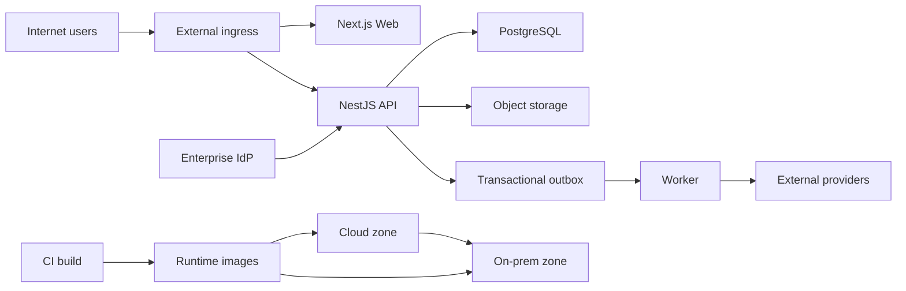

# ERP Preschool Threat Model

## Executive summary

ERP Preschool là hệ thống đa organization/campus sẽ xử lý HRI của trẻ và dữ liệu
tài chính, trong khi cả parent/mobile API lẫn admin portal đều được xác nhận
Internet-facing trên mô hình hybrid. Rủi ro cao nhất là triển khai nhầm development
authentication, authorization chưa đủ tenant/campus/data-class, và các command
admission có thể phá SoD hoặc prerequisite an toàn. Source hiện phù hợp làm scaffold
local với synthetic data, **chưa phù hợp để nhận HRI thật hoặc mở Internet trước
Gate G1**. Các control tốt đã có gồm SQL parameterization, transaction audit/outbox,
state machine, campus checks ở nhiều flow và production guard cơ bản; chúng chưa bù
được thiếu OIDC runtime, schema/body/rate limit, tenant-safe FK và secure storage.

## Scope and assumptions

In scope:

- Runtime code tại `apps/web`, `apps/api`, `apps/worker`, `packages/*`.
- PostgreSQL schema/migration/seed tại `database` và `scripts`.
- Deployment/build baseline tại `docker-compose.yml`, `infra/docker` và
  `.github/workflows`.
- Security/AI engineering constraints tại `AGENTS.md` và Phase 0 governance docs.

Out of scope:

- Snapshot/ZIP trong `docs/.../02_Release_Candidate_Source` và
  `03_Release_History`; chúng là artifact chỉ đọc.
- Implementation bên trong enterprise IdP, cloud/on-prem network, reverse proxy,
  WAF, secret manager, KMS, payment/e-sign/messaging provider vì chưa có trong repo.
- AI runtime/model/RAG vì chưa được implement; threat AI chỉ là pre-build condition
  dựa trên phạm vi đã công bố trong `AGENTS.md` §7.

Assumptions confirmed by the user on 30/08/2026:

- Deployment target is hybrid cloud/on-premise.
- Parent/mobile API and admin portal are both Internet-facing.
- Before Gate G1, only synthetic/de-identified data is allowed; no real HRI.
- The intended tenancy remains multi-organization and multi-campus
  (`database/migrations/0001_platform.sql`, `AGENTS.md` §5–6).
- No production/Internet rollout should occur until G1 controls and decisions are
  evidenced; this is a security requirement, not evidence that rollout is blocked
  by infrastructure today.

Open questions that can change ranking:

- Enterprise IdP, MFA/session model, trusted claim mapping and parent/staff identity
  separation (`docs/governance/DECISION_REGISTER.md`, DEC-004).
- Which components/data live cloud versus on-prem, connectivity, TLS/mTLS, ingress,
  DDoS/WAF and admin access restrictions.
- User/tenant scale, availability target, RPO/RTO, data residency and retention.
- Object storage/scanner, secret/KMS and external provider choices.

## System model

### Primary components

- **Next.js Web:** browser UI calling the API directly; the current scaffold emits
  fixed development actor/org/campus headers (`apps/web/src/app/sop-os-app.ts`,
  `actorHeaders` and `api`).
- **NestJS API:** listens on all interfaces, exposes `/api/v1`, creates development
  actor context, applies a global permission guard and accesses PostgreSQL
  (`apps/api/src/main.ts`, `bootstrap`; `apps/api/src/app.module.ts`).
- **Domain/contracts/config packages:** state machines, shared types and environment
  validation (`packages/domain/src/*`, `packages/config/src/index.ts`).
- **PostgreSQL:** system of record for identity scope, SOP, HRI admission records,
  finance drafts, audit, security event and outbox tables (`database/migrations`).
- **Worker:** polls the shared outbox; current dispatch is a logging stub, then marks
  the event processed (`apps/worker/src/main.ts`, `claimOne`, `dispatch`, `complete`).
- **MinIO metadata path:** Compose provides MinIO and schema stores document metadata,
  but API upload/download/scan adapter is not implemented
  (`docker-compose.yml`; `database/migrations/0004_mvp_workflows.sql`).
- **CI/build:** GitHub Actions frozen install, migration/seed/check/build/smoke; Docker
  images build from pinned Node and pnpm versions (`.github/workflows/ci.yml`,
  `infra/docker/*`).

### Data flows and trust boundaries

- **Internet browser → Web:** UI assets and user input over HTTPS assumed at an
  external ingress; repository contains no TLS termination, session or WAF evidence.
  Web validates only HTML form constraints and currently sends development identity
  headers (`apps/web/src/app/sop-os-app.ts`).
- **Internet browser/client → API:** JSON, query, path, identity/session and HRI cross
  HTTP. CORS origin allowlist and response security headers exist; no global runtime
  DTO validation, explicit body limits or rate limiter is configured
  (`apps/api/src/main.ts`; controllers under `apps/api/src/modules`).
- **IdP → API:** intended OIDC tokens/claims. Configuration is checked, but no token
  validation or actor construction exists; OIDC mode therefore fails closed for
  protected routes rather than providing production authentication
  (`packages/config/src/index.ts`; `apps/api/src/platform/actor-context.ts`).
- **API → PostgreSQL:** HRI, SOP, finance state, permissions, audit and outbox cross
  the PostgreSQL protocol using one connection URL/pool. Queries are parameterized;
  no TLS settings, least-privilege role split or RLS policies are evidenced
  (`apps/api/src/platform/database.module.ts`, `database/migrations/0001_platform.sql`).
- **API → Outbox → Worker:** transactionally created JSON events cross a shared DB
  boundary. Worker claims at-least-once, but payload schema/provider delivery and
  reconciliation are not implemented (`apps/api/src/platform/mutation-log.ts`,
  `apps/worker/src/main.ts`).
- **API → Object storage/scanner:** planned HRI file bytes and metadata; only metadata
  table and local MinIO exist, so authorization, quarantine, scan and signed access
  remain a pre-production boundary (`application_documents` in migration `0004`).
- **Cloud zone ↔ On-prem zone:** HRI, credentials, events and operational traffic may
  cross this user-confirmed hybrid boundary. Protocol, encryption, segmentation and
  direction are not represented in source and remain open design inputs.
- **Developer/CI → artifacts/runtime:** source, lockfile, migrations and images cross
  the supply-chain boundary. Frozen installs exist; GitHub actions use moving major
  tags and no SAST/SCA/secret/container gate is currently configured
  (`.github/workflows/ci.yml`).

#### Diagram

## Assets and security objectives

| Asset | Why it matters | Security objective (C/I/A) |
|---|---|---|
| Child/guardian identity and contact data | HRI disclosure can cause stalking, fraud and direct child/family harm | C high, I high, A medium |
| Assessment, consent, documents and handover evidence | Drives admission and safeguarding decisions; false or missing evidence can endanger a child | C high, I critical, A high |
| Authorized actor, role, tenant/campus scope | Security root for every API decision | C medium, I critical, A high |
| SOP Effective versions and approvals | Operational staff rely on correct approved procedure | C medium, I critical, A high |
| Offers, contracts, fee plans and approvals | Unauthorized values or duplicated actions cause financial/legal loss | C high, I critical, A high |
| Audit/security events and outbox | Required for accountability, detection and reliable integration | C high, I critical, A high |
| IdP, DB, storage, provider and KMS credentials | Theft enables broad tenant/data compromise | C critical, I high, A high |
| PostgreSQL/object storage availability | Core operation stops without records and evidence | C medium, I high, A critical |
| Build source, lockfile, CI workflow and images | Supply-chain compromise reaches both hybrid zones | C medium, I critical, A high |
| Future AI prompt/model/retrieval policy and evals | Compromise can leak HRI or generate unsafe recommendations at scale | C high, I high, A medium |

## Attacker model

### Capabilities

- Anonymous Internet attacker can reach both portal/API ingress, send arbitrary HTTP
  methods, JSON, headers, identifiers, query strings and high request volume.
- Authenticated parent/staff attacker can possess a valid low-privilege account;
  compromised accounts and malicious insiders are realistic.
- Attacker may learn UUID/business codes through an authorized response, shared link,
  browser/device compromise or operational communication.
- Supply-chain attacker may submit a malicious dependency/update or compromise a CI
  action/image registry; repository write access itself is not assumed.
- In hybrid deployment, an attacker compromising one zone or credential may attempt
  lateral movement across the cloud–on-prem connection.

### Non-capabilities

- No assumption of database superuser, host root, KMS control or enterprise IdP
  administrator at attack start.
- No current remote file upload, webhook, payment, messaging or AI endpoint exists;
  threats needing these are conditional pre-deployment risks.
- Direct access to Compose ports/default credentials is not assumed in production;
  it becomes plausible only if local configuration is reused or network controls fail.
- Physical device/school access and malicious model-provider behavior are not modeled
  beyond their software trust boundaries.

## Entry points and attack surfaces

| Surface | How reached | Trust boundary | Notes | Evidence (repo path / symbol) |
|---|---|---|---|---|
| Next.js portal | Internet ingress, port 3000 baseline | Internet → Web | Fixed dev identity headers; fallback synthetic view | `apps/web/src/app/sop-os-app.ts` / `api`, `actorHeaders` |
| NestJS API routes | Internet ingress, port 3001 baseline | Internet → API | All business endpoints under `/api/v1`; no global DTO pipe/rate limit | `apps/api/src/main.ts`; `apps/api/src/modules/*/*.controller.ts` |
| Development identity headers | Arbitrary request headers in development mode | Client → actor context | Actor/org/campus/permissions are client-controlled | `apps/api/src/platform/actor-context.ts` / `resolveDevelopmentActor` |
| Permission metadata/guard | Every controller call | Actor → domain command | String wildcard/resource checks; no data-class policy | `apps/api/src/platform/permissions.ts` |
| Lead/application searches | API query parameters | Client → SQL query | Parameterized and bounded; returns HRI contact fields for lead readers | `lead.service.ts` / `list`; `application.service.ts` / `list` |
| SOP content/terms/checklist JSON | API JSON bodies | Client → DB/audit/outbox | No schema/size bound; checklist can be replaced | `sop.service.ts` / `saveSection`; `application.service.ts` |
| Workflow transitions | Permissioned command endpoints | Client → integrity-critical state | State machines exist; SoD/prerequisites incomplete | `packages/domain/src/*`; admission/SOP services |
| PostgreSQL listener | Port 5432 in local Compose | Network → data store | Published on all host interfaces with dev credential default | `docker-compose.yml` / `postgres` |
| MinIO API/console | Ports 9000/9001 in local Compose | Network → object store | Published with default dev credentials; no app file flow yet | `docker-compose.yml` / `minio` |
| Outbox consumer | DB polling | DB → worker/provider | Global tenant queue; stub dispatch marks processed | `apps/worker/src/main.ts` |
| Seed/migration inputs | Operator/CI files and environment | Developer/CI → DB | SQL and JSON are trusted operator inputs | `scripts/migrate.mjs`, `scripts/seed.mjs` |
| CI/dependency/build | PR/push and registries | Developer/registry → artifact | Frozen lockfile; action tags/image tags not digest-pinned throughout | `.github/workflows/ci.yml`, `infra/docker` |

## Top abuse paths

1. **Internet attacker → development authentication bypass → HRI/finance mutation.**
   Attacker reaches an accidentally exposed non-production or misconfigured hybrid
   API, supplies arbitrary actor/org/campus/permission headers, grants `*`, reads
   leads/applications and invokes approval/enrollment/finance commands.
2. **Low-privilege account → over-broad permission → cross-role HRI access.** A valid
   actor receives `lead:read` or a wildcard, API returns email/phone/name without
   field-level purpose/masking, and the attacker harvests family contact records.
3. **Compromised staff account → forged completed checklist → unsafe handover.** The
   caller replaces the stored checklist with an empty or attacker-defined array;
   `some(item => !complete)` passes, allowing READY/SUBMITTED/ACCEPTED without the
   canonical identity/consent/health evidence.
4. **Single privileged account → self-directed offer/enrollment/finance chain.** The
   actor creates/transitions an offer, approves it, accepts it, confirms enrollment
   and creates fee/contract drafts because admission flows lack a shared SoD engine,
   approved config snapshot and idempotency control.
5. **Anonymous client → oversized nested JSON/request flood → database exhaustion.**
   The attacker sends large SOP content, terms, checklist or repeated search/mutation
   requests; no explicit body/rate limit exists and some JSON is copied into audit/
   outbox, amplifying storage and CPU consumption.
6. **Hybrid zone compromise → plaintext/default credential reuse → lateral movement.**
   If Compose-like DB/MinIO exposure or connection settings reach a shared network,
   the attacker uses published ports/default credentials or intercepts traffic and
   pivots between cloud/on-prem data stores.
7. **Malicious/invalid outbox payload → false delivery evidence.** A compromised DB
   writer or future producer inserts an event; the worker performs no schema/tool
   allowlist check and current stub marks it processed without provider outcome,
   obscuring missed operational notifications.
8. **Supply-chain compromise → image trusted in both zones.** A moving CI action,
   dependency or base-image tag is compromised; CI builds and deploys a modified
   API/worker image able to steal credentials/HRI across the hybrid environment.
9. **Future malicious document/prompt → scanner/RAG/tool abuse.** If Phase 1/AI-0
   accepts files or retrieved content without quarantine, ACL-before-retrieval,
   prompt-injection isolation and tool reauthorization, content can exfiltrate HRI or
   trigger unsafe recommendations/actions.

## Threat model table

| Threat ID | Threat source | Prerequisites | Threat action | Impact | Impacted assets | Existing controls (evidence) | Gaps | Recommended mitigations | Detection ideas | Likelihood | Impact severity | Priority |
|---|---|---|---|---|---|---|---|---|---|---|---|---|
| TM-001 | Anonymous Internet attacker | API is exposed with `AUTH_MODE=development`, or environment is mislabeled non-production | Forge actor/org/campus/permissions headers and call protected routes | Full HRI disclosure and arbitrary operational/financial mutation | Actor scope, HRI, finance, SOP/audit | Production+development mode is rejected when `NODE_ENV=production` (`packages/config/src/index.ts`); global guard exists | Test/staging and any mis-set `NODE_ENV` remain forgeable; Web ships fixed actor headers; OIDC runtime absent | Treat as deployment blocker: remove dev actor from production image/build, use explicit `APP_ENV=local`, implement OIDC JWT validation/JWKS/issuer/audience/MFA claims, derive actor server-side, add startup canary and ingress deny | Alert on any `x-actor-*`/`development:*` outside local; startup/config compliance metric; synthetic unauthorized probes | High because both portals are Internet-facing and config drift is plausible | High because compromise spans HRI and integrity-critical commands | critical |
| TM-002 | Compromised account or malicious insider | Valid account plus overly broad/wildcard permission, claim-mapping error or guessed cross-org FK | Escalate action or create references across organization/campus/domain/data class | Cross-tenant data leak and corrupt records/approvals | Tenant scope, HRI, SOP, audit | Organization/campus filters exist in core services; object outside campus often returns 404; SQL parameterized (`lead.service.ts`, `application.service.ts`) | Permissions are resource strings supplied by actor; no domain/data-class policy, server DB resolution or tenant-safe composite FK/RLS | Implement trusted claim→user→active role-scope resolution; action+org+campus+domain+class policy; deny default; composite tenant FK/unique; negative API+DB tests; RLS defense-in-depth after DEC-009 | Cross-org/campus denial counters, impossible FK/scope anomaly query, permission-change audit and UEBA | Medium; requires account/control weakness but multi-tenancy raises exposure | High due HRI and systemic tenant boundary breach | high |
| TM-003 | Authenticated staff/parent or compromised browser | Any permission that returns an aggregate containing more fields than purpose requires | Read/export HRI contact/name/assessment fields or expose them via UI/error/log | Privacy breach and child/family harm | HRI, consent, assessment | `persons.data_classification` defaults HRI; list queries are scoped and bounded; generic 500 hides internals | `lead:read` returns email/phone; no parent/staff projection, field masking, purpose/export permission or consent enforcement; no retention | Define role/use-case response DTOs; server-side field projection/masking; separate HRI/export permissions with reason/audit; purpose/consent checks; retention/legal hold; privacy tests | HRI read/export volume, unusual campus/family access, sensitive-field access audit, DLP rules | Medium given Internet-facing accounts and broad scaffold responses | High due child/family privacy impact | high |
| TM-004 | Compromised or overprivileged staff actor | Handover/offer/enrollment/finance transition permission | Replace checklist or self-drive approval chain, bypass prerequisites and confirm unsafe state | Child-safety, legal and process-integrity failure | Handover evidence, enrollment, SOP/approval | Explicit state machines; row locks; SOP prevents author self-approval; mutation+audit+outbox transaction | Handover trusts caller checklist and empty list passes; admission lacks SoD/approval engine/blocker snapshot; author/requester can approve offers | Server-owned versioned checklist definition/items; reject unknown/missing/empty mandatory items; immutable evidence; shared approval/SoD engine; reauthorize every critical command; blocker/config snapshot; direct-API negative E2E | Alert transition velocity/self-approval, missing checklist evidence, same actor across chain, out-of-hours high-risk actions | Medium; needs a permission or TM-001, but logic is directly exploitable | High/critical because unsafe handover can affect a child | critical |
| TM-005 | Anonymous or authenticated Internet client | Reach API routes | Send oversized/deep JSON, invalid values and high-rate concurrent requests/searches | API/DB exhaustion, large JSON/audit/outbox growth, malformed state | Availability, DB capacity, audit/outbox | Parameterized SQL; list limits at 100 in current services; state/selected manual checks | No global `ValidationPipe`, unknown-field rejection, explicit body/depth limits, rate/quota or timeout; long-lived arbitrary JSONB contracts | Zod/DTO validation at boundary; reject unknown; per-route body/array/string/depth limits; rate limit by IP+actor+tenant; request/DB timeouts; pagination; JSON schemas; load/adversarial tests | 4xx/429/body-size metrics, latency/connections, JSON/audit/outbox growth, WAF rate anomalies | High for two Internet-facing portals | Medium to high depending hybrid capacity and operational dependency | high |
| TM-006 | Network attacker or attacker in one hybrid zone | Cloud–on-prem traffic lacks authenticated encryption/segmentation, or local defaults are reused | Sniff credentials/HRI, access DB/MinIO ports, pivot between zones | Broad confidentiality/integrity/availability compromise | DB/storage credentials, HRI, hybrid runtime | Compose is documented local; secrets are environment-driven; production dev-auth guard exists | Repo shows plaintext local endpoints, published DB/MinIO ports and default credentials; no hybrid topology/TLS/mTLS/firewall/KMS evidence | Approve data placement/flow; private subnets and default-deny firewall; TLS/mTLS DB/storage/service links; no public DB/MinIO; secret manager+rotation; separate zone identities; egress allowlist; hybrid failover threat test | Network flow/DNS/TLS audit, public-port exposure scan, secret-use anomaly, cross-zone IDS, certificate expiry | Medium until topology known; high if Compose pattern is reused | High due full datastore and lateral movement | high |
| TM-007 | Compromised DB credential, buggy producer or future provider | Ability to insert/alter outbox or influence event content/delivery | Inject malformed event, cause repeated failure, false `PROCESSED`, or leak error/content | Missed/duplicated notification, downstream integrity and audit ambiguity | Outbox, provider actions, audit evidence | Business mutation/audit/outbox atomic; claim uses lock and retry/DLQ states; worker logs metadata only | One DB role, payload has no event schema validation, dispatch is stub and completes immediately, no provider receipt/idempotency/reconciliation | Versioned event schemas and size/classification; least-privilege worker role; provider adapter with timeout/retry/idempotency/receipt; mark processed only on confirmed outcome; DLQ/reconciliation; redact `last_error` | Queue age/retry/DLQ, event schema rejection, provider receipt mismatch, reconciliation delta | Medium; current provider side effect is absent but false success exists | Medium/high for operational workflows | medium |
| TM-008 | Privileged actor, retrying client or automation | Finance/admission command permission and network retry/concurrency | Duplicate contract/fee setup, exploit floating-point input/default currency or race workflow actions | Financial inconsistency and reconciliation/legal loss | Fee plans, contracts, offers, enrollments | PostgreSQL numeric column and non-negative constraint; transactions/row locks on some commands | API accepts JavaScript `number`, defaults `VND`, no approved precision/rounding/config snapshot, idempotency key or universal row-version contract | Decimal string schema + ISO currency; DEC-012 policy; versioned fee/discount approval; command idempotency table/key; ETag/row-version; unique business invariant; reconciliation jobs | Duplicate command keys/codes, amount/currency anomaly, actor-chain SoD alert, finance reconciliation variance | Medium; retries and privileged misuse are realistic | High because financial integrity is priority 3 | high |
| TM-009 | Dependency/registry/CI attacker | Compromise of moving action tag, package registry/base-image tag or reviewer path | Inject code into build/image used in cloud and on-prem | Credential/HRI theft across both zones and persistent compromise | Source, images, secrets, runtime | Frozen pnpm lockfile, read-only CI permission, local build gates (`.github/workflows/ci.yml`) | Actions use major tags, images are tag-pinned not consistently digest/attestation verified; no SAST/SCA/secret/container scan or signed provenance gate | Pin action/image digests with update process; dependency review/SCA/SBOM; secret/SAST/container scan; artifact signing/provenance and deploy verification; protected environments/CODEOWNERS | Registry digest drift, dependency diff alert, provenance verification failure, unexpected network egress from CI/runtime | Medium; requires supply-chain compromise | High because one artifact spans hybrid zones | high |
| TM-010 | Malicious uploader or storage attacker | Secure document API/storage adapter is implemented without mandatory controls | Upload malware/polyglot, swap object, enumerate signed URLs or download file outside scope | Malware, HRI exfiltration and evidence tampering | Documents, HRI, operator devices | Schema has scan states; design rules require quarantine/signed access (`0004_mvp_workflows.sql`, `AGENTS.md` §6) | No upload/download implementation, scanner, object authorization, content hashing or retention evidence | Before enabling: allowlist+magic-byte+size; random keys; quarantine bucket; async scan; immutable hash; ACL on every download; short URL; CSP download; legal hold/retention; malicious-file tests | Upload/scan/download audit, hash mismatch, repeated infected files, signed URL misuse | Low now because endpoint absent; rises high when enabled | High | medium |
| TM-011 | Malicious retrieved document/user or compromised model/provider | AI/RAG/tooling is added without documented gateway/ACL/eval controls | Prompt-inject retrieved content, exfiltrate HRI, cite stale SOP or invoke an unsafe tool | Unsafe operational advice, privacy breach or unauthorized side effect | HRI, SOP authority, AI config/evals | `AGENTS.md` §7 forbids autonomous critical decisions and requires gateway, ACL, eval, reviewer, kill switch | No AI runtime/control implementation yet; provider/region/retention decisions OPEN | Enforce AI gateway; Effective-only ACL-before-retrieval; treat content as data; structured output validation; tool allowlist+reauthorization+human confirmation; redact HRI; prompt/model/source versions; golden/adversarial leakage eval; kill switch | Citation/ACL failures, prompt-injection canaries, tool denial, leakage scan, drift/false-negative/cost alerts | Low now; becomes medium/high at AI-0 | High because child/medical/safeguarding contexts are planned | medium |

## Criticality calibration

- **Critical:** plausible path to child-safety impact or broad unauthenticated HRI/
  integrity compromise. Examples: Internet-exposed development actor; forged
  handover evidence; remote cross-tenant write affecting many campuses.
- **High:** serious HRI, financial or tenant-integrity compromise requiring a valid
  account, config failure or supply-chain foothold. Examples: broad HRI projection,
  missing offer/finance SoD, hybrid DB credential interception.
- **Medium:** limited/currently conditional exposure, recoverable operational failure
  or prerequisite not yet implemented. Examples: false outbox processing, planned
  upload malware path before endpoint exists, future AI prompt injection before AI-0.
- **Low:** low-sensitivity disclosure or noisy, easily contained failure without HRI,
  financial or child-safety impact. Examples: public service version disclosure,
  anonymous UI availability noise, synthetic fallback-data disclosure.

Risk ranking is most sensitive to actual ingress/network controls, IdP/claim design,
permission assignment and whether the no-HRI-before-G1 commitment is enforced by a
technical data gate rather than policy alone.

## Focus paths for security review

| Path | Why it matters | Related Threat IDs |
|---|---|---|
| `apps/api/src/main.ts` | Internet listener, CORS, headers and development actor injection; add validation/rate/body controls here | TM-001, TM-005 |
| `apps/api/src/platform/actor-context.ts` | Client-controlled development identity and future trusted actor boundary | TM-001, TM-002 |
| `apps/api/src/platform/permissions.ts` | Global authorization semantics and wildcard behavior | TM-001, TM-002, TM-003 |
| `packages/config/src/index.ts` | Startup fail-safe and environment/auth mode validation | TM-001, TM-006 |
| `apps/api/src/modules/admission/application.service.ts` | Offer, enrollment, finance and handover integrity; checklist bypass | TM-004, TM-005, TM-008 |
| `apps/api/src/modules/admission/lead.service.ts` | HRI ingestion/search, campus scope and duplicate behavior | TM-002, TM-003, TM-005 |
| `apps/api/src/modules/sop/sop.service.ts` | SOP authority, SoD, arbitrary JSON and Effective transitions | TM-004, TM-005 |
| `apps/api/src/platform/mutation-log.ts` | Atomic audit/outbox payload content and HRI minimization | TM-003, TM-007 |
| `apps/worker/src/main.ts` | At-least-once processing, false success, retry/DLQ and future provider boundary | TM-007 |
| `database/migrations/0001_platform.sql` | Tenant FK, permissions, audit/outbox and DB-role/RLS foundation | TM-002, TM-007 |
| `database/migrations/0003_admission.sql` | HRI tables and current tenant/campus constraints | TM-002, TM-003 |
| `database/migrations/0004_mvp_workflows.sql` | Document, assessment, finance and handover schema/invariants | TM-004, TM-008, TM-010 |
| `database/migrations/0005_security_hardening.sql` | Audit hash-chain claims and security-event protection | TM-007 |
| `apps/web/src/app/sop-os-app.tsx` | Public browser boundary and fixed development identity headers | TM-001, TM-003 |
| `docker-compose.yml` | Published DB/storage ports and local default credentials | TM-006 |
| `.github/workflows/ci.yml` | Supply-chain trust, migration/seed/smoke gates and action pinning | TM-009 |
| `infra/docker` | Base images, lockfile install, runtime contents and production image posture | TM-009 |
| `AGENTS.md` | Mandatory HRI, authorization, AI and delivery constraints to convert into executable gates | TM-002, TM-003, TM-010, TM-011 |

## Quality check

- [x] Covered all discovered HTTP routes, development identity, DB/MinIO listeners,
  worker, operator migration/seed and CI/build entry points.
- [x] Represented Internet→Web/API, IdP→API, API→DB/storage/outbox,
  worker→provider, cloud↔on-prem and CI→runtime boundaries in threats.
- [x] Separated current runtime, local Compose/dev controls, CI/build tooling and
  unimplemented upload/provider/AI surfaces.
- [x] Reflected user-confirmed hybrid deployment, dual Internet exposure and
  synthetic/de-identified-only rule before G1.
- [x] Kept remaining IdP, hybrid topology, scale/RPO/RTO and vendor decisions explicit.

